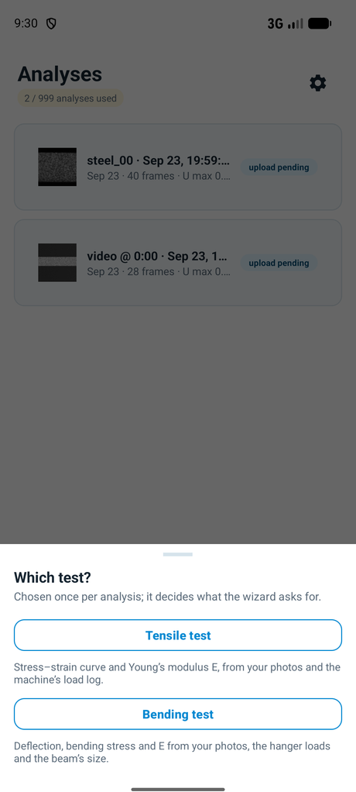
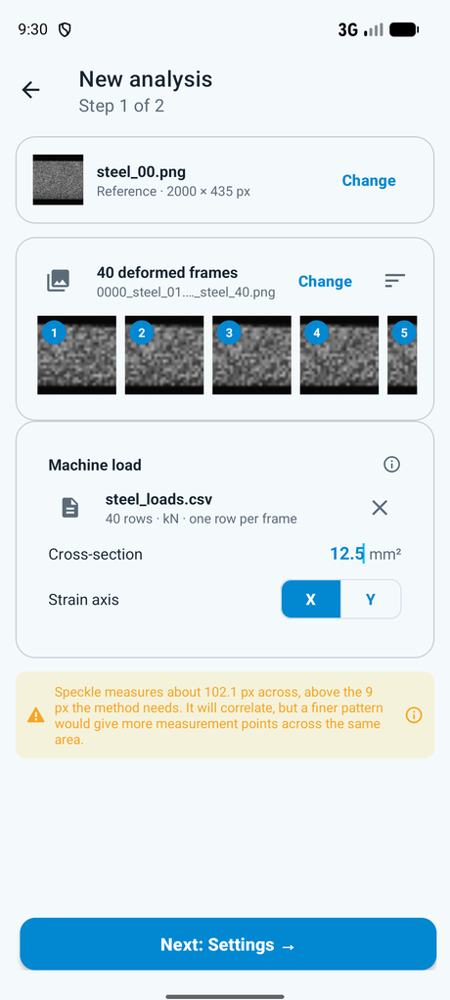
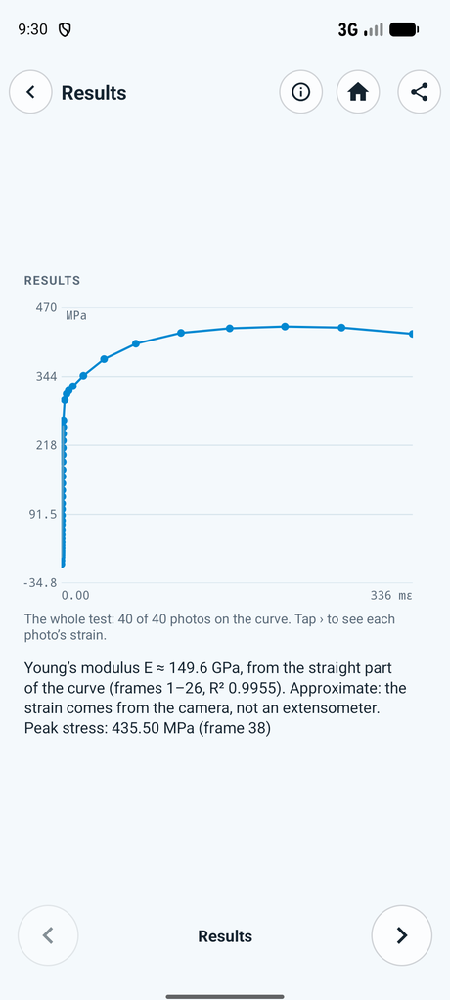
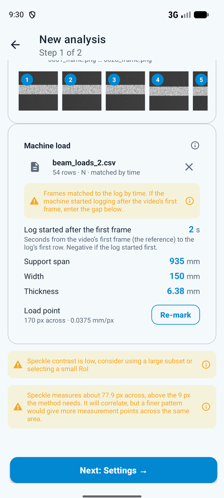
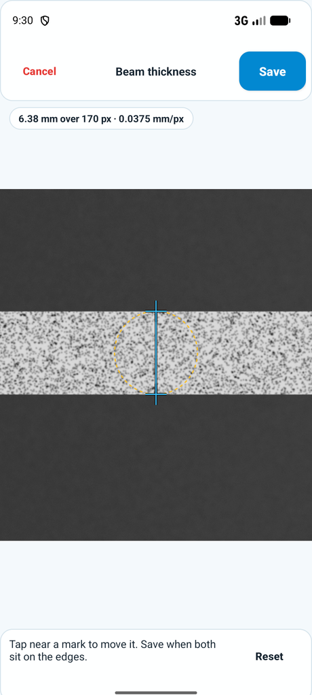
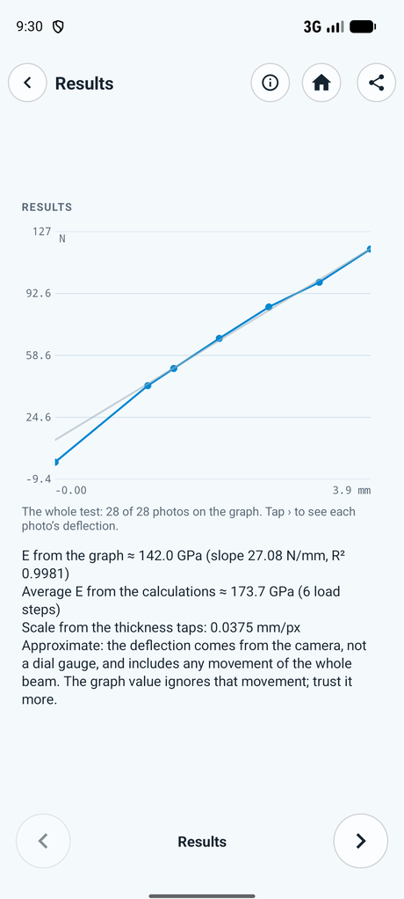
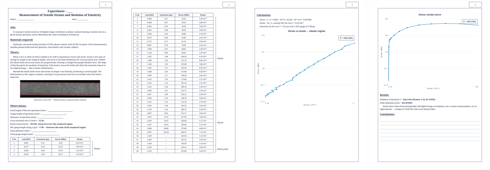
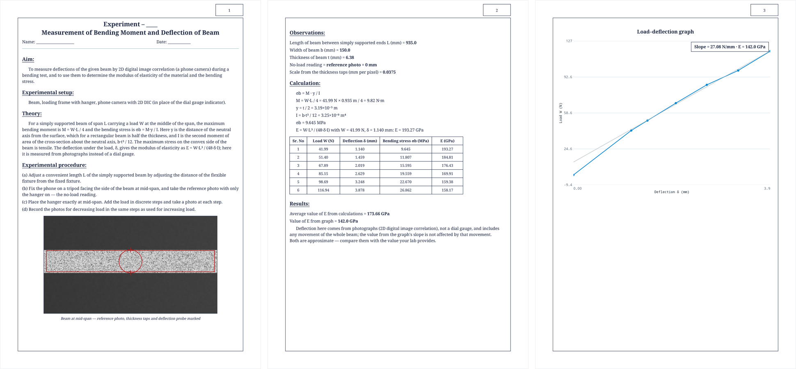
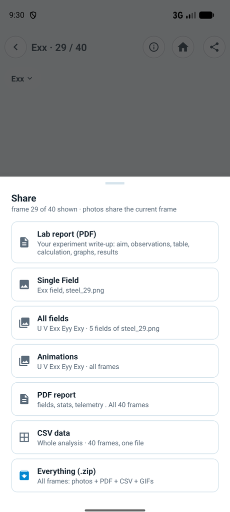

<p align="center">
  
  <br><br>
  <strong>Material Testing</strong> — Semper DIC for tensile and bending tests
  <br>
  <a href="https://github.com/sempermechanics/material_testing/actions/workflows/ci.yml"></a>
</p>

Phone-camera **2D digital image correlation (DIC)** for the first-semester
**tensile** and **bending** labs. You photograph the speckled specimen and import the
machine's load log. The app gives you E and fills in your lab report.

<p align="center">
  
  &nbsp;
  
  &nbsp;
  
</p>

<p align="center">
  
  &nbsp;
  
  &nbsp;
  
</p>

| Test | You give | You get |
|---|---|---|
| **Tensile** | Photos or video, the load log (N or kN), cross-section area | Stress–strain curve, **E** from the straight part, peak stress |
| **Bending** | Video, the timed load log, span / width / thickness, two taps on the beam edges | Load–deflection graph, σb and E for each load step, **E from the slope** |

**Share → Lab report (PDF)** fills in the journal layout: aim, observations, table,
calculation, graphs and results.

<p align="center">
  
  <br>
  
</p>

The full field is there too: U and V displacement (about 1/100 px), Exx, Eyy and Exy
strain as heatmaps, and PDF, CSV, PNG, GIF and ZIP exports. The C++ engine runs
**offline**. Cloud backup is optional.

<p align="center">
  
  &nbsp;
  
  &nbsp;
  
</p>

How to run a lab: [docs/OPERATING_MANUAL.md](docs/OPERATING_MANUAL.md) · Spec and accuracy:
[docs/app/STUDENT_LAB_WORKFLOW.md](docs/app/STUDENT_LAB_WORKFLOW.md) · Check against the handwritten
reports: [docs/app/REAL_WORLD_VALIDATION.md](docs/app/REAL_WORLD_VALIDATION.md)

> **Lineage.** This repo holds the full history of
> [`sempermechanics/semperdic-app`](https://github.com/sempermechanics/semperdic-app) at `bfe00e5`
> (2026-09-21), and merges the parent's `main` back in (last at `643462c`, 2026-09-24).
> - **Same identity.** It keeps the `applicationId` (`com.indicvision.semper`), the backend and CI,
>   so a build **replaces** Semper on a device.
> - **Deploys.** The backend deploys from the parent repo only, so the deploy workflows here fail if run.
> - **`main`.** Changes need a PR and a green `CI OK`.

---

## Who

| You are | Start here |
|---|---|
| **New developer** | This page → [docs/README.md](docs/README.md) (DIC primer) → clone below → [docs/app/ARCHITECTURE.md](docs/app/ARCHITECTURE.md) |
| **Contributor** | [CONTRIBUTING.md](CONTRIBUTING.md) (build, test, PR rules) + [docs/ops/CI.md](docs/ops/CI.md) when a check fails |
| **Maintainer** | [docs/ops/ENVIRONMENTS.md](docs/ops/ENVIRONMENTS.md) · [RELEASING.md](docs/ops/RELEASING.md) · [PRODUCTION_READINESS_GATE.md](docs/ops/PRODUCTION_READINESS_GATE.md) |
| **Engine author** | [`semper-dic-engine`](https://github.com/sempermechanics/semper-dic-engine) submodule at `native/` — app contract: [docs/engine/ENGINE_APP_CONTRACT.md](docs/engine/ENGINE_APP_CONTRACT.md) |
| **Backend author** | [docs/backend/CLOUD_ARCHITECTURE_GCP.md](docs/backend/CLOUD_ARCHITECTURE_GCP.md) · deploy: [GCP](docs/backend/BACKEND_SETUP_GCP.md) or [Console](docs/backend/BACKEND_SETUP_CONSOLE.md) |

PRs target **`main`**. UI and docs work need no C++ toolchain. Issues tagged
`good first issue` are scoped for newcomers.

---

## How — build & run

```bash
git clone --recurse-submodules https://github.com/sempermechanics/material_testing
cd material_testing
git submodule update --init --recursive   # engine + Eigen/OpenCV (large, one-time)
cd native && ./scripts/sparse-opencv.sh && cd ..   # Windows: .\scripts\sparse-opencv.ps1
```

Open in Android Studio → **Run**. First build compiles OpenCV once (`app/.cxx/`
cache). **No API keys required** for local analysis; without them cloud sync
stays off. Release builds require HTTPS `INDIC_API_BASE_URL` in
`local.properties` (cloud cannot ship silently disabled).

**Emulator (x86_64):** `./gradlew :app:installDebug -PabiFilters=x86_64` — debug
boots straight to Home as a local dev account (no backend). Set
`INDIC_DEV_AUTH_BYPASS=false` in `local.properties` to exercise real sign-in.

Full commands, engine bumps, disk hygiene, and backend setup:
[CONTRIBUTING.md](CONTRIBUTING.md).

---

## Where — repository map

> **The C++ engine is not in this repo.** It is pinned in
> [`native/`](https://github.com/sempermechanics/semper-dic-engine) as a git
> submodule; engine CI proves that commit. This repo proves it still **links**.

<p align="center">
  
</p>

| Path | What |
|---|---|
| `native/` | **Submodule** — solver, strain, seeding, JNI, engine tests & docs |
| `app/src/main/cpp/` | App-side JNI boundary |
| `app/src/main/java/.../ui/analysis/` | Setup wizard, ROI, parameter-sweep lattice |
| `app/src/main/java/.../ui/viewer/` | Heatmaps, probe, exports |
| `app/src/main/java/.../ui/auth/` · `ui/settings/` | Sign-in, access gating, settings |
| `app/src/main/java/.../report/` | Stress–strain, E, beam deflection, lab-report and DIC PDFs, CSV |
| `app/src/main/java/.../data/` | Cloud client, upload/restore workers, storage budget |
| `app/src/test/` · `app/src/androidTest/` | JVM and instrumented tests |
| `backend/` | FastAPI on Cloud Run |
| `firebase-hosting/` | Auth continue URLs, asset links, generated legal pages |
| `scripts/` | Legal-page renderer, Firestore export/restore |
| `docs/` | **[Documentation index](docs/README.md)** — app, engine contract, backend, ops |

Screen flow and package roles: [docs/app/ARCHITECTURE.md](docs/app/ARCHITECTURE.md).
Every user-facing flow: [docs/app/WORKFLOWS.md](docs/app/WORKFLOWS.md).

---

## How — analysis pipeline

<p align="center">
  
</p>

Each tracked **subset** (odd-width window) is matched with **ICGN** (6-DOF warp)
scored by **ZNSSD** (0 = perfect, ≤ 0.15 accepted — lighting-invariant). Engine
detail: `native/docs/ARCHITECTURE.md` · [docs/engine/](docs/engine/).

### Parameters (Advanced in the wizard)

<p align="center">
  
</p>

| Parameter | Default | Range | Role |
|---|---|---|---|
| Subset size | measured (41 px fallback) | 15–121, **odd** | Tracked window — larger = robust, less detail |
| Step size | 5 px | 1–30 | Grid spacing between points |
| Strain window | 5 points (bending 9) | 3–31, **odd** | Data points per strain fit; VSG = (window − 1) × step + 1 px |

Subset width is **suggested from the reference speckle** (SSSIG criterion, Pan
et al. 2008): weak speckle → larger window. Typed evens snap to odd; out-of-range
values clamp. Override freely — **Reset** restores the suggestion.

---

## Test & CI

```bash
./gradlew :app:testDebugUnitTest spotlessCheck :app:detekt :app:lintDebug
```

That is the usual app gate. Backend, emulator tier, and **engine host /
sanitizer / DICe suites run in the engine repo**, not here — this CI proves the
pinned engine still links (arm64-v8a release + x86_64 emulator).

Release gate, per-chunk tests, benchmarks, and legal-page checks:
[CONTRIBUTING.md](CONTRIBUTING.md) · tier map: [docs/ops/CI.md](docs/ops/CI.md).

---

## Contributing

[CONTRIBUTING.md](CONTRIBUTING.md) is the source of truth for build, test, and PR
workflow. [docs/README.md](docs/README.md) has the DIC primer and glossary.

## License

See [LICENSE](LICENSE). Terms finalize before public release; until then, all
rights reserved.
