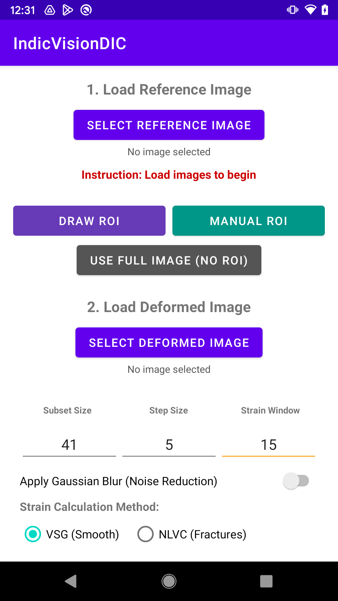
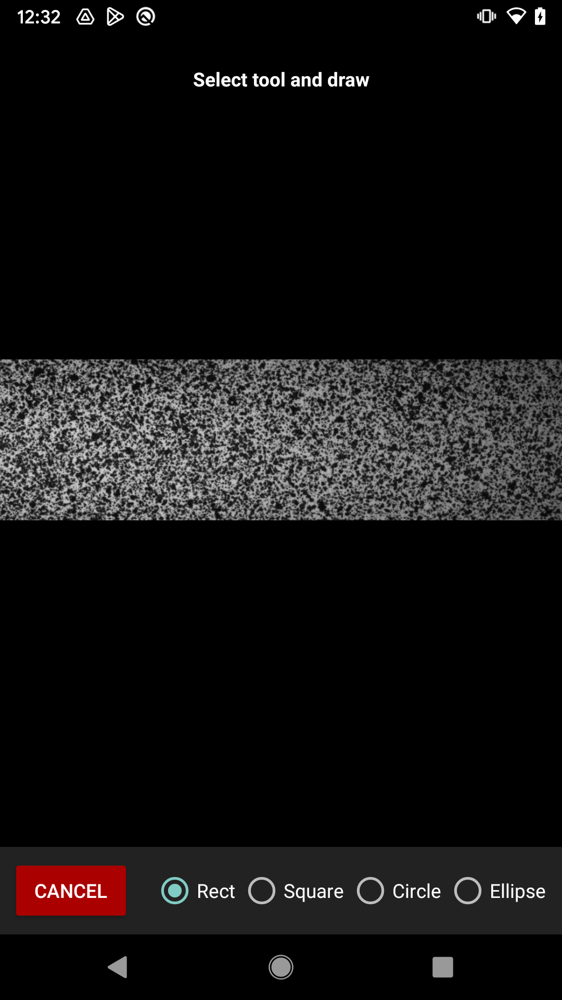
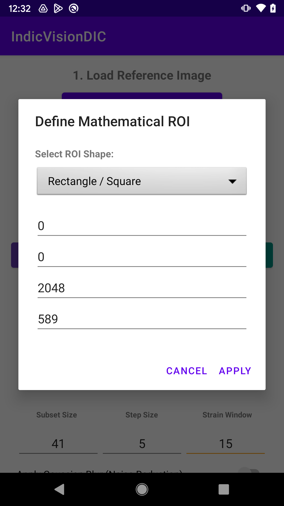
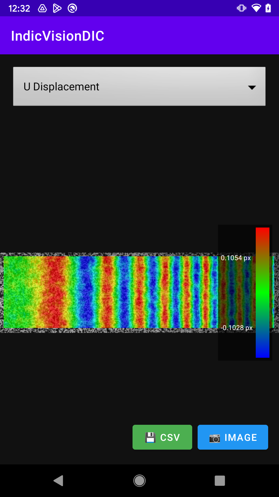

# 🔬 IndicVision DIC (Digital Image Correlation)

**IndicVision DIC** is a high-performance, mobile-first Digital Image Correlation (DIC) application. It bridges native C++ computing with modern Android UI, allowing engineers and researchers to calculate full-field displacements and strains (U, V, Exx, Eyy, Exy) directly on a smartphone or tablet.

---

## ✨ Key Features

* **High-Performance C++ Core:** Utilizes the Android NDK, OpenCV, and OpenMP multi-threading to process large 12-Megapixel datasets (40,000+ points) in just seconds.
* **Advanced Mathematical Solvers:** Implements a **Zero-Normalized Sum of Squared Differences (ZNSSD)** criterion optimized via an Inverse Compositional Gauss-Newton (IC-GN) algorithm, backed by a Simplex fallback for complex deformations.
* **Versatile ROI Selection:**
  * **Interactive:** Draw a Region of Interest directly on the touchscreen.
  * **Mathematical/Numerical:** Input precise pixel dimensions for Rectangles, Circles, Ellipses, and Triangles.
  * **Custom Masks:** Upload external image masks for complex specimen geometries.
* **Publication-Ready Visualization:** Features a smooth, Google-Maps-style pan/zoom viewport. The internal engine applies 2nd/98th percentile statistical outlier filtering to generate clean, noise-free "Jet" colormap heatmaps.
* **Comprehensive Export Suite:**
  * **Image Export:** Safely merges the raw deformed specimen image with the translucent heatmap overlay into a high-res `.PNG` saved to the Android Gallery.
  * **Data Export:** Dumps tracking data into a neatly formatted `.CSV` spreadsheet in the device Downloads folder.
* **Robust Architecture:** Architected with Kotlin `ViewModel`s to survive lifecycle changes (like screen rotations) and `std::mutex` hardware locks to ensure memory safety during parallel computing.

---

## 📸 Screenshots

A complete workflow from setup to analysis results on a mobile device.

  
  
  
  

  <i>From left to right: Main setup interface, interactive ROI drawing, numerical shape input dialog, and final displacement and strain heatmap visualization with a legend.</i>

---

## 🚀 Quick Start Guide

### 1. Setup the Analysis
1. Tap **Load Reference Image** (the un-deformed state).
2. Tap **Load Deformed Image** (the stretched/deformed state).
3. Set your parameters:
   * **Subset Size:** The size of the speckle pattern tracking block (e.g., `41`).
   * **Step Size:** The pixel distance between computed points (e.g., `5`).
   * **Strain Window:** The grid size for smoothing strain derivatives (e.g., `15`).

### 2. Define the Region of Interest (ROI)
* Tap **Draw ROI** to trace a bounding box with your finger.
* Tap **Manual ROI** to mathematically define a specific shape (Rectangle, Circle, Ellipse, Triangle) using exact pixel coordinates.
* *Or* tap **Use Full Image** to compute the entire specimen.

### 3. Compute & View
1. Hit **Calculate Full Field**. The C++ engine will execute in the background.
2. Once complete, the **Result Viewer** opens.
3. Use the top dropdown to switch between: `U Displacement`, `V Displacement`, `Exx Strain`, `Eyy Strain`, and `Exy Shear`.
4. Pinch to zoom and drag to inspect stress concentrations.

### 4. Export
Use the Floating Action Buttons at the bottom right of the results view:
* **💾 CSV:** Saves the raw X, Y, U, V, Strain, and Correlation data to your `Downloads/IndicVision` folder.
* **📷 Image:** Saves a combined, high-resolution PNG of your specimen and the active heatmap to your `Pictures/IndicVision` folder.

---

## 🛠️ Tech Stack & Architecture
* **Frontend UI:** Kotlin, XML, Android SDK, ViewModels, MediaStore API.
* **Backend Engine:** C++17, Android NDK, CMake.
* **Computer Vision:** OpenCV (cv::Mat, cv::GaussianBlur).
* **Parallelization:** OpenMP (`#pragma omp parallel`), `<atomic>`, `<mutex>`.
* **Data Flow:** Flat JNI arrays (`jfloatArray`) to minimize Java-to-C++ memory overhead.

---

## 📝 License
This project is licensed under the [MIT License](LICENSE).

---
*Developed as a high-performance mobile engineering tool.*
