# inDIC operating manual

How to get displacement and strain fields out of a DIC image set, using the app.

<!-- **For:** a graduate researcher who knows DIC basics — subsets, correlation,
strain fields — and has not used this app.

**Not covered:** speckle patterning, lighting, cameras, rigs, calibration and
how to choose test parameters. Those are experiment questions. Use *A Good
Practices Guide for Digital Image Correlation* (iDICs). This manual starts once
you have images. -->

| | |
|---|---|
| [1. What it does](#1-what-it-does) | [7. Sweeps](#7-sweeps) |
| [2. Getting in](#2-getting-in) | [8. Reading results](#8-reading-results) |
| [3. Images it accepts](#3-images-it-accepts) | [9. Exports](#9-exports) |
| [4. Running an analysis](#4-running-an-analysis) | [10. Managing analyses](#10-managing-analyses) |
| [5. Parameters](#5-parameters) | [11. Troubleshooting](#11-troubleshooting) |
| [6. Region of interest](#6-region-of-interest) | [12. Limits](#12-limits) |

---

## 1. What it does

You give it one reference frame and N deformed frames. It matches subsets on a
grid and returns five fields per frame.

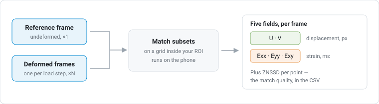

| Field | Unit |
|---|---|
| **U**, **V** — displacement | px |
| **Exx**, **Eyy**, **Exy** — strain | mε (millistrain) |

Two things to know up front:

- **Displacements are in pixels.** There is no scale calibration. Convert to
  physical units yourself.
- **Everything runs on the phone.** Cloud backup stores results only.

---

## 2. Getting in

Accounts need approval, not just sign-up.

1. Sign in with Google or email.
2. **Passwords** need 8+ characters with upper and lower case, a digit and a
   special character. **Generate secure password** fills a strong one in for you
   and reveals it so you can save it. (A forgotten password is reset through
   Firebase's own page, which these rules cannot reach.)
3. **Signing up with email?** Creating the account sends a verification link and
   puts you back on the sign-in form with your address still filled in. Open the
   link, then sign in there. Until you do, sign-in is refused and a fresh link is
   sent each time you try.
4. New accounts land on **Pending approval**. Support is emailed automatically
   at this point — you do not have to ask to be noticed.
5. Tap **Request access** if you want to add context. It opens a prefilled
   email; send it.
6. After an admin approves you, tap **Check status**.

**Nothing polls.** The screen never updates on its own. Use the button.

Google and email-link sign-ins skip step 2 — both already prove the address.

Offline works if you have been approved on this device before. Import, solve and
read results all work without a network. Uploads wait.

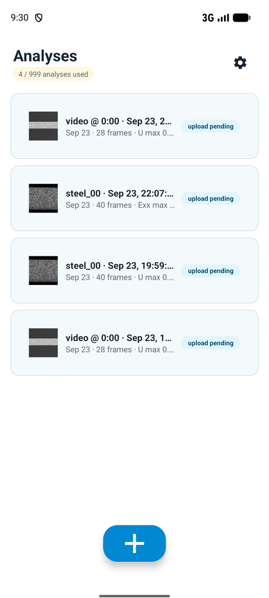

Home lists your analyses. Tap one to open it. Long-press for select, rename,
delete. Pull down to sync. **+** starts a new analysis.

---

## 3. Images it accepts

Hard rules:

| Rule | If broken |
|---|---|
| All frames the same pixel size as the reference | Blocking error; you cannot run |
| At least one reference + one deformed frame | **Next** stays off |
| At most *Max frames* (default 50) | Extras dropped, with a toast |

**Formats.** PNG and TIFF are best. JPEG works but raises an accuracy warning —
compression damages the intensity gradients correlation needs. RAW and DNG
import **only through Files**, not Photos.

**Texture check.** On import the app measures your speckle. Weak pattern → a
warning naming a bigger subset size. Treat it as a comment on the pattern, not
just a setting.

**Video.** Pick a video and a sampling sheet opens: frame rate, time segment,
live frame-count estimate. Frame 0 becomes the reference.

---

## 4. Running an analysis

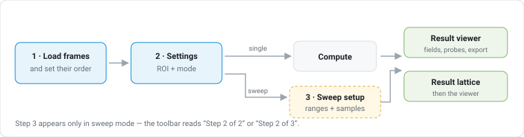

### Step 1 — Load frames

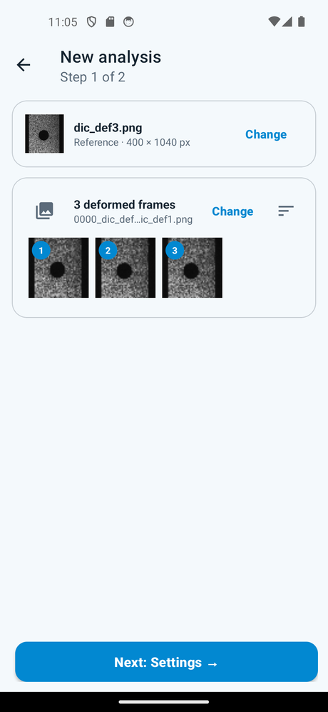

Tap each dropzone and pick your images:

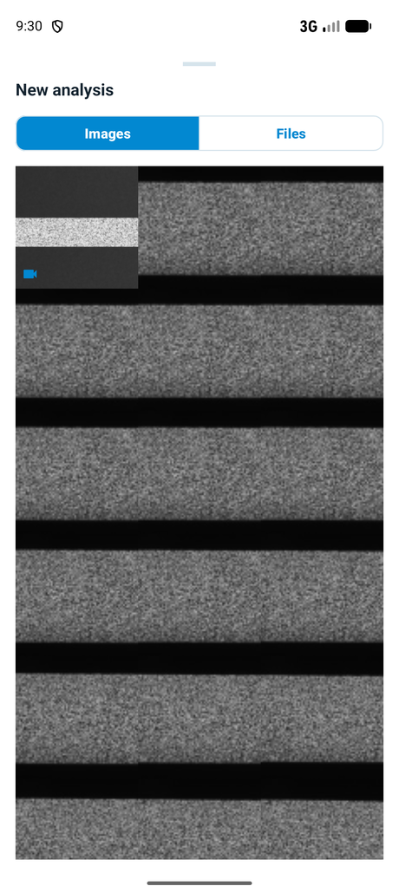

**Photos** is the system picker. **Files** is the only route to RAW and DNG.

The strip shows the deformed frames with order badges.

**The badge order is the analysis order.** Frame 1 here is frame 1 everywhere
after. Tap the sort icon to change it:

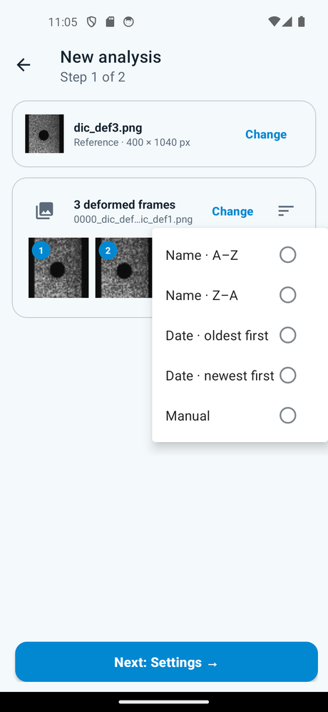

| Sort | Use when |
|---|---|
| Name · A–Z / Z–A | Filenames carry the sequence |
| Date · oldest / newest first | Filenames don't; uses capture time, then EXIF |
| Manual | Neither works — drag the thumbnails |

You cannot get back to the picker's original order once sorted. With one
deformed frame the control is hidden.

### Step 2 — Settings

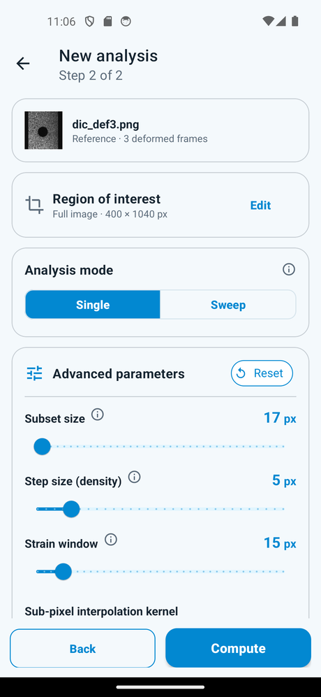

Three decisions:

- **Region of interest** — defaults to the full image. **Edit** opens the editor
  ([§6](#6-region-of-interest)).
- **Single** or **Sweep** — Single solves every frame once. Sweep solves one
  frame many times ([§7](#7-sweeps)).
- **Advanced parameters** — [§5](#5-parameters).

Then **Compute**.

### While it runs

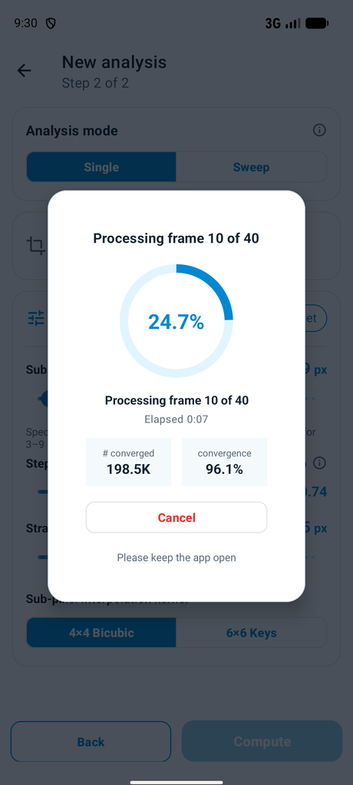

Points solved and convergence update live. **Cancel** stops the run where it is,
within a moment — it does not wait out the frame being solved. Nothing is kept.
Back is blocked.

**A run stops itself if the images decorrelate.** Two consecutive frames below
50% convergence end it — the frames after them would be no better, and the
message names the frame and image it gave up on.

This is a **short run, not a failed one**: the frames solved before the collapse
are real data, they are saved as an analysis, and acknowledging the message takes
you straight into them. A 50-frame test that decorrelated at frame 40 still gives
you frames 1–39.

**Keep the app open.** A run has no resume. If Android kills the app, the run is
gone.

### After

| Result | You land on |
|---|---|
| Single | Result viewer, frame 1 |
| Sweep | Result lattice |
| Some sweep points failed | `N of M skipped` toast, then the lattice |
| Engine failed | A dialog naming the cause, and which frame and image it failed on |
| Every sweep combination failed | The lattice, every node hollow — tap one for its reason. No **View results** |

Re-running the same inputs updates the same analysis. Different inputs make a
new one.

---

## 5. Parameters

Single mode only. Slider or typed field, each with an ⓘ.

| Parameter | Range | Reset to |
|---|---|---|
| Subset size | 15–121, odd | Recommended |
| Step size | 1–30 | 5 |
| Strain window | 5–101, odd | 15 |
| Kernel | 4×4 Bicubic / 6×6 Keys | 4×4 Bicubic |

### Subset and step

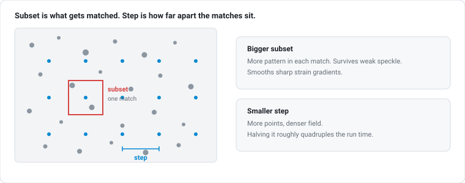

The app recommends a subset from **your** reference image, using the SSSIG model
of Pan et al. (Opt. Express 16(10), 2008): displacement error scales as
1/√SSSIG, so it grows the subset until the gradient content clears the threshold
for 0.007 px accuracy, sampled on a 4×4 grid and taken as the median.

It is a starting point. Touch the slider and it stops tracking the image.
**Reset** brings it back.

### Strain window and VSG

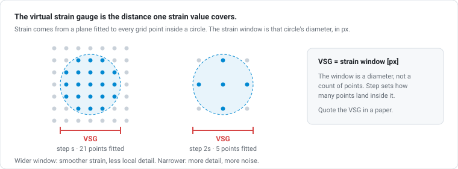

```
VSG = (strain window − 1) × step + 1     [px]
```

Quote the VSG, not the window: it is the distance one strain value actually
covers. The sweep varies the **window** and reports the resulting VSG per node —
the window is the knob, the VSG is the number you publish.

### Kernel

Sub-pixel interpolation. Leave it on 4×4 Bicubic unless interpolation bias is
your subject.

### Max frames

In Settings, not here. 10–150, default 50. Caps frames per analysis.

---

## 6. Region of interest

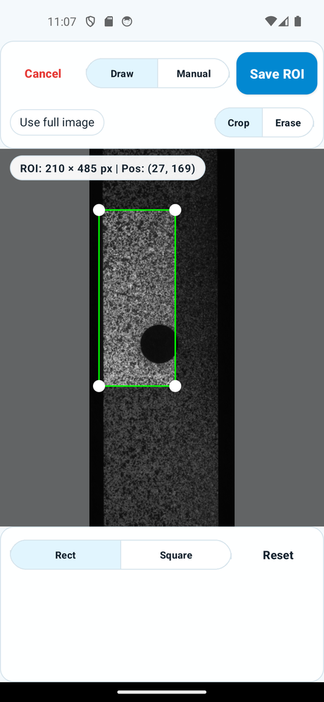

**Draw** — pick Rect or Square, drag on the image. Drag inside to move, corners
to resize. The HUD gives size and position live.

**Manual** — type X, Y, W, H and Apply.

**Crop / Erase** — Crop sets the area to correlate. Erase punches holes in it,
for grips, fiducials or anything that will decorrelate. Add as many as you need.

| Button | Does |
|---|---|
| **Save ROI** | Keeps it, returns to step 2 |
| **Use full image** | Saves the whole frame |
| **Reset** | Clears the canvas |
| **Cancel** | Discards — back to full image |

An ROI smaller than the subset will not run.

---

## 7. Sweeps

### Why

Strain is a derivative, so its size depends on how much you smooth. Small VSG:
peak strain rises, noise rises. Large VSG: peak gets flattened. A sweep shows
where your answer stops depending on the setting — the convergence argument the
Good Practices Guide asks for (Tip 5.4).

A sweep uses **one** deformed frame.

### Setting it up (step 3)

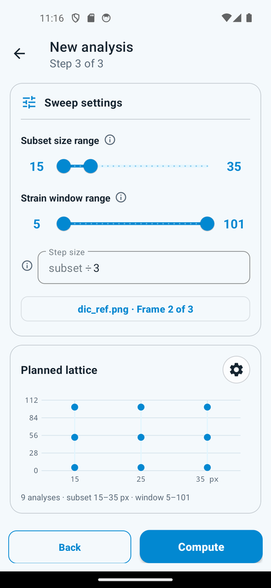

| Control | Range |
|---|---|
| Subset range | 15–121, odd |
| Strain window range | 5–101, odd — min and max, the sweep's y axis |
| Step denominator | 2–9 — step is `subset ÷ n`, never below 1 px |
| Samples | 1–8 per axis |
| Frame to sweep | radio list + number + preview |

Runtime is the product of the two sample counts. 8 × 8 is 64 solves. Start at
3 × 3.

The sweep varies the **strain window** directly, not the VSG. VSG is still what
you quote — it is shown per node and in the settings sheet — but it is derived
(`(window − 1) × step + 1`), so two combinations with different steps can share a
window and land on different VSGs. Sweeping the window is what makes the axis
mean one thing.

The lattice preview on this step is **inert** — taps do nothing until it has
run. The coach mark points it out on a first visit.

### Reading the result lattice

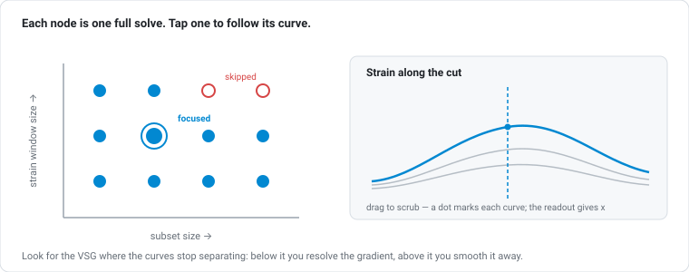

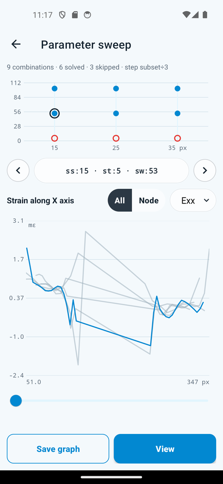

| | |
|---|---|
| Filled dot | Solved |
| Hollow red ring | Skipped — tap it and the reason names the combination and what went wrong |

- **Tap** a node — its curve is highlighted, the rest fade.
- **Double-tap** or **long-press** — opens that result.
- **Drag across the plot** — a guide follows your finger and the readout gives
  `(x, y)` for every curve, so you can compare combinations at one position.
- The **Exx / Eyy / Exy** selector switches component.

Look for the VSG where the curves stop separating.

---

## 8. Reading results

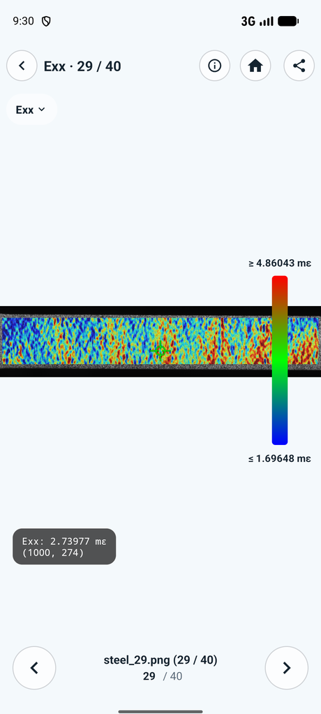

Tabs switch field. Pinch to zoom (~10×), drag to pan; both survive a field
change. The strip under the image gives max, min and mean.

**Colour scale.** Auto by default — which rescales every frame separately, so
frames are *not* comparable by eye. Tap the bar to set fixed min/max. Bounds are
remembered per field. **Auto scale** releases them.

**Tools.**

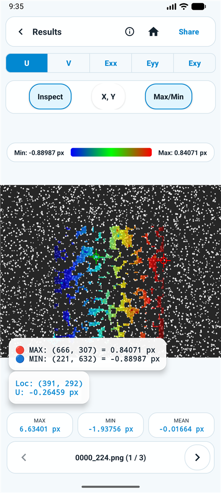

Above: Inspect and Max/Min on together — the probe card gives the point under
your finger, the other card gives both extrema with their coordinates.

| Tool | Does |
|---|---|
| **Inspect** | Tap or drag to probe; HUD gives location and value. Says so outside the correlated area |
| **X, Y** | Jump the probe to typed coordinates — same point across frames |
| **Max/Min** | Marks both extrema with values and positions |

**The summary comes first.** The viewer opens on a looping animation of the
whole sequence in the current field — every frame, never longer than 10 seconds,
about 300 ms a frame until the frame count forces it faster. **Next** enters the
frames; **Prev** on frame 1 comes back to it. Switching field rebuilds it in that
field.

Unlike scrubbing, the animation puts **every frame on one colour scale** — the
range that covers the whole sequence, shown in the labels beside it. That is the
point of it: on the per-frame auto scale, a frame late in a test can look exactly
like an early one. If you have set a fixed scale for a field, the animation uses
that instead.

(Animation playback needs Android 9 or newer. Below that you get the first frame
and a note; the GIFs still export.)

**Frames.** Prev / Next step through; the counter shows the filename and
`(i / N)`. Type a number in the small field under it and press Go to jump
straight to that frame — useful at 150 frames. Anything out of range leaves you
where you are. On a sweep each frame is a parameter combination, labelled like
`S15 · St5 · W13 · VSG 61`.

### Settings used

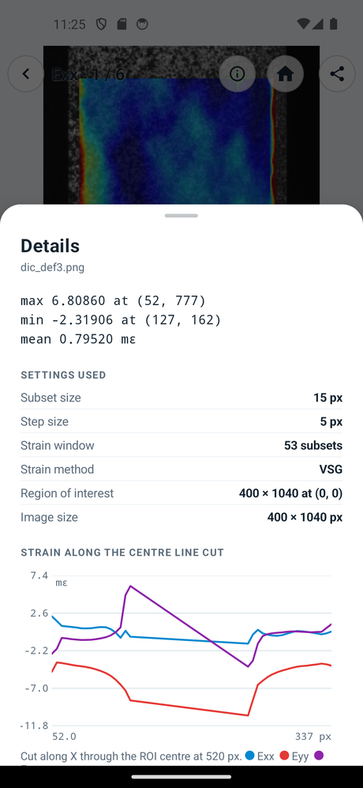

The ⓘ button. Everything the result was computed with — and on a sweep, the VSG
plus the line-cut plot. Note `(13 − 1) × 5 + 1 = 61 px`, the VSG relation from
[§5](#5-parameters).

**Changing settings later never changes an old result.** This sheet is your
provenance record.

---

## 9. Exports

**Share** gives six targets. Every chooser offers **Save to Files**.

| Export | Contents |
|---|---|
| Result photo | One PNG: current field and frame, annotated, full resolution |
| All field photos | Five PNGs for this frame, zipped |
| Field animations (GIF) | Five looping GIFs — one per field, every frame, each on its own whole-sequence scale — zipped |
| PDF report | Every frame, plus a telemetry page |
| CSV data | `x_px,y_px,u_px,v_px,exx,eyy,exy,znssd` — sweeps add subset, step, window |
| Everything (.zip) | Raw photos + animations + all fields + CSV + PDF |

The animations are shared as a set, not one at a time — they are only comparable
because they share a scale, and the set is what carries that.

Build on the **CSV**. Coordinates are image pixels, displacements pixels,
strains scientific notation. `znssd` is the match residual — filter on it to drop
badly correlated points. Number formatting is locale-independent.

For a paper, export **Everything** and keep it with your raw images. Inputs,
fields and parameters in one archive is what makes the result reproducible.

---

## 10. Managing analyses

Long-press a row to select. Pencil renames (one row only), bin deletes.

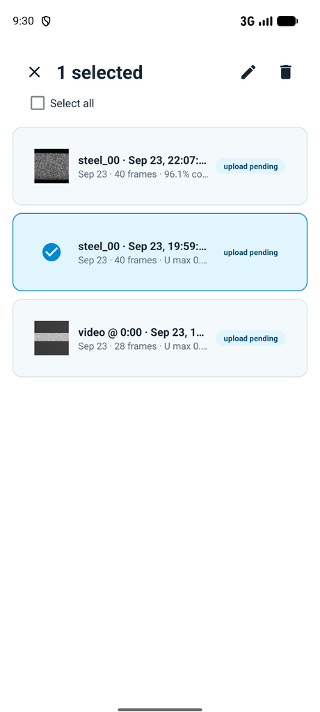

**What delete does depends on whether there is a cloud copy.** With none, it
goes from the phone and that is that:

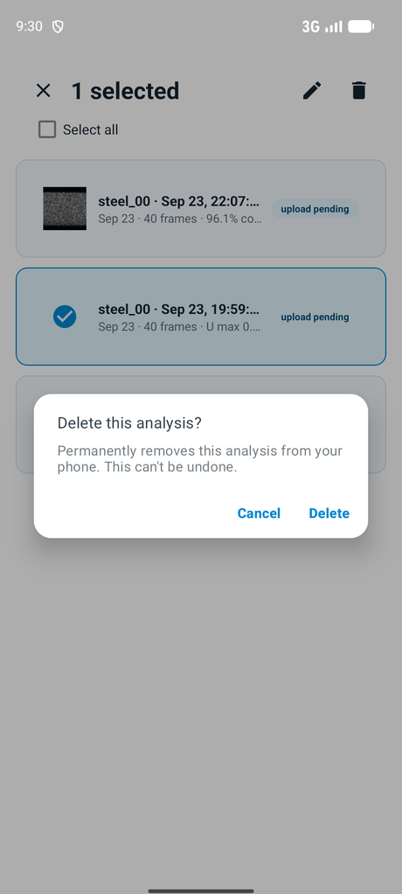

With a backup you are asked *where* instead — **on this device only**, keeping
the backup, or **everywhere**. Read that dialog before tapping.

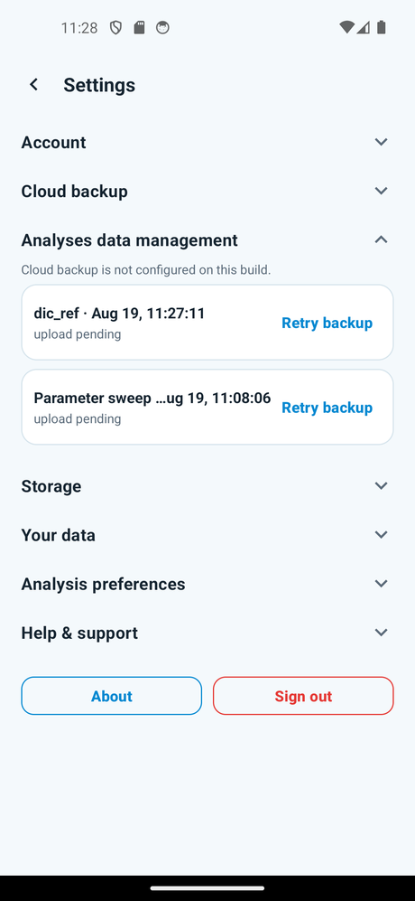

**Cloud backup**: turn it on and it offers to back up what is already
local. **Wi-Fi only** holds uploads until Wi-Fi. **Analyses data management**
lists local and cloud together — back up, restore or delete per row. A deleted
backup has a **5-second Undo**.

**No notifications exist.** Background uploads and restores report nothing until
you come back.

**Deleting your account** (Settings → Your data) asks you to confirm your
identity first, on the sign-in screen itself — whichever way you normally sign
in: password, Google, or an emailed link. Your address is filled in and cannot be
changed; you are proving *this* account. Back out and nothing happens. Once
confirmed it erases the cloud copy, this device, and the sign-in itself, and
signs you out. If the cloud cannot be reached nothing is deleted at all.

**Quota.** The Home chip reads `Using N of M analyses` and turns red at the cap.
Not a paywall — email support from the limit screen, or delete something and
tap **Re-check**.

**Help & support** is the last section. It shows `support@indicvision.com` —
selectable, so you can copy it if this device has no mail app — and **Email
support**, which opens a mail already carrying your account, device ID, app
version and phone model. Write above that block; leave it in place.

---

## 11. Troubleshooting

| Symptom | Cause |
|---|---|
| Run blocked, size message | A frame differs in pixel size from the reference |
| **Next** off on step 1 | Missing the reference or all deformed frames |
| "ROI too small" | ROI smaller than the subset — enlarge it or shrink the subset |
| Engine failure: feature detection | The pair could not be correlated. Pattern, or wrong pair |
| Engine failure: ROI | Region too small or fully masked |
| Low-texture warning | Weak speckle for this region |
| Sweep skipped nodes | Those combinations don't fit — usually big subsets in a small ROI. Tap a hollow node for its reason |
| Run stopped itself partway | Convergence fell below 50% twice running — the pair has decorrelated. The message names the frame, and the frames before it are kept |
| Sweep ended early | Same rule: two combinations under 50% and it stops rather than sweep the rest |
| Password rejected on sign-up | 8+ chars, upper and lower case, a digit and a special character — or tap **Generate secure password** |
| Only the first N frames | *Max frames* capped it |
| Frames in the wrong order | Sort on step 1, then re-run |
| Run vanished | The app was killed. No resume — run it again in the foreground |
| Frames look incomparable | Auto colour scale. Fix the bounds, or use the summary animation — it already puts them on one |
| Summary still says "Rendering" | A long analysis takes a while to render five fields; the frames are usable meanwhile |
| Summary shows one frame, not a loop | Android 8 or older. The exported GIFs still animate |
| Delete account opens the sign-in screen | Expected — that is where your identity is confirmed |
| Badge stuck on Pending | Offline, Wi-Fi-only, or backup off |
| Still pending approval | Tap **Check status** — it never polls |
| Sign-in refused after signing up | Open the verification link in your email, then try again |
| Nothing here matches | **Settings → Help & support → Email support** — the mail carries your account, device and build, so quote nothing |

---

<!-- ## 12. Limits

- An interrupted run is lost. No resume.
- No notifications for background work.
- No spatial calibration — pixels only.
- Coach marks show once and cannot be replayed.
- Approval never polls.
- No privacy policy, terms or licences screen.
- ROI shapes are rectangle and square only. -->

---

## Appendix A — Parameters

| Parameter | Range | Default | Raise when | Lower when |
|---|---|---|---|---|
| Subset | 15–121, odd | Recommended | Speckle is weak; correlation fails | You need resolution across a sharp gradient |
| Step | 1–30 | 5 | Runtime matters | You need a denser field |
| Strain window | 5–101, odd | 15 | Strain is noisy | Detail is being smoothed away |
| Kernel | 4×4 / 6×6 | 4×4 Bicubic | Studying interpolation bias | — |
| Max frames | 10–150 | 50 | Long sequences | Runs are killed for memory |
| Sweep subset range | 15–121, odd | Around recommended | — | — |
| Sweep strain window range | 5–101, odd | 5–101 | Strain is noisy | Detail is being smoothed away |
| Step denominator | 2–9 | — | Denser correlation | Faster runs |
| Samples | 1–8 per axis | 3 | Finer detail | Runtime is the product |

`VSG = (strain window − 1) × step + 1`

## Appendix B — Glossary

| Term | Meaning here |
|---|---|
| Reference | The undeformed frame everything is matched against |
| Deformed frame | One load step |
| Subset | The pixel window matched at each point |
| Step | Spacing between grid points |
| Strain window | Points fitted to get strain from displacement |
| VSG | Virtual strain gauge — what one strain value covers, in px |
| ROI | Region of interest, optionally with erased holes |
| SSSIG | Sum of squared subset intensity gradients — drives the subset recommendation |
| ZNSSD | Correlation residual, one per point, in the CSV |
| mε | Millistrain |
| Sweep | One frame solved across a lattice of subset × VSG |

## Appendix C — Administrators

Admin accounts get **Settings → Account → Pending access requests**: everyone
waiting, with **Approve** and **Deny**. Approved users get in when they next tap
**Check status** — they are not notified, so tell them.

You do not have to watch that list. The backend emails `support@indicvision.com`
the moment an account is created pending, naming the account and its user id,
with both ways to approve it. One mail per account, at creation — approving,
denying or signing in again sends nothing further. If no mail arrives, check the
`NOTIFY_FROM` / `RESEND_API_KEY` settings on the service: unconfigured, the
backend sends nothing and says nothing, and the pending list is your only signal.
