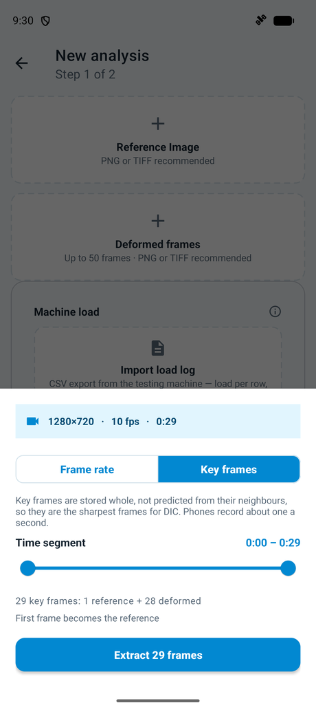
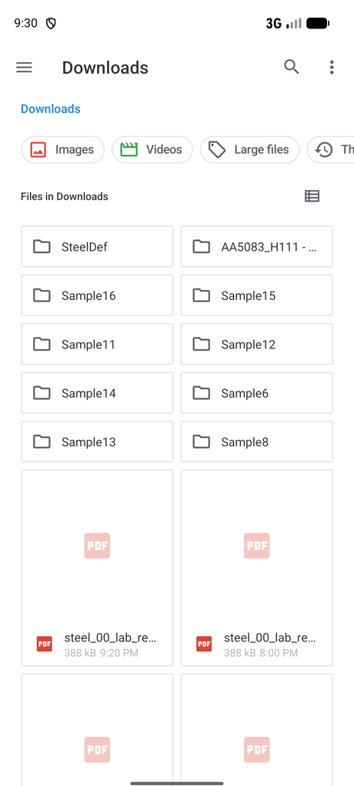

# Material Testing operating manual

How to go from photos of a speckled specimen to E, a lab report and full-field strain.
Before this:
- **Lighting and rig stability** are covered in [app/NOISE_FLOOR_STRAIN_ACCURACY.md](app/NOISE_FLOOR_STRAIN_ACCURACY.md).
- **Speckle paint, cameras and wider DIC practice** are in the iDICs *Good Practices Guide*.

| | |
|---|---|
| [1. What it does](#1-what-it-does) | [7. Region of interest](#7-region-of-interest) |
| [2. Lab tests](#2-lab-tests) | [8. Parameter sweeps](#8-parameter-sweeps) |
| [3. Getting in](#3-getting-in) | [9. Reading results](#9-reading-results) |
| [4. Images it accepts](#4-images-it-accepts) | [10. Exports](#10-exports) |
| [5. Running an analysis](#5-running-an-analysis) | [11. Managing analyses](#11-managing-analyses) |
| [6. Parameters](#6-parameters) | [12. Troubleshooting](#12-troubleshooting) |

Screenshots: light theme, captured on 2026-09-23 ([images/CAPTURE_CHECKLIST.md](images/CAPTURE_CHECKLIST.md)).

---

## 1. What it does

You give it one reference frame and N deformed frames. It gives you five fields for each frame.


| Field | Unit |
|---|---|
| **U**, **V**: displacement | px |
| **Exx**, **Eyy**, **Exy**: strain | mε (millistrain) |

- **Pixels, not mm.** The exception is bending: your two taps on the beam's thickness
  give mm per px for the deflection and E. The heatmaps stay in pixels.
- **Everything runs on the phone.** Cloud backup stores the results only.

---

## 2. Lab tests

**+** asks which test it is. That choice decides what the wizard asks for, and you make it once per analysis.


Formulas, accuracy and worked numbers: [app/STUDENT_LAB_WORKFLOW.md](app/STUDENT_LAB_WORKFLOW.md).

### Tensile: stress–strain and E

<p>


</p>

1. **Photos.** Pick the reference (no load), then the loaded photos, or a video.
2. **Load log.** The machine's CSV with one load per row, in N or kN. With photos, a log that matches the frame count is paired in order.
   With a video, a timed log is matched by time: a frame takes a row within 100 ms, or has no load.
3. **Cross-section** in mm², and the **strain axis** (the pulling direction in the photo).
4. Set the ROI on the gauge section and tap **Compute** (§5).

**Results** is the first page of the viewer. It shows:
- the curve;
- **E** from the straight part (the frames used and R²);
- the peak stress.

The lab report's table adds **Extension (px)**, measured between the two ends of the analysed region. A "—" means one end has left the view.

### Bending: load–deflection and E

<p>


</p>

1. **Video** of the beam's side face at mid-span, filmed from a tripod. Extract at **1 fps**, or take its **Key frames** (§4).
2. **Timed load log** (`time, load`). Frames are matched to it by time. If the log started later than the video,
   put the gap in **Log started after the first frame**, in seconds (negative if the log started first).
   Hanger mass in kg × 9.81 = load in N.
3. **Span, width and thickness** in mm.
4. **Beam height → Set.** Double-tap to zoom, then tap the top edge and then the bottom edge right under the load.
   The readout gives mm/px. Under 40 px a 1 px slip moves E by several percent, so zoom in or film closer.
5. ROI on the beam, then **Compute**.

In **Results**:
- **E from the graph** (the slope of W against δ) is the number to trust.
- The average of the per-step E includes any movement of the whole beam.
- Unloaded frames are dropped. Frames at the same hanger load become one load step.

### The lab report

**Share → Lab report (PDF)** fills in the handwritten report's layout.
Blank lines are left where the app has no value, such as the final diameter, name and date.


### 2D DIC: the fields only

Pick **2D DIC** when you only want the displacement and strain maps, with no load log and no specimen size.
The wizard has no load card; pick the photos, set the ROI and tap **Compute** (§5).
The analysis is saved as a plain DIC analysis: no **Results** page, no lab report, and no **Test type** row in ⓘ.

---

## 3. Getting in


| | |
|---|---|
| **Sign in** | Google or email. Accounts need **approval**. Support is emailed automatically; tap **Check status** later (the app never polls) |
| **Email sign-up** | Open the verification link first; until then sign-in is refused and a fresh link is sent |
| **Passwords** | 8+ characters: upper and lower case, a digit and a symbol. **Generate secure password** makes one. **Forgot password** resets inside the app |
| **Offline** | Import, solve and read all work once this device has been approved. Uploads wait |
| **Crash reports** | Off until you say yes. Change it in **Settings → Your data** |

**Home:**
- **Tap** a row to open it.
- **Long-press** to rename or delete.
- **Pull down** to sync.
- **+** starts a new analysis. There is no in-app camera; the app measures photos you already have.

---

## 4. Images it accepts

| Rule | If broken |
|---|---|
| Every frame the same pixel size as the reference | Blocking error |
| One reference and at least one deformed frame | **Next** stays off |
| At most *Max frames* (default 50, set in Settings) | The extras are dropped, with a toast |

- **Formats.**
  - PNG and TIFF are best.
  - JPEG works, but it warns that compression costs accuracy.
  - RAW and DNG come in **only through Files**.
- **Video.** Pick one, then the time segment and either:
  - **Frame rate:** frames evenly at the rate you choose;
  - **Key frames:** the encoder's own key frames, which are stored whole and are the sharpest input for DIC. Shown when the file marks two or more.

  The frame count updates as you go, and the first frame becomes the reference.



---

## 5. Running an analysis


### Step 1: frames (and loads)

<p>


</p>

- **Images** is your gallery, with videos badged. The first time, it asks for media permission.
- **Files** is the system browser, and it needs no permission. It's the only way in for RAW and DNG.
  For many frames: long-press one file, then **⋮ → Select all**.
- **Speckle chip.** The app measures the speckle as soon as the reference loads. Outside 3–9 px you get a chip.
  It's advice, not a block: the fix is a different photo. Before an ROI is set, the dark background can inflate the reading.
  Step 2 re-measures inside the ROI.

**The badge order is the analysis order.** The sort icon changes it:


| Sort | Use when |
|---|---|
| Name A–Z / Z–A | The filenames carry the sequence |
| Date oldest / newest | The filenames don't (uses capture time, then EXIF) |
| Manual | Neither works, so drag the thumbnails |

### Step 2: settings


- **Single** solves every frame once. **Sweep** solves one frame many times (§8).
- **Region of interest.** **Edit** opens the editor (§7).
- **Parameters** (§6). The subset is suggested from your speckle.
  - A chip under the slider names a bigger subset if the current one spans fewer than three speckles.
  - **Paste params** fills in a combination copied from a sweep.

### While it runs


- **Cancel** stops within a moment, and nothing is kept.
- **Keep the app open.** There is no resume.
- **Decorrelation stops the run.** Two frames in a row under 50% convergence end it. The frames before that are kept and saved, and the reason is recorded on Home and in ⓘ.

| Result | You land on |
|---|---|
| Tensile or bending | **Results** (curve or graph), then › through the frames |
| 2D DIC, or an older analysis with no test type | The looping summary, then the frames |
| Sweep | The result lattice |
| Engine failed | A dialog naming the cause, the frame and the image |

Re-running the same inputs updates the same analysis. Different inputs make a new one.

---

## 6. Parameters


| Parameter | Range | Reset to | Raise when | Lower when |
|---|---|---|---|---|
| Subset | 15–121, odd | Suggested | Correlation fails, speckle is weak | You need detail across a gradient |
| Step | 1 to min(30, subset/2) | 5 | Runtime matters | You need a denser field |
| Overlap | 0.50–0.99 = 1 − step/subset | Follows step | — | — |
| Strain window | 3–31 points, odd | 5 points; bending 9 | Strain is noisy | Detail is being smoothed away |
| Kernel | 4×4 Bicubic / 6×6 Keys | 4×4 | You are studying interpolation bias | — |

- **The suggested subset** follows the SSSIG criterion (Pan et al. 2008). It's the median over a 4×4 grid, sized to reach 0.007 px.
  It stops following the image once you touch the slider. **Reset** brings it back.
- **The strain window is a count of data points.** The virtual strain gauge (VSG) is the
  distance it covers, in px, shown under the slider as you change the window or the step.
  Strain is a plane fitted to every point within (window − 1) / 2 steps of the centre, so the
  same window covers more pixels at a coarser step. Quote the VSG, not the window, in a paper.
  Sessions from before the window was counted in points show their VSG alone.


```
VSG = (strain window − 1) × step + 1     [px]
```

---

## 7. Region of interest


| Control | Does |
|---|---|
| **Draw** (Rect / Square) | Drag to draw. Drag inside to move, drag a corner to resize |
| **Manual** | Type X, Y, W and H, then tap **Apply** |
| **Crop / Erase** | Crop sets the area to solve. Erase cuts holes (grips, marks) |
| **Save ROI** / **Use full image** / **Reset** / **Cancel** | Keep it / whole frame / clear / discard |

An ROI smaller than the subset won't run.

---

## 8. Parameter sweeps

Strain depends on how much you smooth. A sweep solves **one** frame over a lattice of subset × strain window.
It shows you where the answer stops changing (Good Practices Guide, Tip 5.4).

<p>


</p>

- **Set up:** ranges on step 2, and step = subset ÷ N (N 2–9, default 3).
  Samples per axis (1–8) are on step 3. Runtime is the product, so start at 3 × 3.
- **Lattice:**
  - a filled dot is solved; a hollow red ring was skipped (tap it for the reason);
  - **‹ ›** walks the nodes;
  - double-tap or long-press opens that result.
- **Plot:**
  - **All / Node** chooses how many curves are drawn;
  - drag or the slider reads values;
  - pinch zooms, and double-tap resets.
- **Taking it with you:**
  - double-tap the parameter chip to copy the combination, then **Paste params** in a new single run;
  - **Save graph** shares a PNG.

Pick the VSG where the curves stop separating.

---

## 9. Reading results

<p>


</p>

| Gesture | Does |
|---|---|
| Field pill (U V Exx Eyy Exy) | Switches field. Zoom and probe stay |
| Pinch / drag / double-tap | Zoom (~10×) / pan / zoom or reset |
| Tap | Probe: a crosshair and the value at the nearest point |
| ‹ › or type a number | Step or jump to a frame |
| Tap the colour bar | Fix min/max for each field. **Auto scale** undoes it |

- **The colour scale** clamps at this frame's 2nd and 98th percentiles, hence "≤" and "≥". The true extremes are in ⓘ.
- **ⓘ** shows:
  - max, min and mean, and a histogram of every accepted point;
  - every setting used, the loads and stress for typed tests, and the Results block.
- **ⓘ is your provenance.** Changing settings later never changes an old result.

---

## 10. Exports


Every export ends at **Save to Files** (a folder you pick) or **Share**. Files are named after the analysis.
Long exports carry on in the background.

| Export | Contents |
|---|---|
| **Lab report (PDF)** | Tensile and bending: the write-up in the lab journal's layout (§2) |
| Single Field | This field and frame as a PNG |
| All fields | This frame's five PNGs, zipped |
| Animations | Five looping GIFs on one scale for the whole sequence |
| PDF report | Every frame, a telemetry page, and the stress–strain or load–deflection page |
| CSV data | `image,x_px,y_px,u_px,v_px,exx,eyy,exy,znssd`, plus `#` lines with loads, E and the load steps |
| Everything (.zip) | Photos, fields, CSV, PDF and GIFs |

**For a paper, keep the Everything zip with your raw images.** In the CSV, filter on `znssd` to drop poorly matched points.

---

## 11. Managing analyses

<p>


</p>

- **Select:** long-press a row. The pencil renames and the bin deletes. When every selected
  row is **Only in cloud**, the cloud button restores them all at once.
- **Delete with a cloud copy** asks where to delete from: **Delete from this phone**,
  **Delete the cloud backup** or **Delete everywhere**. A phone-only delete leaves an
  **Only in cloud** row; tap it and choose **Restore**, and it restores in the background.
- **Backups not on this phone** (a new phone, or a reinstall): a card above the list offers
  them. **Restore** lists them all ticked; **Hide** puts the card away until a new backup
  appears. Demo accounts have no cloud backup, so never see it.

| Settings section | Holds |
|---|---|
| **Cloud backup** | On/off and Wi-Fi only |
| **Analyses data management** | Local and cloud rows: **Download** (zip to a folder), **Restore** (when the local frames are missing), **Delete** (5 s Undo) |
| **Storage** | **Free up space** (drops frames that are backed up), **Clear cache**, and an **auto-free budget** (0–64 GB) |
| **Your data** | Crash reports and analytics (off by default), **Export my data**, cloud data download, **Delete account** (confirm who you are first) |
| **Analysis preferences** | Max frames (10–150): a ceiling on imported and video frames |
| **Help & support** | The manual, feedback, support email (carries device and build) |

- **Transfers keep going when you leave the screen.** A permanent failure shows a dialog with **Try again**.
- **Quota:** the Home chip reads `N / M analyses used` and turns red at the cap. Email support, or delete an analysis and tap **Re-check**.

---

## 12. Troubleshooting

| Symptom | Cause, fix |
|---|---|
| **Next** off on step 1 | The line above **Next** says what's missing (frames, load log, area, dimensions, load point) |
| No E, or E ≤ 0 | Wrong strain axis, or no straight early part. Check the axis and the load units |
| Bending E far off | Too few pixels across the thickness, taps not on the edges, or the log offset is wrong |
| Load rows don't match frames | Time match: set **Log started after the first frame**; log at ≥ 10 rows/s so each frame has a row within 100 ms. Photos: one row per frame |
| Extension "—" in the report | One end of the region left the view on that frame |
| Size error | A frame differs in pixel size from the reference |
| "ROI too small" | The ROI is smaller than the subset |
| Engine failure | Feature detection: the pair can't be matched. ROI: too small or fully erased |
| Run stopped partway | It decorrelated (two frames under 50%). The earlier frames are kept |
| Sweep nodes skipped | Big subsets in a small ROI. Tap the hollow node |
| Only the first N frames | *Max frames* capped the run |
| Run vanished | The app was killed. Re-run it in the foreground |
| Summary shows one frame | Android 8 or older. The GIFs still export |
| Badge stuck Pending / Failed | Offline, Wi-Fi only, or backup off / tap it for the reason and **Try again** |
| Row says "Only in cloud" | Its frames were freed. Tap it and choose **Restore** |
| Still pending approval | Tap **Check status** |
| Nothing here matches | **Settings → Help & support** |

---

## Appendix A — Parameters

| Parameter | Range | Default |
|---|---|---|
| Subset | 15–121, odd | Suggested |
| Step | 1–30 | 5 |
| Strain window | 3–31 points, odd | 5; bending 9 |
| Kernel | 4×4 / 6×6 | 4×4 Bicubic |
| Max frames | 10–150 | 50 |
| Sweep step denominator | 2–9 | 3 |
| Sweep samples | 1–8 per axis | 3 |

`VSG = (strain window − 1) × step + 1` (px; window in points)

## Appendix B — Glossary

| Term | Meaning here |
|---|---|
| Reference | The unloaded frame everything is matched against |
| Deformed frame | One load step |
| Subset / Step | The window matched at each point / the spacing between points |
| Strain window / VSG | The window is a count of data points; the VSG is the distance it covers, `(window − 1) × step + 1` px, the diameter of the circle of points fitted for one strain value |
| ROI | Region of interest, with optional erased holes |
| SSSIG | The sum of squared subset intensity gradients, which drives the suggested subset |
| ZNSSD | The match residual (0 is perfect; ≤ 0.15 accepted) |
| mε | Millistrain |
| E | Young's modulus: the slope of stress against strain, or from the load–deflection slope for a beam |
| σb | Bending stress M·y/I |
| Load step | Consecutive frames at the same hanger load, averaged into one row |

## Appendix C — Administrators

Admin accounts get **Settings → Account → Pending access requests**: everyone
waiting, with **Approve** and **Deny**. Approved users get in when they next tap
**Check status** — they are not notified, so tell them.

You do not have to watch that list. The backend emails `support@sempermechanics.com`
the moment an account is created pending, naming the account and its user id,
with both ways to approve it. One mail per account, at creation — approving,
denying or signing in again sends nothing further. If no mail arrives, check the
`NOTIFY_FROM` / `RESEND_API_KEY` settings on the service: unconfigured, the
backend sends nothing and says nothing, and the pending list is your only signal.

## Appendix D — Licensing (demo / individual / institution)

Every account is **Demo** (25 saved analyses, no share, no backup/restore
*feature*) until a licensed key is activated. A demo account's analyses are
still **recorded** — images and results upload and are stored exactly as a
licensed account's are — but the app shows demo no sync badge, banner or
Settings backup section, and the backend refuses demo retrieval (`/content`,
bundle → `feature_not_licensed`). Recording is open so that installed builds
predating licensing keep backing up after the backend deploy; a licence turns
retrieval on with nothing to re-upload. There is no billing anywhere in
the product — a licensed key is issued by Semper staff or, for an
institution, self-served by that institution's own IT once Semper staff mint
the institution key. There is **no in-app screen to type a key in yet** in this
release; activation goes through the backend API
(`POST /v1/licenses/activate`) directly. See
[CLOUD_ARCHITECTURE_GCP.md §20](backend/CLOUD_ARCHITECTURE_GCP.md#20-licensing--entitlements)
for the full design; this appendix is the day-to-day operator/support version.

**Minting a key** (Semper staff, device-attested — same admin device that
approves/revokes accounts):

- **Individual**: `POST /v1/admin/licenses` with an `emailLock`. Minting also
  records a pending invite against that address, and **that is the delivery**:
  the customer signs in with it and the licence attaches on their first
  request. If that address **already has an approved, verified account** — a
  demo user, or an account from before licensing — the licence attaches
  immediately at mint time instead; the response carries `claimedByUid`, and
  the system demo key is dropped. It binds to the first device they sign in
  on, and stays on that device.
- **One licence per person.** An address that already holds or is promised a
  live licence — its own, an institution seat, or a pending invite — is
  refused with `409 email_already_licensed: <licence id>`, and the desk shows
  that licence. To renew, use Edit on it; to replace it, revoke it first, then
  mint. A revoked licence, one past its grace, and the Demo key do not count.
  The same rule refuses a key typed in the app (`409 already_licensed`) and an
  IT roster add (`409 member_already_licensed`). To change the person's
  device, use **New device** on their licence — never a second licence.
  `backend/scripts/find_duplicate_licences.py --project <id>` lists anyone
  who got two before the rule existed. Nothing is sent to them and nothing is typed. `deviceIdLock` is
  still accepted for the rare case where the device is known up front, but
  normal issuing leaves it empty.
- **Institution**: `POST /v1/admin/licenses` with `kind: "institution"`, a
  `domainLock` (the institution's email domain), the `adminEmails` of the
  people at that institution who will manage seats, and an optional
  `maxSeats`. Anyone at that institution with a **verified** email on the
  domain can then activate the same key and claim a seat, up to `maxSeats`.

**Perpetual or timed.** Either kind of key is one or the other, set by
`duration` at mint:

- `duration: "perpetual"` (the default) — never expires. Do **not** send
  `expiresAt`; the request is rejected if you do, so a perpetual key cannot
  silently acquire an expiry.
- `duration: "timed"` — requires a future `expiresAt`. Add `graceDays` to say
  how long it keeps working past that date (omitted uses the fleet default of
  14; `0` is a hard cliff).

`supportUntil` may be set on either and is recorded for support's benefit
only — it never stops anyone using the product.

**What grace means.** During grace the account keeps *everything*: cloud
backup, share, the licensed analysis ceiling. The user sees a notice on Home
saying a renewal is overdue, and nothing else changes. It exists so a renewal
being processed does not interrupt someone mid-project. Entitlement stops at
`expiresAt + graceDays`, at which point the account drops to Demo — which, as
always, never deletes anything.

**Renewing a key** (Semper staff, device-attested):

```
PATCH /v1/admin/licenses/{licenseId}
{"expiresAt": "2027-06-01T00:00:00Z", "graceDays": 30}
```

This extends the key **in place**. Everyone already on it — the individual
holder, or every non-revoked institution seat — is re-entitled without issuing
a new key or asking anyone to re-activate. Send only the fields that change;
`maxSeats`, `maxAnalyses`, `supportUntil` and `note` can be edited the same
way. A `maxSeats` below the members already on an assigned institution roster
is refused (`422 max_seats_below_used`) — it would remove nobody and only make
the count read "12 of 10"; remove members first. A floating licence's pool may
be smaller than its roster. On the desk every one of these is the row's
**Edit** dialog, which sends only what changed.

**Upgrades and downgrades in place.** On an institution licence, `seating`
switches between assigned and floating (floating needs `maxSeats`; assigned
needs `maxSeats` to cover the roster, and clears every lease), and
`adminEmails` replaces the IT contacts. `perpetual: true` removes the end
date. What you cannot change is who the key is *for*: `kind` and the
email/device/domain locks are fixed at mint — except **To institution**
(`POST /v1/admin/licenses/{licenseId}/convert` with `domainLock`,
`adminEmails`, `maxSeats`, `seating`): a new institution key carrying the
individual licence's terms, the holder moved onto its roster on the same
device, and the individual licence revoked and marked replaced. The holder's
address must be on the domain. The new key is shown once.

A new `expiresAt` must normally be **later** than the one in force. The
request is refused with `422` and nothing changes if the date has already
passed (`expiry_in_past`), is earlier than the current expiry
(`expiry_before_current`), or the key is perpetual (`license_perpetual`). A
**downgrade** agreed with the customer — an earlier end, or an end on a
perpetual key — is sent with `"allowShorten": true`; the desk asks for the key
to be typed first. A past date is refused even then: to end a key now, revoke
it. The operator desk reports the expiry the server stored.

**`maxAnalyses` is per person, not per licence**, and is normally left empty:
empty gives every holder the licensed default (`LICENSED_MAX_SESSIONS_PER_USER`,
999). On the operator desk it is "Cloud analyses per person", and the table's
"Analyses / person" column shows it. A value below the demo allowance
(`DEMO_MAX_ANALYSES`, 25) is refused, and the backend floors any older one at
that allowance. To remove a cap, empty "Cloud analyses per person" in the
row's **Edit** dialog, or:

```
PATCH /v1/admin/licenses/{licenseId}
{"clearMaxAnalyses": true}
```

**A demo key has no cap to set.** Every account gets a system-minted demo key
(`createdByUid: "system"`, `mode: "demo"`), and a demo holder gets the demo
allowance (`DEMO_MAX_ANALYSES`, 25) whatever the key stores
(`resolve_user_config` reads a licence cap only for a licensed account). A
`maxAnalyses` on a demo key is refused with `422 cap_on_demo_key` and nothing
changes. On the desk a demo row's **Edit** dialog has the field disabled and its
"Analyses / person" column reads "demo (25)". To give that person more
analyses, issue them a licensed key. `clearMaxAnalyses` is still accepted on a
demo key; use it to remove a cap stored before this refusal existed, which
never applied (SEMP-8AKN, set to 100 on 2026-09-25, is one).

Renewing is also the fix when someone reports being dropped to Demo
unexpectedly — check the key's `expiresAt` in `GET /v1/admin/licenses` first;
an account past `expiresAt + graceDays` is the expected outcome, not a bug.

**A key past its grace window will not activate.** `POST /v1/licenses/activate`
returns `403 license_expired` rather than appearing to succeed and leaving the
user on Demo. Renew it first, then have them activate. A key still *inside*
grace activates normally.

The plaintext key from an individual mint is shown once, in the mint response,
and Semper does not store it anywhere retrievable afterward (only its hash).
**Keep it; do not send it.** It exists for support recovery — re-attaching a
licence when the invite has been consumed but the account has lost it — not
for delivery. Institution keys are the same in reverse: membership is the
roster, so there is nothing to hand anyone.

**"I never got my licence."** Check `GET /v1/admin/licenses` for the address:
`status: "unused"` with an outstanding invite means it is waiting for them to
sign in, and the usual cause is that they signed in with a *different* address
than the one it was minted against — mint a new licence against the right one
and revoke the first. `status: "redeemed"` means it attached; if they are
still in Demo, the device lock is the next thing to check.

If minting reports the address is **already promised another licence**, the
new licence exists and its key still redeems it, but the invite belongs to the
earlier licence and the new one will not attach at sign-in. Revoke whichever
of the two is wrong, then mint the replacement: revoking withdraws that
licence's outstanding invites, which frees the address. Minting also recovers
by itself from an invite left behind by a licence that is already revoked or
deleted — such an invite promises nothing, since the claim discards it on
sight, so a fresh mint overwrites it.

**Assigned or floating seats.** An institution key is one or the other, set by
`seating` at mint:

- `seating: "assigned"` (the default) — every member of the roster is
  licensed, and `maxSeats` caps how many members there can be.
- `seating: "floating"` — every member is *eligible*, but `maxSeats` caps how
  many are licensed **at the same time**. The roster itself is uncapped, which
  is the point: fifty people in a lab can share ten seats. `maxSeats` is
  required for floating; an uncapped pool would never refuse anyone.

A floating member without a seat is in Demo, not blocked or removed. Their app
takes a seat when they start work and gives it back when they finish; a seat
also frees itself if their device goes quiet for 8 hours. If someone reports
being in Demo unexpectedly on a floating key, the pool being full is the first
thing to check — `GET .../seats` shows the roster, and the license summary
shows how many seats are in use.

**Adding people to an institution key.** IT adds members by email:

```
POST /v1/institutions/licenses/{licenseId}/seats
{"email": "student@university.edu"}
```

There is **no key for members to type**, and the person does **not** need an
account first. An address that already has one takes a seat immediately; an
address that does not becomes a pending invitation, redeemed by itself the
first time that person signs in. IT works from a list of addresses and cannot
make people sign up on cue, so the roster is built from the list you have.

The response says which of the two happened — exactly one of `seat` and
`invite` comes back — and the seats console labels an unclaimed place
*invited* rather than showing an error. An invitation holds no seat and counts
against nothing until it is claimed. On an assigned key a seat is licensed
immediately; on a floating one it makes the member eligible, and they take a
seat when they work.

The refusals worth recognising are `409 member_already_licensed` (that
person already holds, or is promised, a different live licence — one licence
per person; Semper staff move them), `409 invite_exists` (the address is
still invited to a different licence that has lapsed — withdraw that
invitation first) and `409 license_seats_exhausted` on an assigned key.
`503 claim_contended` is not a refusal: another request was claiming on the
same licence at that moment, and adding the member again succeeds.

An invitation to a full assigned key is not lost. The person signs in to Demo,
and within about 15 minutes of a seat freeing up their account claims it on
its own. The console counts pending invitations beside the seats taken.

**Hold and Resume** (`PATCH .../seats/{uid}` with `enabled`) work on a current
member only. A held seat keeps its place against the cap but gives up a
floating seat it was using. A removed member cannot be resumed (`409
seat_revoked`); add their address again instead, which takes a free seat.

**One address for everybody.** `sempermechanics.com/login` is the only web
address anyone needs — a customer, an IT contact, or Semper staff (it forwards
to `app.sempermechanics.com/login`, where the dashboards actually live). It signs
them in and forwards them to whichever dashboard is theirs: staff to the
operator console, an address named in a licence's `adminEmails` to that
roster, and everyone else to their own account page. Somebody who is both a
Semper operator and runs a licence gets a choice rather than a guess.

**Every user has an account page.** `/account` shows what the person holds —
mode, kind, key prefix, term, expiry and grace, whether they hold a floating
seat and until when — and how many analyses they have stored. From it they can
give a floating seat back, move their licence to a different device, and
download any stored analysis as one zip. The last two need a second factor;
the page offers to enrol an authenticator app if there is none. Point a
customer here before answering "am I licensed?" by hand.

**The seats console.** Institution IT can do all of the below from
`/console/institution` on the Semper auth site instead of curl — sign in with
the address named in `adminEmails`, paste the licence id, and the roster,
who currently holds a seat, and the add/hold/remove actions are all there. The
routes below are what it calls, and stay equally usable from a script.

Semper staff have `/console/operator`, which now does the whole job: issue an
individual or institution licence, extend a term, revoke a key, unbind a
licence or a seat from the device it is on, drive any institution's roster,
and approve accounts. It requires a **second factor** and
a sign-in from the last 15 minutes, because a browser cannot produce the device
attestation the phone path uses — the page walks you through enrolling an
authenticator app the first time. Revoking asks you to type the key prefix
before it will proceed. The phone admin screen still works exactly as before.

**Institution IT self-service.** Once an institution key exists, its `adminEmails`
manage seats themselves, with no Semper staff involvement — from the console
above, or by calling these routes directly (script, curl, or their own tooling):

| Need | Route |
|---|---|
| See who's activated, each seat's status, and who has been invited but not yet signed in | `GET /v1/institutions/licenses/{id}/seats` |
| Add someone by email — they do **not** need an account yet; an unknown address becomes a pending invitation, redeemed automatically at their first sign-in | `POST /v1/institutions/licenses/{id}/seats` `{"email": …}` |
| Withdraw an invitation nobody has claimed | `DELETE .../invites/{inviteId}` — the id comes from the seats listing |
| Someone lost/replaced their device | `PATCH .../seats/{uid}` `{"clearDeviceLock": true}` — lets them re-bind without a support ticket |
| Pause someone without losing their seat (e.g. leave of absence) | `PATCH .../seats/{uid}` `{"enabled": false}`, then later `{"enabled": true}` to restore — this does **not** free the seat slot |
| Someone leaves the institution for good | `DELETE .../seats/{uid}` — drops them to Demo and **frees the slot** for someone else |

Institution IT authenticates with a normal signed-in account (their Firebase
ID token) whose **verified** email is in that license's `adminEmails` — they
do not need a registered/attested device for this, since they are managing
seats from a browser or script, not from the licensed device itself. A
license id they do not administer, or one that does not exist, both come back
as the identical "not found" — so nothing about a foreign institution's
licenses leaks by probing ids.

**Did the revoke actually land?** Removing someone frees the slot at once, so
the seats console shows the new number immediately — but that number is what
IT *intended*, and it is the only number IT has. The person's account is
demoted a moment later, and their phone only finds out when the app next
checks in, which for an idle phone is up to four hours.

Semper staff can see the difference. In the operator console, **Verify** on an
institution licence checks every seat against its holder and says, in words,
which revocations have landed and which have not. Two answers matter:

- *"The revoke did not land — this account is still licensed."* This is a
  fault, not a delay: the demotion never wrote. **Revoke the seat again.** It
  is safe to repeat and re-runs the demotion.
- *"This account has not been back since."* Nothing is wrong. The record is
  correct and the phone has not connected to hear it. It will, and there is
  nothing to do.

This is the check to run when someone reports that an ex-member is still using
Semper, and the answer to give when IT asks whether a removal "went through".

**Changing device.** A phone dies, is replaced, or the wrong one was signed
in on. Three people can move a licence, and all three do the same thing —
empty the device lock:

| Who | How |
|---|---|
| The holder | **Use Semper on a different device** on their own `/account` page — `POST /v1/licenses/unbind`. Needs a second factor and a sign-in from the last 15 minutes, and is allowed once every `SELF_DEVICE_CHANGE_COOLDOWN_DAYS` (default 30). |
| Institution IT | `PATCH /v1/institutions/licenses/{id}/seats/{uid}` `{"clearDeviceLock": true}`, or **New device** on the seat in `/console/institution`. |
| Semper staff | **New device** on the licence row (individual) or on the seat in the roster (institution) in `/console/operator`. |

Clearing the lock **is** the change: it releases the account's old phone, and
the licence binds to whichever device signs in next. Nothing is re-issued, nothing is typed, and nothing is revoked
— entitlement, seat, lease and every stored analysis stay as they are. A
holder who was demoted to Demo by trying the new phone first gets their mode
back as part of the clear.

Only the holder's own change waits out a cooldown; a support request never
does, so a lost phone is fixed the same day. `429 device_change_too_soon`
means the holder has already moved device inside the window — the detail
carries the instant they may again (`device_change_too_soon: <ISO time>`), and
the account page shows it, and staff or IT can do it for them meanwhile.

**The order on the new device matters.** Sign in first, then let one authed
request bind the licence, and only then restore. Restoring first fails as
*unlicensed* — file downloads are device-attested and the licence is still
bound to the old phone. If someone reports "restore says I'm not licensed on
my new phone", they are almost certainly at step 3 without step 2: check
`GET /v1/admin/licenses` for whether the lock has actually moved.

**Getting an analysis out through a browser.** A licensed user can download a
stored analysis as a single zip from their `/account` page — images, results
and reports together, ready to import back into the app on any device they are
signed in on. It is `GET /v1/sessions/{sid}/bundle`, and it needs a second
factor and a recent sign-in for the same reason the operator console does: a
browser cannot produce the device attestation the phone uses, and this hands
out data. Demo accounts are refused (`feature_not_licensed`) — their analyses are
stored, but retrieval is the licensed half; so is an analysis with nothing
finished uploading (`file_not_uploaded`). A large
analysis takes a while to arrive — the archive is streamed as it is built, so
a download that begins is not yet a download that finished.

This is the second route to moving someone's work to a new phone, alongside
the app's own restore: pull the bundle here and import it.

**Revoking the whole key** (Semper staff, e.g. a contract ends):
`POST /v1/admin/licenses/{id}/revoke`. For an individual key, that one person
drops to Demo. For a institution key, **every** activated seat drops to Demo at
once — use this for "the institution's contract ended," not for offboarding
one member (use the IT self-service `DELETE` above for that).

**Deleting a key** (Semper staff): **Delete** on the desk, or
`DELETE /v1/admin/licenses/{id}`, with the same typed key and step-up as a
revoke. A live key is revoked first. The licence then leaves the list and is
held under **Recently deleted** for 30 days, with **Restore**; after that it is
purged for good (Firestore TTL — see BACKEND_SETUP_CONSOLE.md §3a). Use it for
mistakes and for revoked keys nobody needs any more; the audit log keeps the
record either way. A restore puts holders back unless they have taken another
licence since. A system Demo key cannot be deleted.

**Downgrading never deletes anything.** Whether a whole key is revoked, a
single seat is revoked, or a seat is disabled, the affected account(s) simply
stop being able to start *new* cloud analyses — everything already saved
stays listable and restorable. Re-activating (or re-enabling) restores full
licensed access with zero data loss.
