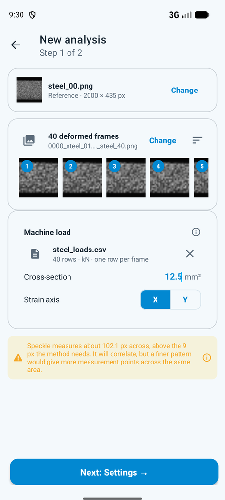
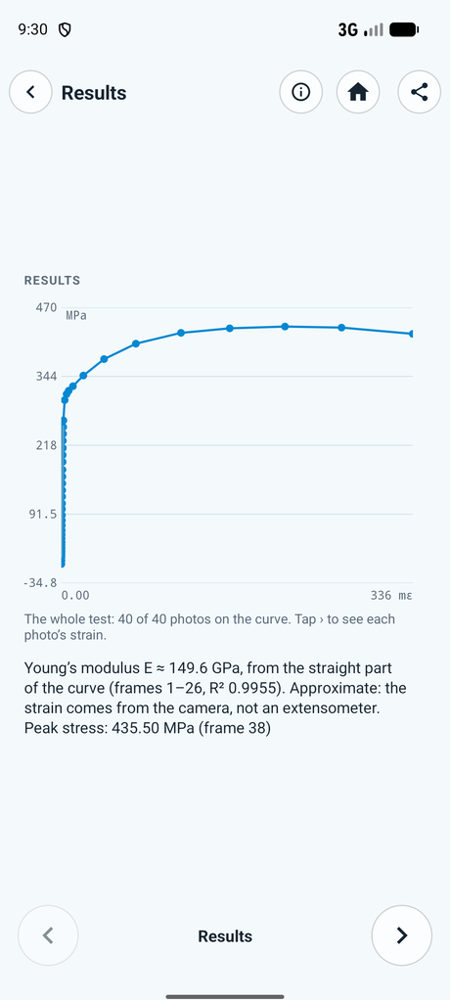
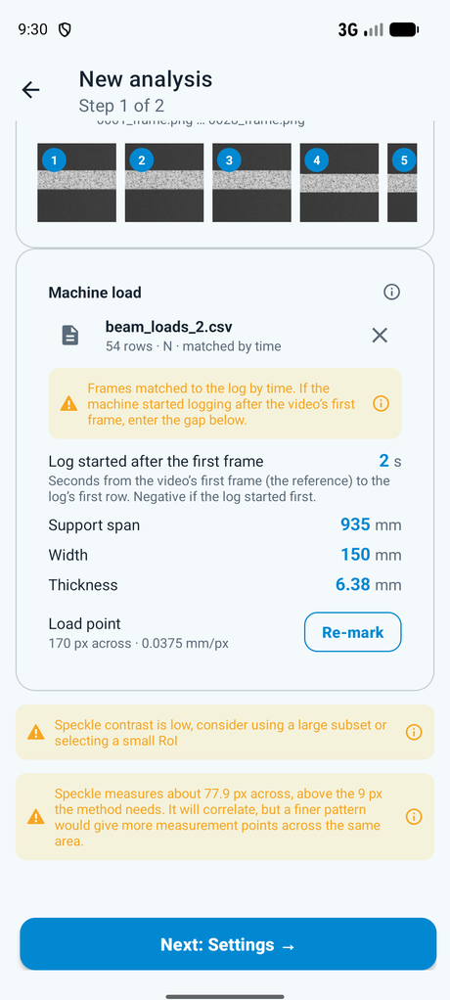
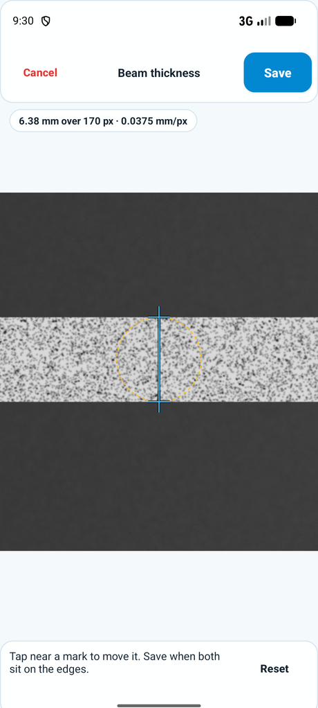
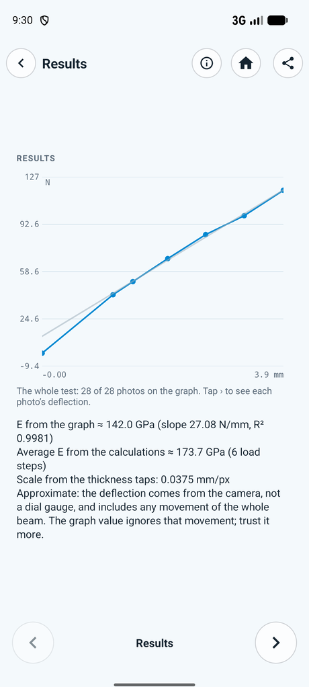
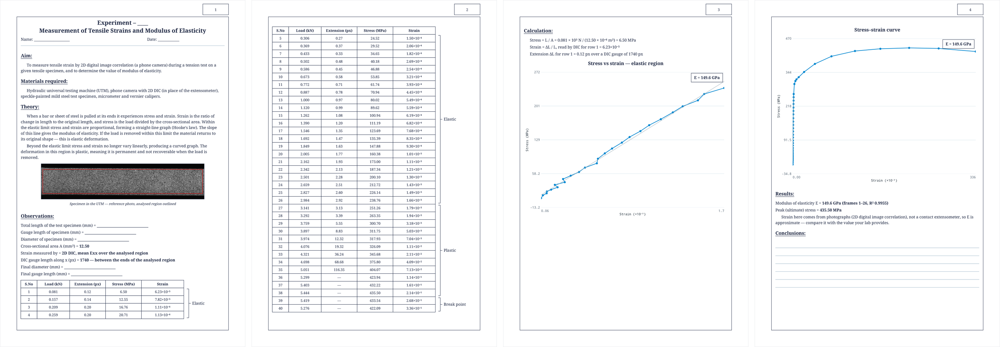
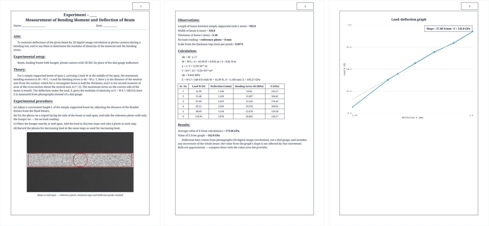

# Student lab workflow: tensile and bending with a phone

**Material Testing is a phone-camera 2D DIC companion for a first-semester undergraduate** doing
the two standard strength-of-materials experiments.
- **The phone replaces the contact instrument** (extensometer, dial gauge).
- **The app writes the lab report.**

The spec follows a student's two handwritten journal reports:
- *Exp. 2: Measurement of Tensile Strains and Modulus of Elasticity*;
- *Exp. 5: Measurement of Bending Moment and Deflection of Beam*.

The app reproduces their sections, order and outputs.

**The student** knows stress, strain and Hooke's law, but not DIC. They run the test on a UTM, or on a frame with a hanger.
They have to hand in:
- aim, apparatus and theory;
- observations and an observation table;
- a worked calculation;
- graphs and results.

So the copy is plain, the formulas are spelled out, and every number shown is one the write-up asks for.

## Inputs

| | Tensile | Bending |
|---|---|---|
| Photos / video | Reference before loading, then one photo per load step | Reference with no weights, then a photo per weight, or a video that holds each weight a few seconds; filmed from the **side face** |
| Loads | CSV in N or kN: one row per photo, or the machine's log | Typed on the phone: the hanger mass of each photo in kg, W = m × 9.80665 N. Or, optionally, a CSV in N or kN |
| Dimensions | Area (mm²); for a round bar πd²/4 | Span L, width b, thickness t (mm) |
| Scale | None: strain is a ratio | Top and bottom edges tapped on the reference (**Beam height → Set**) |

**Rows meet photos** in one of two ways:
- **Timed log with a video, or with photos that carry a capture time:** always matched by time, even when the counts agree.
  Time 0 is the reference: the video's first frame, or when the reference photo was taken.
  A frame takes a row only within **100 ms** of it; a frame with none has no load and is left off the curve.
  If the machine started logging later, enter the gap in **Log started after the reference** (s; negative if the log started first).
- **Photos without capture times, or a log without a time column:** paired in order when the counts agree.
  A photo's time is its EXIF `DateTimeOriginal` (+ `SubSecTimeOriginal`); the reference and every photo need one.
  Phone cameras write it; screenshots and photos sent through a messenger usually lose it.

**Bending loads are typed** (**Type loads (kg)** on the load card): one box per deformed photo, the mass on the hanger when it was taken, with the reference at 0 kg. **Loads typed as** switches the boxes between **Absolute** (the total on the hanger) and **Incremental** (what was added since the photo before; negative for a weight taken off), with each row's running total shown. Switching converts what is typed; the app stores totals either way.
The app stores W = m × 9.80665 N. Every photo needs a number: 0 for no weight. The sheet will not close with **Done** while a box is empty, and **Next** waits until every photo has its load.
Typed loads and a CSV are never combined; ✕ on one brings back the choice. Tensile loads stay CSV-only.

## Tensile (Exp. 2)

- **σ = P/A** for each photo. **ε** is ΔL / L₀ along the load axis from the virtual extensometer below, as a clip-on extensometer reads it ([ADR-012](../adr/ADR-012-tensile-strain-virtual-extensometer.md)).
- **E** is the slope of the straight early part.
  - The fit takes the longest leading run up to the peak whose line keeps R² ≥ 0.995, with a free intercept.
  - Every run length is tried, so noisy first photos don't stop it.
  - MPa ÷ mε = GPa.
- **The reference is not forced onto the line.** Labs zero the gauge under a preload. Through the origin, Exp. 2 would read 218 GPa, not 194.
- **Peak stress.**
- **The virtual extensometer** (`Extensometer`) gives both ε and the report table's **Extension (px)**:
  - Two end bands, each a tenth of the region, are fixed on the first solved photo.
  - ΔL is the mean displacement of the far band minus that of the near band.
  - The distance between the bands is L₀, the **DIC gauge length** (px), printed under Observations. Pixels cancel in ΔL / L₀, so no mm scale is needed.
  - Before ADR-012 the curve plotted the region's mean strain; on the steel case ΔL / L₀ tracked it within 0.5 % in the elastic range (1.95×10⁻³ against 1.94×10⁻³ at 263 MPa).
  - A photo where an end band has no points (it left the view, usually well past yield) has no strain and is left off the curve.

## Bending (Exp. 5)

- **σb = M·y/I**, where M = WL/4, y = t/2 and I = bt³/12. This equals 3PL/(2bh²).
- **δ** is the DIC deflection at the load point, in place of the dial gauge.
- **E = WL³/(48·δ·I)** is given for each load step and averaged, and also from the load–deflection slope. The report asks for both.
- **Scale:** mm/px = t ÷ the thickness in px.
  - The editor zooms (pinch or double-tap) and pans, and the zoom holds while you mark.
  - Under 40 px it warns, because a 1 px slip then moves E by more than 2.5%.
  - The second mark stays on the first mark's vertical line, so the thickness is measured straight down.
  - Either edge can be tapped first. δ is read along the line between the marks and then signed the way the load pushes (`BeamDeflection.alongLoad`), so the order never flips δ or E.
- **Strain window:** bending starts at 9 points, not 5: a 41 px VSG at step 5, not 21 px. δ and E come from displacement, so strain only draws the maps, and at about 45 px they are about 2.5× less noisy. The cost is a band about 20 px wide along the ROI's edges with no strain (the outer fibres), which also lowers the "converged" figure. On a thin beam, lower it or frame closer.
- **Load steps:**
  - Frames within 0.5% of the largest load of each other form one averaged row, so a 1 fps video gives the same six rows as six photos.
  - Frames under 1% of the largest load (the reference, and frames before the hanger went on) are left out of the table, the average and the slope.
  - With them in, Exp. 5's slope would read 30.5 N/mm instead of 27.06.

## Where results appear

- **Viewer → Results:** the page the viewer opens on. It shows:
  - the curve or graph with its fitted line;
  - E and the frames it came from;
  - peak stress, or the bending summary.

  The same block closes the ⓘ sheet. The heatmap loop is under **Share → Animations**.
- **Share → Lab report (PDF):** the report's own layout, filled in. Anything the app can't know (lengths, final diameter, name, date) stays as a blank line.

**Tensile**, in order:
  1. title and Aim;
  2. Materials;
  3. Theory;
  4. figure (the reference with the region);
  5. Observations (area, DIC gauge);
  6. table: S.No, Frame, Load, Extension (px), Stress, Strain, with Elastic / Plastic / Break point bracketed;
  7. Calculation for row 1;
  8. graphs: the elastic region with its line, and the full curve with E;
  9. Results;
  10. ruled Conclusions.

**Bending**, in order:
  1. title and Aim;
  2. Setup;
  3. Theory;
  4. Procedure (a)–(d);
  5. figure (the taps and the probe);
  6. Observations (L, b, t, no-load = reference, mm/px);
  7. Calculation for row 1 (M, y, I, σb, E);
  8. table with one row per load step: Sr. No, Frame, W, δ, σb, E. Frame is the viewer's number, a range such as 4–6 when a load is held over several frames; Sr. No counts rows, so the two differ once an unloaded frame is left out;
  9. Results (average E, E from the graph);
  10. graph with the slope and E boxed.

It's offered once the thickness is tapped.
- **CSV:** a `# mechanical_results` trailer after the point rows.
  - **Tensile:** `# elastic_modulus_gpa`, `# elastic_fit_frames` and `# elastic_fit_r2`.
  - **Bending:** one `# bending_step` row per frame, `# e_mean_gpa`, the slope and its R², and `# e_slope_gpa`. The last three are over the load steps.
- **DIC PDF report:** its closing page is the stress–strain or load–deflection page, with E.

## Capture checklist

1. Speckle the face the camera sees: the bar's face, or the beam's **side** face.
2. Put the phone on a tripod or clamp. It must not move.
3. Take the reference before any load, or before the first weight.
4. Get at least three photos in the elastic part before yield. More is better.
5. Loads: one CSV row per photo in order (no time column), or the machine's timed log for a video or for photos straight off the phone.
6. Bending: frame the **middle** of the beam, not the whole span. Aim for 100+ px across the thickness.

## Worked numbers

**Exp. 2:**
- d = 12.54 mm, so A = 123.51 mm².
- Row 1: 8.9 kN → 72.06 MPa; strain 0.002/25 = 8×10⁻⁵.
- All twelve rows form one straight run: **E = 194.0 GPa**, R² 0.9989.
- The report's ~170 GPa is a hand-drawn slope.

**Exp. 5:**
- L = 935 mm, b = 150 mm, t = 6.38 mm, I = 3.246×10³ mm⁴.
- Step 1 (4.28 kg): σb = 9.65 MPa, E = 193.2 GPa. The report's 9.591 MPa and 189.94 GPa used L = 930 and g ≈ 9.8.
- Average ≈ 173.6 GPa. Slope 27.06 N/mm → **≈ 142 GPa**.
- The app on a synthetic video of this beam: **142.0 GPa** from the graph and 173.7 GPa average ([REAL_WORLD_VALIDATION.md](REAL_WORLD_VALIDATION.md)).

## Accuracy

- **Camera strain is noisier than an extensometer's,** so E is approximate. Steel's elastic range is below 1 mε, which is where the noise matters most. More pixels and a still camera help most.
- **Strain is ΔL / L₀ over a gauge the ROI sets,** so after necking it is the average over that gauge, as with a clip-on extensometer, and a longer ROI reads a smaller elongation. The steel figures below were taken with the older region-mean strain (TD-142).
- **A seating start** that never straightens can still give no E, and the report says so.
- **On published steel data,** the strain reads about 8% above the dataset's 3D gauge points and E about 5% below ([REAL_WORLD_VALIDATION.md](REAL_WORLD_VALIDATION.md)).
- **On a published PMMA 3-point bend,** the deflection at the load point is within 0.0074 mm RMS of the authors' own DIC, 0.5% of the peak. Both E values are within 1%. Displacement agrees to 0.013 px, and strain to about 400 µε at the 45 px window. The thickness taps matter most: a 49 px slip on 572 px put E 9% low (same page, case 2).

## Deferred

- Typing tensile loads (a dial-read UTM) in the app.
- Comparing against a textbook or lab E.
- Extensometer strain over a chosen gauge length, in mm.
- Snapping the thickness taps to the edge automatically.
- Removing rigid movement of the whole beam from δ. The slope E is unaffected by it; the per-step E is not.
- A bending test on real images with a dial-gauge reference.
