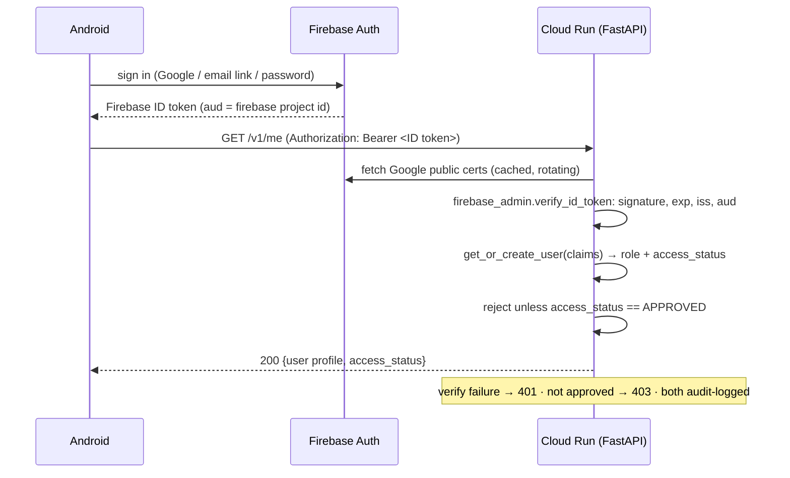

# Semper — Production Cloud Architecture (Pure GCP, Keyless)

**You probably don't need this document.** Analysis is fully offline and the
cloud is off unless someone builds with `INDIC_API_BASE_URL` set. Read it if
you are changing `backend/` or the sync path in `app/.../data/`.

| If you want to… | Go to |
|---|---|
| Deploy it and see it work | [BACKEND_SETUP_GCP.md](BACKEND_SETUP_GCP.md) |
| Understand why Drive and not GCS | [§0](#0-the-one-hard-truth-up-front-drive-is-not-gcs) |
| Follow a request end to end | [§2 auth](#2-authentication-flow) → [§4 upload](#4-upload-sequence-5-gb-resumable-keyless) |
| Find the code for a concept | [§7 backend map](#7-implementation-map) · [§8 Android map](#8-android-client-map) |
| Know the data shape | [§5 Firestore](#5-firestore-schema) · [§6 Drive layout](#6-google-drive-folder-hierarchy) |
| Fix sign-in | [AUTH_SETUP.md](AUTH_SETUP.md) |

> **Status / scope.** This document specifies the **GCP-native** backend:
> Firebase Auth → Cloud Run (FastAPI) → Firestore → Google Drive, with **no
> service-account JSON keys anywhere** and **no image processing in the cloud**.
> This is the only backend. The on-device engine
> ([ARCHITECTURE.md](../engine/ARCHITECTURE.md)) is unchanged — the cloud only does
> identity, metadata, orchestration, and audit.

**Non-negotiables baked into this design**

| Constraint | How it is honored |
|---|---|
| No JSON service-account keys (Workspace policy) | Cloud Run runs *as* a service account; Drive tokens are minted via **IAM Credentials `generateAccessToken`** (self-impersonation). Zero key material at rest. |
| Developer is not a Workspace admin | The only admin-gated step is a one-time "allow adding a service account to a Shared Drive" toggle. Everything else is a normal-user or Cloud-project action. |
| Storage stays in company Google Drive (5 TB) | The Cloud Run SA is a **Manager** of a company **Shared Drive**; writes count against the org pool. (Manager, not Content manager: `files.delete` requires organizer rights, so erasure fails otherwise.) |
| Cloud never processes images | Cloud Run only creates folders, initiates resumable sessions, and records metadata. **Bytes never transit Cloud Run** — the client PUTs directly to Drive's resumable session URI. |
| No secrets in Android | Android holds only public config (`google-services.json`, which ships in every APK by design). The device private key lives in Android Keystore and never leaves the device. |
| $0 during pilot | Scale-to-zero Cloud Run, Firestore free tier, no egress through the backend. |

---

## 0. The one hard truth up front: Drive is not GCS

This comparison comes first because it shapes every downstream decision.

| Capability | Google Cloud Storage | Google Drive (your constraint) |
|---|---|---|
| Direct client **upload** without backend touching bytes | ✅ V4 **signed URL** (fully anonymous, per-object, ≤7-day TTL) | ⚠️ **Resumable session URI** only — broker must initiate it; client then PUTs directly. Works, but the URI is minted by the SA, not signed offline. |
| Direct client **download** without backend touching bytes | ✅ signed URL | ❌ **No anonymous signed download.** Requires an OAuth token or making the file link-shared. Downloads must be **brokered** or link-shared (privacy hit). |
| Per-object access control | ✅ IAM / signed policy | ❌ Coarse: file/Shared-Drive membership only. |
| Object size | 5 TiB | 5 TB file OK, but **750 GB/user/day** upload ceiling and **400,000 items/Shared Drive**. |
| Throughput / quota | Effectively unlimited | Drive API **12,000 queries/min**/project; upload throughput fine but item/day caps bite at scale. |
| Cost model | Pay per GB + egress | **Free** (already-paid 5 TB Workspace pool) — this is the whole reason to use it. |

**Conclusion.** Drive is the right choice *now* purely because the 5 TB is
already paid for and must stay in-org. It is a **capacity and download-ergonomics
liability at scale**. The architecture is therefore built so that **the Android
client API is storage-agnostic** — migrating Drive→GCS later is a backend-only
change (see §19).

---

## 1. Production architecture diagram

```
                         ┌───────────────────────────────────────────┐
                         │             Android device                 │
                         │  Android Views UI (XML + findViewById)     │
                         │  ├─ Firebase Auth (Firebase ID token)      │
                         │  ├─ Android Keystore (device private key)  │
                         │  ├─ WorkManager CoroutineWorker            │
                         │  └─ OkHttp streaming (chunked resumable)   │
                         │  ── DIC / OpenCV / PDF: 100% on-device ──  │
                         └───────────────┬───────────────────────────┘
                                         │ HTTPS (ID token + device signature)
                                         ▼
              ┌────────────────────── Google Cloud project ──────────────────────┐
              │                                                                   │
              │   ┌──────────────┐   verify ID token (firebase-admin: certs,     │
              │   │  Cloud Run   │◀── aud, iss, exp) + verify device signature   │
              │   │  FastAPI     │                                               │
              │   │  (scale→0)   │──▶ Firestore (users, devices, sessions,       │
              │   │  runs as SA  │        files, audit_logs)                     │
              │   │ indic-api@…  │                                               │
              │   └──────┬───────┘                                               │
              │          │ IAM Credentials generateAccessToken                   │
              │          │ (Drive scope, keyless self-impersonation)             │
              │          ▼                                                       │
              │   ┌──────────────┐   create folders, init resumable session     │
              │   │ Drive API    │   (metadata only — NO bytes)                  │
              │   └──────┬───────┘                                               │
              │          │ returns resumable session URI                        │
              │  Cloud Logging / Monitoring / Error Reporting  ◀── structured    │
              └──────────┼────────────────────────────────────────────logs──────┘
                         │ session URI handed back to device
                         ▼
              ┌───────────────────────────────────────────────┐
              │  Company Google Workspace — Shared Drive       │
              │  "Semper-Research-Storage" (5 TB pool)          │
              │  SA is Manager. Device PUTs bytes here        │
              │  DIRECTLY (never through Cloud Run).           │
              └───────────────────────────────────────────────┘
```

**Trust boundaries.** (1) Device↔Cloud Run: mutually authenticated (the
Firebase ID token proves *user*; the Keystore signature proves *device*). (2) Cloud
Run↔Google APIs: keyless, via the metadata server + IAM Credentials. (3)
Device↔Drive: capability-scoped — the resumable session URI authorizes writes
to *exactly one file*, nothing else.

---

## 2. Authentication flow

Identity is federated through **Firebase Authentication** — Google, email link,
or email/password, all producing one **Firebase ID token** (a JWT, ~1 hour).
The backend **re-verifies on every request** with `firebase-admin`: stateless,
with zero server-side key management. The client refreshes silently through the
Firebase SDK.



Claims consumed downstream: `sub` (the stable Firebase uid, identical across
providers for one account), `email`, `email_verified`, `name`, and
`firebase.sign_in_provider`.

**Why re-verify vs. minting our own session JWT.** Re-verifying needs **no
signing secret** — perfectly aligned with "no secrets." If per-request cert
verification ever becomes a latency concern, mint a short-lived backend session
JWT using **IAM Credentials `signJwt`** (Google signs it; verifiable via the
SA's public JWKS) — still keyless. Not needed at pilot scale.

**Access control is a separate decision from authentication.** Verification
proves identity; it does not grant entry. `get_or_create_user`
([firestore_repo.py](../../backend/app/firestore_repo.py)) assigns:

1. `role = admin` if a **verified** email is in `ADMIN_EMAILS`;
2. `access_status = APPROVED` if admin, or `AUTO_APPROVE=1`, or a **verified**
   email at `AUTO_APPROVE_HD`;
3. otherwise `PENDING` — authenticated but refused with `403 not_approved`
   until an admin approves them.

Auto-approval always requires `email_verified`, so a fresh email/password
signup cannot claim a privileged domain it does not own.

> **There is no hosted-domain gate on sign-in, by design.** Any account
> Firebase Auth accepts can authenticate; the `PENDING`/`APPROVED` status is
> the control that holds. This is what makes the "outside collaborator requests
> access" flow work. (Earlier revisions carried an `ALLOWED_HD` setting that no
> code read — it has been removed rather than left to imply a gate that was
> never there.)

---

## 3. Device registration & challenge-response

Device identity = an EC P-256 key pair generated **inside** Android Keystore
(`StrongBox` when available). The private key is non-exportable; only the
public key and a stable `deviceId` (a random UUID, *not* IMEI/serial/MAC) leave
the device.

```mermaid
sequenceDiagram
    participant A as Android (Keystore)
    participant R as Cloud Run
    participant F as Firestore
    A->>A: generateKeyPair(EC P-256, StrongBox, user-auth optional)
    A->>R: POST /v1/devices/register {deviceId, publicKeyPem, model, osVer}\n(Authorization: ID token)
    R->>F: users/{uid} exists? one active device already bound?
    alt no active device
        R->>F: devices/{deviceId} = {uid, publicKeyPem, status: ACTIVE}
        R-->>A: 201 registered
    else already bound to another device
        R-->>A: 409 device_conflict (needs admin re-bind)
    end

    Note over A,R: Every subsequent mutating request:
    A->>R: POST /v1/challenge (ID token) 
    R->>F: store nonce (TTL 120s) bound to uid+deviceId
    R-->>A: {nonce}
    A->>A: sig = Keystore.sign(nonce || method || path || bodySHA256)
    A->>R: POST /v1/sessions ... headers: X-Device-Id, X-Nonce, X-Signature
    R->>F: load devices/{deviceId}.publicKeyPem; verify sig; consume nonce
    R-->>A: 200 (or 401 bad_signature / 409 nonce_replay)
```

**One-user-one-device binding.** `devices/{deviceId}.uid` is unique per active
device. Re-registering the *same* `deviceId` for its owner is idempotent — it refreshes
the stored public key and returns `201` with `healed: true` (see
`register_device` in `main.py`). Registering a *different* second device for a
`uid` that already has one returns `409 device_conflict`; moving to genuinely
new hardware currently means an admin revokes the prior device first. (There is
no `:rebind` endpoint — that was a design idea, not something implemented.)

**Latency note.** A per-request challenge round-trip doubles RTT. For hot paths
you may fold it into a **signed-timestamp assertion** (client signs
`timestamp||method||path||bodyHash`; server accepts a ±120 s skew window and
caches used signatures to block replay) — same security property, one fewer
round-trip. The challenge endpoint remains for registration and sensitive
admin actions.

---

## 4. Upload sequence (5 GB, resumable, keyless)

```mermaid
sequenceDiagram
    participant W as WorkManager Worker (OkHttp)
    participant R as Cloud Run
    participant IAM as IAM Credentials
    participant D as Google Drive (Shared Drive)
    Note over W: session already computed on-device (raw/processed/reports/metadata)
    W->>R: POST /v1/sessions {specimen, files:[{name,role,bytes,sha256}]}\n(ID token + device sig)
    R->>D: (keyless) create folder tree user/{uid}/session/{sid}/{raw,processed,reports,metadata}
    Note over R,IAM: token = generateAccessToken(SA, scope=drive) — NO json key
    loop for each file
        R->>D: POST resumable init (metadata: name, parent, driveId)
        D-->>R: 200 Location: <resumable session URI>
    end
    R->>Firestore: sessions/{sid}=UPLOADING, files/{fid}=PENDING (+ session URIs)
    R-->>W: 200 {sessionId, uploads:[{fileId, uploadUrl, chunkSize:32MiB}]}

    loop each file, 32 MiB chunks
        W->>D: PUT uploadUrl  Content-Range: bytes a-b/total  (direct, no backend)
        D-->>W: 308 Resume Incomplete (Range: bytes=0-b)
    end
    W->>D: PUT final chunk
    D-->>W: 200/201 {id, md5Checksum, size}
    W->>R: POST /v1/files/{fileId}/complete {driveFileId, md5, bytes}
    R->>R: verify size + (client md5 vs Drive md5Checksum)
    R->>Firestore: files/{fid}=COMPLETED; if all done → sessions/{sid}=COMPLETED
    R->>Firestore: audit_logs += UPLOAD_COMPLETED
    R-->>W: 200
```

**Resume after crash / network loss.** The resumable session URI survives ~1
week. On restart the worker issues `PUT uploadUrl` with
`Content-Range: bytes */TOTAL` (zero-length body) → Drive replies `308` with the
last-received byte in the `Range` header → worker resumes from there. No bytes
re-sent. WorkManager's `BackoffPolicy.EXPONENTIAL` + network constraint handles
retry/offline.

**Integrity.** At `:complete` the backend asks Drive for the object's real
`size`/`md5Checksum` and rejects a mismatch with `422` (`size_mismatch` /
`checksum_mismatch`), leaving the file `PENDING` rather than marking it
`COMPLETED` — see `complete_file` in `main.py`. It does **not** currently mark
`FAILED`, delete the Drive object, or auto-re-enqueue; the client retries the
completion. Whenever Drive reports an `md5Checksum` (always for our binary
blobs), the client **must** supply a matching `md5`; omitting it is treated as
`checksum_mismatch`. The check is skipped only when Drive itself has no md5
(Docs-native types we never store). The Android client computes the local file
MD5 during upload so `:complete` does not depend on Drive's completion JSON
including `md5Checksum`.

**One Session.zip per session (current), not per-file objects.** The product now
uploads a single `bundle`-role `Session.zip` holding `raw/`, `dat/`, `csv/` and
the report archives (plus a small `metadata.json` at the session root), so a
session costs ~1–2 Firestore file docs instead of 3F+4. This trades in-Drive
browsability of individual frames for far fewer resumable inits and Firestore
writes. The `raw/processed/reports/metadata` subfolder tree below is the older
per-file layout, kept for reference.

---

## 5. Firestore schema

Native mode, `nam5`/regional to match Cloud Run region. Collections:

```
users/{uid}                       (uid = Google 'sub')
  email, displayName              (note: `hd`/hostedDomain is NOT persisted today —
                                   get_or_create_user does not write it, so
                                   /v1/me/export returns hostedDomain: null)
  role: "user" | "admin"
  access_status: "PENDING" | "APPROVED" | "SUSPENDED"
  activeDeviceId: string | null
  createdAt, lastSeenAt (Timestamp)

devices/{deviceId}                (deviceId = client UUID)
  uid, publicKeyPem
  status: "ACTIVE" | "REVOKED"
  model, osVersion, appVersion
  registeredAt, lastAssertionAt

challenges/{nonce}                (short-lived, TTL-deleted)
  uid, deviceId, createdAt, expireAt (Timestamp, TTL policy)

sessions/{sessionId}
  uid, deviceId
  specimen: string
  status: "PENDING" | "UPLOADING" | "COMPLETED" | "FAILED"
  driveFolderId                   (…/session/{sid} folder)
  totalBytes, fileCount, completedCount
  metrics: { pointsConverged, avgIcgnIters, execMs }  // small, from device
  createdAt, updatedAt, completedAt

files/{fileId}                    (fileId = deterministic sid_role_name)
  sessionId, uid
  role: "raw" | "processed" | "reports" | "metadata" | "csv" | "dat" | "bundle"
        (see Role in models.py; "bundle" is the Session.zip the app now ships)
  name, sizeBytes, sha256
  status: "PENDING" | "UPLOADING" | "COMPLETED" | "FAILED"
  uploadUrl                       (resumable session URI, cleared on complete)
  driveFileId, driveMd5
  createdAt, updatedAt

audit_logs/{autoId}               (append-only)
  ts (Timestamp), uid, deviceId, ip, ua
  action: "LOGIN" | "DEVICE_REGISTER" | "DEVICE_REBIND" |
          "SESSION_CREATE" | "UPLOAD_COMPLETE" | "AUTH_DENIED" | ...
  target: { type, id }
  outcome: "OK" | "DENIED" | "ERROR"
  detail: map
```

**Indexing.**
- **No composite indexes are required today**, which is why
  `backend/firestore.indexes.json` is empty. Every query the code issues is a
  single-field equality (`.where(field, "==", value)`) with an optional
  `.limit()`/`.count()` — see `firestore_repo.py` — and single-field auto-indexes
  cover those. A composite index becomes necessary only if a query adds an
  `order_by` or a second `where`; add it to that file then.
- **Exempt** large/opaque fields from indexing (`publicKeyPem`, `uploadUrl`,
  `sha256`) to cut index cost and stay off the 40 KB/1500-field limits.
- **TTL policy** on `challenges.expireAt` and optionally `audit_logs.ts` (e.g.
  400-day retention) — planned, not yet configured in IaC.

Security: Firestore is **written only by the Cloud Run SA** (server-side). No
Android SDK writes → Firestore Security Rules can be `allow read, write: if
false` (deny all client access); all access mediated by FastAPI. This removes a
whole class of rules-bypass risk.

---

## 6. Google Drive folder hierarchy

```
Shared Drive: Semper-Research-Storage/        (SA = Manager/organizer)
└── Research Storage/
    └── user/{uid}/
        └── session/{sessionId}/
            ├── raw/          Reference.png, Deformed_0001.png, …
            ├── processed/    heatmaps, overlays
            ├── reports/      Master_Report_0001.pdf
            └── metadata/     session.json  (device-authored, verbatim)
```

`{uid}` = Google `sub` (stable, opaque, not PII-leaking like email in a path).
Folder IDs are cached in `sessions.driveFolderId` / a `folders` map to avoid
re-resolving by name (name lookups are slow and race-prone).

---

## 7. Implementation map

The code is the specification — these modules are implemented and deployed, so
read them rather than a sketch. Sections 2–6 above explain *why* each behaves
the way it does.

| Concern | File | Notes |
|---|---|---|
| FastAPI app, routes | [`backend/app/main.py`](../../backend/app/main.py) | All `/v1/*` endpoints |
| Auth + device dependencies | [`backend/app/deps.py`](../../backend/app/deps.py) | Bearer verify, device-signature check |
| ID-token verify, keyless Drive token | [`backend/app/google_auth.py`](../../backend/app/google_auth.py) | Self-impersonation to add the Drive scope (§2) |
| Drive folders, resumable init | [`backend/app/drive.py`](../../backend/app/drive.py) | Returns the opaque upload URI (§4) |
| Firestore access | [`backend/app/firestore_repo.py`](../../backend/app/firestore_repo.py) | Schema in §5 |
| Pydantic models | [`backend/app/models.py`](../../backend/app/models.py) | |
| Audit trail | [`backend/app/audit.py`](../../backend/app/audit.py) | |
| Config / env vars | [`backend/app/config.py`](../../backend/app/config.py) | Includes `DEV_INSECURE_AUTH` |
| Container | [`backend/Dockerfile`](../../backend/Dockerfile) | Deployed with `gcloud run deploy --source backend` |
| API Gateway spec | [`backend/gateway/openapi.yaml`](../../backend/gateway/openapi.yaml) | Covers all current routes |

---

## 8. Android client map

| Concern | File |
|---|---|
| Google sign-in, session state | [`data/AuthRepository.kt`](../../app/src/main/java/com/indicvision/semper/data/AuthRepository.kt) |
| Credential Manager helper | [`ui/auth/GoogleSignInHelper.kt`](../../app/src/main/java/com/indicvision/semper/ui/auth/GoogleSignInHelper.kt) |
| EC P-256 Keystore device key | [`data/DeviceKeyManager.kt`](../../app/src/main/java/com/indicvision/semper/data/DeviceKeyManager.kt) |
| Backend HTTP client | [`data/net/IndicApi.kt`](../../app/src/main/java/com/indicvision/semper/data/net/IndicApi.kt) |
| Token storage / refresh | [`data/net/TokenStore.kt`](../../app/src/main/java/com/indicvision/semper/data/net/TokenStore.kt) · [`TokenProvider.kt`](../../app/src/main/java/com/indicvision/semper/data/net/TokenProvider.kt) |
| Resumable upload worker | [`data/DicUploadWorker.kt`](../../app/src/main/java/com/indicvision/semper/data/DicUploadWorker.kt) |
| Restore / download | [`data/DicRestoreWorker.kt`](../../app/src/main/java/com/indicvision/semper/data/DicRestoreWorker.kt) · [`CloudRestore.kt`](../../app/src/main/java/com/indicvision/semper/data/CloudRestore.kt) |

The upload worker speaks the resumable protocol from §4: `PUT` with a
`Content-Range` header, `308` means keep going, `200`/`201` means the file
landed. It runs under WorkManager with a network constraint and exponential
backoff, so an upload survives losing connectivity or the app being killed.

Cloud sync stays off entirely unless `INDIC_API_BASE_URL` is set at build time
— see [BACKEND_SETUP_GCP.md](BACKEND_SETUP_GCP.md) step C1.
---

## 9. IAM configuration

Two service accounts, least-privilege:

```bash
PROJECT=indic-prod   # placeholder GCP project id — replace with yours
API_SA=indic-api@$PROJECT.iam.gserviceaccount.com
DEPLOY_SA=indic-deployer@$PROJECT.iam.gserviceaccount.com
```
Firebase Auth may use a different project id (`indicvision-dic-app-auth`); see AUTH_SETUP.md and set `FIREBASE_PROJECT_ID` when they differ.

```bash
# Runtime SA — what Cloud Run runs AS
gcloud iam service-accounts create indic-api --project $PROJECT

# Firestore access
gcloud projects add-iam-policy-binding $PROJECT \
  --member="serviceAccount:$API_SA" --role="roles/datastore.user"

# Keyless Drive tokens: SA may impersonate ITSELF to add the Drive scope
gcloud iam service-accounts add-iam-policy-binding $API_SA \
  --member="serviceAccount:$API_SA" --role="roles/iam.serviceAccountTokenCreator"

# Logging / monitoring
gcloud projects add-iam-policy-binding $PROJECT \
  --member="serviceAccount:$API_SA" --role="roles/logging.logWriter"

# Deployer SA (used by GitHub Actions via Workload Identity Federation — NO KEY)
gcloud iam service-accounts create indic-deployer --project $PROJECT
for R in run.admin artifactregistry.writer iam.serviceAccountUser cloudbuild.builds.editor; do
  gcloud projects add-iam-policy-binding $PROJECT \
    --member="serviceAccount:$DEPLOY_SA" --role="roles/$R"; done
```

**Drive membership (the only Workspace-side step, done by you, not the SA):**
add `indic-api@indic-prod.iam.gserviceaccount.com` as **Manager** of the
`Semper-Research-Storage` Shared Drive. If Workspace blocks adding a
service-account principal, a Workspace admin must one-time-allow it (Admin
console → Drive & Docs → Sharing → allow members outside org / add to the
allow-list). **No JSON key, no domain-wide delegation required.**

---

## 10. Cloud Run deployment

Container: [`backend/Dockerfile`](../../backend/Dockerfile) (python:3.12-slim,
uvicorn, 2 workers). The exact deploy command with all flags is step B1 of
[BACKEND_SETUP_GCP.md](BACKEND_SETUP_GCP.md) — it is a runbook step, not
something to retype from here.

The shape it deploys into, and why:

| Setting | Value | Reason |
|---|---|---|
| Min instances | 0 | Scale to zero — $0 when idle |
| Max instances | 10 | Pilot-sized ceiling |
| CPU / memory | 1 / 512Mi | Bytes never transit Cloud Run; requests are tiny |
| Timeout | 120 s | Same reason — no long-lived request bodies |
| Public endpoint | yes | Auth is enforced in the app layer (ID token + device signature), not the network layer |

No mounted secrets. All identity comes from the attached SA + metadata server.
HTTPS-only is the default; consider Cloud Armor / a WAF once public.

---

## 11. Application Default Credentials (ADC)

- **In Cloud Run:** `google.auth.default()` returns metadata-server
  credentials for `$API_SA`. **Nothing to configure, no file.** Drive scope is
  layered on via `impersonated_credentials` (§7.1).
- **Local dev:** `gcloud auth application-default login` mints a user ADC file
  under your own identity; grant your user `serviceAccountTokenCreator` on
  `$API_SA` to exercise the Drive path locally. Never download a key.
- **Never** set `GOOGLE_APPLICATION_CREDENTIALS` to a JSON key — that's exactly
  what the Workspace policy (and this design) forbids.

---

## 12. Security best practices (checklist)

- **Keyless everywhere:** ADC + IAM Credentials impersonation; WIF for CI. Zero
  long-lived key material.
- **Defense in depth on identity:** signature + `aud` + `iss` + `email_verified`
  + Firestore allow-list (`access_status`). Note there is deliberately **no `hd`
  sign-in gate** — any account Firebase accepts may authenticate; what it may
  *use* is decided by `access_status` (config.py spells this out). Domain only
  affects auto-approval via `AUTO_APPROVE_HD`, not admission.
- **Device binding:** non-exportable Keystore key, challenge/nonce with replay
  cache, admin-gated revoke. (Nonce TTL cleanup is not yet enforced by an IaC
  TTL policy — see §5.)
- **Least privilege IAM:** `datastore.user` + self-`tokenCreator` only; deployer
  SA separate.
- **Firestore locked to the server:** client rules deny-all; all writes via API.
- **No PII in URLs/logs:** log `uid` (opaque `sub`), never tokens; scrub
  `Authorization`, `uploadUrl`, `X-Signature` from logs.
- **Capability-scoped uploads:** resumable URI authorizes one file only; expires.
- **Transport:** TLS only; HSTS; reject non-HTTPS.
- **Input validation:** pydantic models; cap `files[]` length and per-file bytes
  (reject >5 GB); sanitize filenames before Drive.
- **Rate limiting (planned, NOT implemented):** there is no rate limiting in the
  service today. `/v1/challenge` in particular mints a nonce doc per call with no
  per-uid throttle. Target is a per-uid token bucket (challenge + session create)
  plus Cloud Armor when public.
- **Audit everything security-relevant**, append-only, with retention.
- **Privacy prerequisites for public launch:** privacy policy + account-deletion
  path (raw specimen images + email are personal data).

---

## 13. Failure recovery strategy

| Failure | Detection | Recovery |
|---|---|---|
| Network drop mid-chunk | OkHttp IOException | WorkManager retry; resume via `bytes */total` → 308 offset |
| App killed during upload | Worker re-created by WM | Reload plan from local store; resume each incomplete file |
| Resumable URI expired (~1 wk) | 404/410 on PUT | **Planned:** a `:reinit` broker endpoint to mint a fresh session URI. Not implemented today; the client re-creates the session. |
| Chunk checksum mismatch | Drive size/md5 checked at `:complete` | reject with `422`, leave the file `PENDING`; client retries the completion (no auto-delete/re-enqueue today) |
| Session stuck `UPLOADING` | janitor query `(status, updatedAt)` | after N hours → notify user / reinit / mark FAILED |
| Firestore write fails after Drive success | try/except around commit | idempotent `:complete` (deterministic fileId) → safe re-POST |
| Drive `403 storageQuotaExceeded` | broker init error | means writing to SA's personal 15 GB, not the Shared Drive → config alarm |
| Drive `429`/quota | broker/PUT 429 | exponential backoff + jitter; surface "try later" |

**Idempotency** is the backbone: deterministic `fileId` / `sessionId` mean every
mutation is safely retryable.

---

## 14. Cost analysis

**Pilot (10–50 users), target $0/month.**

| Service | Free tier | Pilot usage | Cost |
|---|---|---|---|
| Cloud Run | 2M req, 360k GiB-s, 180k vCPU-s / mo | tiny JSON reqs, scale-to-zero | **$0** |
| Firestore | 1 GiB, 50k reads / 20k writes / 20k deletes per day | metadata only, low volume | **$0** |
| IAM Credentials / metadata tokens | free | per-request token (cached 1 h) | **$0** |
| Drive storage | 5 TB already-paid Workspace pool | ~5 sessions/user × 1 GB | **$0 marginal** |
| Egress | uploads go **device→Drive**, not via Cloud Run | ~0 GB through GCP | **$0** |
| Cloud Logging | 50 GiB/mo free | structured logs | **$0** |
| Artifact Registry | 0.5 GB free | one image | **~$0** |

The killer design win: **bytes never transit Cloud Run**, so the usual
egress/compute blowup for 1–5 GB uploads simply doesn't exist.

**As users scale (hundreds→thousands):**
- *Cloud Run:* still cents/month — requests are small and infrequent (one burst
  per session). Even 10k sessions/day ≈ well within paid tier at ~$1–5/mo.
- *Firestore:* watch the **per-day free quotas**; thousands of users generating
  sessions + audit logs can exceed 20k writes/day → single-digit $/mo. Batch
  writes, TTL-expire old audit logs.
- *Network:* remains ~$0 (byte path bypasses GCP).
- *Drive capacity:* **this is what breaks first** (see §15).

---

## 15. Scalability analysis — when Drive becomes the ceiling

Drive limits, in the order they bite:

1. **5 TB pool.** At ~1 GB/session, ~5,000 sessions total. With retention (auto-
   delete raw after N months) you stretch it, but **capacity is the #1 wall.**
2. **750 GB / user / day upload.** The SA is the "user"; ~750 sessions/day is
   the hard ingest ceiling across *all* users. A busy field day with hundreds of
   testers can hit this.
3. **400,000 items / Shared Drive.** Many small files per session erode this;
   bundle `raw/` if sessions get file-heavy.
4. **Download ergonomics.** No anonymous signed download → every download either
   brokers bytes through Cloud Run (reintroduces egress/compute cost) or
   link-shares files (privacy regression). At dashboard scale this is painful.
5. **API query quota** (12k/min): fine unless you fan out huge per-file loops.

**Migrate to GCS when any of:** you approach ~4 TB, sustained ingest nears
750 GB/day, you need real per-object access or performant in-app downloads, or
Drive rate-limits start showing in logs. GCS removes all five ceilings at the
cost of GB-month + egress billing (~$0.02/GB-mo storage, ~$0.12/GB egress).

---

## 16. CI/CD pipeline

> **Status: built, gated on secrets.** `.github/workflows/deploy-backend.yml`
> deploys the backend to Cloud Run; it runs ruff + pytest first and deploys only
> if they pass. It is `workflow_dispatch` (manual) and stays inert until
> `GCP_WIF_PROVIDER` and `GCP_DEPLOY_SA` are set, so the documented manual
> `gcloud run deploy` in the runbook is still the path until then.
> `.github/workflows/ci.yml` continues to build and test the app and engine
> ([CI.md](../ops/CI.md)).

It authenticates with **Workload Identity Federation** rather than a stored key:
a pool trusting GitHub's OIDC, mapped to a deployer service account and
restricted to this repo, with `permissions: id-token: write`. That keeps the
no-JSON-keys rule (§0) intact all the way through delivery. The signing keystore
for Android release builds stays in GitHub encrypted secrets or Play App
Signing.

---

## 17. Monitoring and logging

**Implemented:**
- **Structured JSON access log** — one line per request (`requestId`, `method`,
  `path`, `status`, `latencyMs`, `outcome`, and `uid` when a device-signed
  dependency resolved it), via the `access_log` middleware in `main.py`. Never
  logs tokens/signatures/URIs.
- **Audit trail** in Firestore `audit_logs` — the compliance record (Cloud
  Logging is the operational one).

**Planned (not yet built):**
- Enrich the access line with `deviceId`/`action`.
- **Cloud Monitoring** dashboards: Cloud Run req count / p95 latency / error
  rate / instance count; Drive init failure rate; Firestore write count vs free
  quota.
- **Error Reporting** auto-grouping of exceptions.
- **Log-based alerts:** spike in `AUTH_DENIED` (attack), `storageQuotaExceeded`
  (misconfig), Drive `429` (quota), sessions stuck `UPLOADING`.
- **Uptime check** on `/healthz`.

---

## 18. Disaster recovery

> **Status: mostly planned.** Offline-first (Identity row) is real today, and
> partial IaC now exists — `backend/firestore.indexes.json` and the
> `deploy-backend.yml` workflow. The scheduled Firestore export, PITR, nightly
> Drive↔Firestore reconciliation, and full Terraform below are **not yet
> implemented**; the RPO/RTO figures describe the target, not current cover.

| Asset | Risk | Mitigation |
|---|---|---|
| Firestore metadata | corruption/deletion | **Scheduled export** to a GCS bucket (`gcloud firestore export`) daily via Cloud Scheduler; PITR (7-day) enabled. |
| Drive blobs | accidental delete | Shared Drive trash retention; restrict delete to admins; nightly manifest reconciliation (Firestore `files` ↔ Drive listing). |
| Cloud Run service | region outage | Stateless + container in Artifact Registry → redeploy to another region in minutes; multi-region if RTO demands. |
| Identity | Google outage | App is **offline-first** — analysis/reports keep working; uploads queue in WorkManager until service returns. |
| Config drift | — | IaC (Terraform) for project/IAM/Run so the whole stack is reproducible. |

**RPO** ≈ 24 h (metadata) / 0 (blobs, WAL-like resumable). **RTO** ≈ minutes
(redeploy). Offline-first design means user-facing RTO for core work is
effectively zero.

---

## 19. Migration path: Drive → GCS with **zero Android change**

The client only ever sees an **opaque resumable upload URL** and speaks the
**resumable PUT + `Content-Range` + 308** protocol. **GCS resumable uploads use
the identical protocol.** So the storage swap is entirely inside the broker:

**Client API contract (frozen):**
```
POST /v1/sessions  → { sessionId, uploads:[{ fileId, uploadUrl, chunkSize }] }
PUT  <uploadUrl>   (Content-Range, 308 resume)   ← Drive OR GCS, indistinguishable
POST /v1/files/{id}/complete
```

**Backend change only:**
- Introduce a `StorageBackend` interface with `ensure_folders()`,
  `init_resumable() → uploadUrl`, `verify_complete()`.
- `DriveBackend` = §7.4. `GcsBackend` = start a GCS resumable session
  (`POST .../o?uploadType=resumable`) and return its session URL — same shape.
- Flip a `STORAGE_BACKEND=gcs` env var (or route per-user for phased cutover).
- **Migration of existing data:** background job copies Drive→GCS (Cloud Run
  job or Storage Transfer), rewrites `files.driveFileId` → `gcsObject`. Clients
  never notice.

GCS then also unlocks **V4 signed URLs** for uploads *and* downloads — at which
point you can even drop the resumable-init broker call for uploads if you want,
though keeping the broker preserves audit/authorization centrally. Downloads
become direct signed URLs, eliminating the Drive download-brokering problem.

**Design payoff:** the abstraction that makes Drive tolerable today
(opaque upload URL + standard resumable protocol) is the *same* abstraction that
makes the GCS migration a config flag tomorrow.

