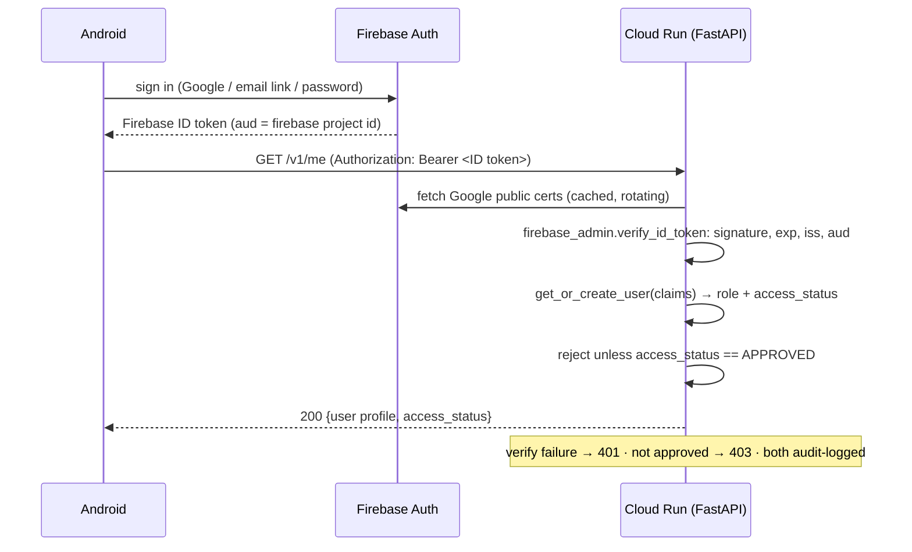
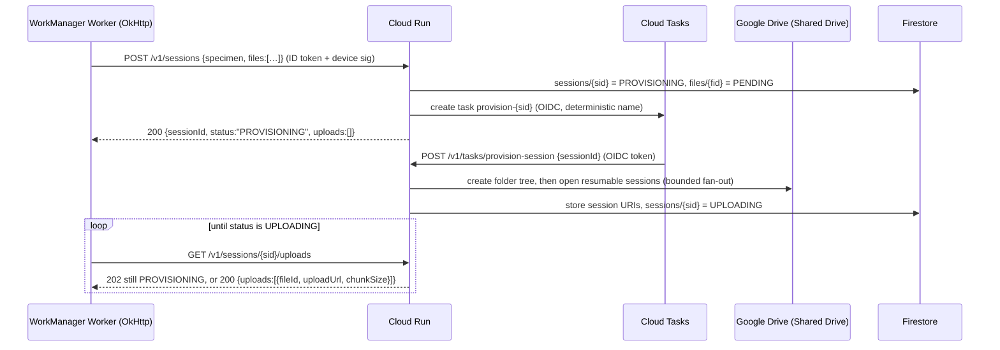
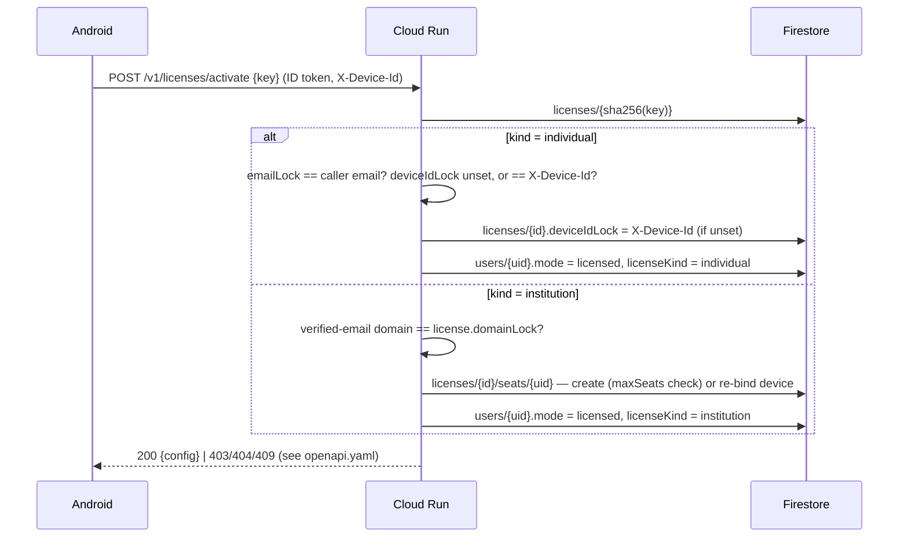

# Semper — Production Cloud Architecture (Pure GCP, Keyless)

**You probably don't need this document.** Analysis is fully offline and the
cloud is off unless someone builds with `INDIC_API_BASE_URL` set. Read it if
you are changing `backend/` or the sync path in `app/.../data/`.

| If you want to… | Go to |
|---|---|
| Deploy it and see it work | [BACKEND_SETUP_GCP.md](BACKEND_SETUP_GCP.md) |
| Understand why Drive and not GCS | [§0](#0-the-one-hard-truth-up-front-drive-is-not-gcs) |
| Follow a request end to end | [§2 auth](#2-authentication-flow) → [§4 upload](#4-upload-sequence-5-gb-resumable-keyless) |
| Find the code for a concept | [§7 backend map](#7-implementation-map) · [§8 Android map](#8-android-client-map) |
| Know the data shape | [§5 Firestore](#5-firestore-schema) · [§6 Drive layout](#6-google-drive-folder-hierarchy) |
| Understand demo / individual / institution licensing | [§20 Licensing & entitlements](#20-licensing--entitlements) |
| Renew or extend a license, or reason about expiry | [§20.6 Duration, grace, and renewal](#206-duration-grace-and-renewal) |
| Understand shared/concurrent institution seats | [§20.7 Floating seats](#207-floating-seats) |
| Use or deploy the web consoles | [§20.8 The consoles](#208-the-consoles-and-what-a-browser-may-do) |
| Fix sign-in | [AUTH_SETUP.md](AUTH_SETUP.md) |

> **Status / scope.** This document specifies the **GCP-native** backend:
> Firebase Auth → Cloud Run (FastAPI) → Firestore → Google Drive, with **no
> service-account JSON keys anywhere** and **no image processing in the cloud**.
> This is the only backend. The on-device engine
> ([ARCHITECTURE.md](../engine/ARCHITECTURE.md)) is unchanged — the cloud only does
> identity, metadata, orchestration, and audit.

**Non-negotiables baked into this design**

| Constraint | How it is honored |
|---|---|
| No JSON service-account keys (Workspace policy) | Cloud Run runs *as* a service account; Drive tokens are minted via **IAM Credentials `generateAccessToken`** (self-impersonation). Zero key material at rest. |
| Developer is not a Workspace admin | The only admin-gated step is a one-time "allow adding a service account to a Shared Drive" toggle. Everything else is a normal-user or Cloud-project action. |
| Storage stays in company Google Drive (5 TB) | The Cloud Run SA is a **Manager** of a company **Shared Drive**; writes count against the org pool. (Manager, not Content manager: `files.delete` requires organizer rights, so erasure fails otherwise.) |
| Cloud never processes images | Cloud Run only creates folders, initiates resumable sessions, and records metadata. **Bytes never transit Cloud Run** — the client PUTs directly to Drive's resumable session URI. |
| No secrets in Android | Android holds only public config (`google-services.json`, which ships in every APK by design). The device private key lives in Android Keystore and never leaves the device. |
| $0 during pilot | Scale-to-zero Cloud Run, Firestore free tier, no egress through the backend. |

---

## 0. The one hard truth up front: Drive is not GCS

This comparison comes first because it shapes every downstream decision.

| Capability | Google Cloud Storage | Google Drive (your constraint) |
|---|---|---|
| Direct client **upload** without backend touching bytes | ✅ V4 **signed URL** (fully anonymous, per-object, ≤7-day TTL) | ⚠️ **Resumable session URI** only — broker must initiate it; client then PUTs directly. Works, but the URI is minted by the SA, not signed offline. |
| Direct client **download** without backend touching bytes | ✅ signed URL | ❌ **No anonymous signed download.** Requires an OAuth token or making the file link-shared. Downloads must be **brokered** or link-shared (privacy hit). |
| Per-object access control | ✅ IAM / signed policy | ❌ Coarse: file/Shared-Drive membership only. |
| Object size | 5 TiB | 5 TB file OK, but **750 GB/user/day** upload ceiling and **400,000 items/Shared Drive**. |
| Throughput / quota | Effectively unlimited | Drive API **12,000 queries/min**/project; upload throughput fine but item/day caps bite at scale. |
| Cost model | Pay per GB + egress | **Free** (already-paid 5 TB Workspace pool) — this is the whole reason to use it. |

**Conclusion.** Drive is the right choice *now* purely because the 5 TB is
already paid for and must stay in-org. It is a **capacity and download-ergonomics
liability at scale**. The architecture is therefore built so that **the Android
client API is storage-agnostic** — migrating Drive→GCS later is a backend-only
change (see §19).

---

## 1. Production architecture diagram

```
 ┌─ Android device ────────────────────────┐   ┌─ Browser: the consoles (§20.8) ─────────┐
 │ Android Views UI (XML + findViewById)   │   │ app.sempermechanics.com = Firebase      │
 │ ├─ Firebase Auth (Firebase ID token)    │   │ Hosting, auth project; static pages     │
 │ ├─ Android Keystore (device key)        │   │ /login /account /console/institution    │
 │ ├─ WorkManager CoroutineWorker          │   │ /console/operator                       │
 │ └─ OkHttp streaming (chunked resumable) │   │ ├─ Firebase Auth: redirect + TOTP       │
 │ ── DIC / OpenCV / PDF: 100% on-device   │   │ └─ fetch + Bearer (CORS preflight)      │
 └────────────────────┬────────────────────┘   └────────────────────┬────────────────────┘
                      │ ID token + device signature                 │ ID token: 2nd factor done,
                      │                                             │ recent auth_time; no device
                      └──────────────────────┬──────────────────────┘
                                             ▼ HTTPS
 ┌──────────────────────────────── Google Cloud project ─────────────────────────────────┐
 │                                                                                       │
 │  ┌───────────────────┐  validates the Firebase JWT (iss / aud = the auth              │
 │  │ API Gateway       │  project); refuses any path not declared in                    │
 │  │ semper-gw (ESPv2) │  gateway/openapi.yaml; allowCors hands the                     │
 │  │                   │  preflight to Cloud Run; per-consumer quotas                   │
 │  └─────────┬─────────┘                                                                │
 │            │ invokes as indic-gw@ (run.invoker; never allUsers)                       │
 │            ▼                                                                          │
 │  ┌──────────────┐   re-verifies the ID token (firebase-admin), then the               │
 │  │  Cloud Run   │   device signature, or from a browser the second                    │
 │  │  FastAPI     │   factor + sign-in age; CORS for CONSOLE_ORIGINS only               │
 │  │  (scale→0)   │                                                                     │
 │  │  runs as SA  │──▶ Firestore (users, devices, licenses + seats,                     │
 │  │ indic-api@…  │        invites, sessions, files, audit_logs)                        │
 │  │              │◀── Cloud Tasks: session provisioning, as indic-api@                 │
 │  └──────┬───────┘                                                                     │
 │         │ IAM Credentials generateAccessToken                                         │
 │         │ (Drive scope, keyless self-impersonation)                                   │
 │         ▼                                                                             │
 │  ┌──────────────┐   create folders, init resumable session                            │
 │  │ Drive API    │   (metadata only — NO bytes)                                        │
 │  └──────┬───────┘                                                                     │
 │         │ returns resumable session URI                                               │
 │ Cloud Logging / Monitoring / Error Reporting  ◀── structured logs                     │
 └─────────┼─────────────────────────────────────────────────────────────────────────────┘
           │ session URI handed back to the device, which
           ▼ PUTs bytes to Drive directly
     ┌─────────────────────────────────────────────┐
     │ Company Google Workspace — Shared Drive     │
     │ "Semper-Research-Storage" (5 TB pool)       │
     │ SA is Manager. Device PUTs bytes here       │
     │ DIRECTLY (never through Cloud Run).         │
     └─────────────────────────────────────────────┘
```

**Trust boundaries.** (1) Device↔Cloud Run: mutually authenticated (the
Firebase ID token proves *user*; the Keystore signature proves *device*). (2)
Browser↔Cloud Run: there is no device key to sign with, so what a state-changing
browser call must prove instead is a **completed second factor and a recent
sign-in**, both read from the ID token by Cloud Run (§20.8). CORS decides only
which origins' pages may *read* a response — bearer tokens, no cookies — so it
is not an authorisation control and nothing relies on it as one. (3)
Gateway↔Cloud Run: Cloud Run is not public, and never `allUsers`.
`run.invoker` is held by the gateway's service account, by the API's own
(which Cloud Tasks uses to call back for provisioning), by the deployer (the
candidate `/readyz` smoke calls the revision directly) and by the owner
account for hand checks. Every other way in from outside passes the
gateway's JWT check and its declared paths — and each of those four still
needs a Firebase ID token for any `/v1/*` route, because Cloud Run verifies
the token itself. (4) Cloud
Run↔Google APIs: keyless, via the metadata server + IAM Credentials. (5)
Device↔Drive: capability-scoped — the resumable session URI authorizes writes
to *exactly one file*, nothing else.

---

## 2. Authentication flow

Identity is federated through **Firebase Authentication** — Google, email link,
or email/password, all producing one **Firebase ID token** (a JWT, ~1 hour).
The backend **re-verifies on every request** with `firebase-admin`: stateless,
with zero server-side key management. The client refreshes silently through the
Firebase SDK.



Claims consumed downstream: `sub` (the stable Firebase uid, identical across
providers for one account), `email`, `email_verified`, `name`, and
`firebase.sign_in_provider`.

**Why re-verify vs. minting our own session JWT.** Re-verifying needs **no
signing secret** — perfectly aligned with "no secrets." If per-request cert
verification ever becomes a latency concern, mint a short-lived backend session
JWT using **IAM Credentials `signJwt`** (Google signs it; verifiable via the
SA's public JWKS) — still keyless. Not needed at pilot scale.

**Access control is a separate decision from authentication.** Verification
proves identity; it does not grant entry. `get_or_create_user`
([repo/users.py](../../backend/app/repo/users.py)) assigns:

1. `role = admin` if a **verified** email is in `ADMIN_EMAILS`;
2. `access_status = APPROVED` if admin, or `AUTO_APPROVE=1`, or a **verified**
   email at `AUTO_APPROVE_HD`;
3. otherwise `PENDING` — authenticated but refused with `403 not_approved`
   until an admin approves them.

Auto-approval always requires `email_verified`, so a fresh email/password
signup cannot claim a privileged domain it does not own.

> **There is no hosted-domain gate on sign-in, by design.** Any account
> Firebase Auth accepts can authenticate; the `PENDING`/`APPROVED` status is
> the control that holds. This is what makes the "outside collaborator requests
> access" flow work. (Earlier revisions carried an `ALLOWED_HD` setting that no
> code read — it has been removed rather than left to imply a gate that was
> never there.)

---

## 3. Device registration & challenge-response

Device identity = an EC P-256 key pair generated **inside** Android Keystore
(`StrongBox` when available). The private key is non-exportable; only the
public key and a stable `deviceId` (a random UUID, *not* IMEI/serial/MAC) leave
the device.

```mermaid
sequenceDiagram
    participant A as Android (Keystore)
    participant R as Cloud Run
    participant F as Firestore
    A->>A: generateKeyPair(EC P-256, StrongBox, user-auth optional)
    A->>R: POST /v1/devices/register {deviceId, publicKeyPem, model, osVer}\n(Authorization: ID token)
    R->>F: users/{uid} exists? one active device already bound?
    alt no active device
        R->>F: devices/{deviceId} = {uid, publicKeyPem, status: ACTIVE}
        R-->>A: 201 registered
    else already bound to another device
        R-->>A: 409 device_conflict (needs admin re-bind)
    end

    Note over A,R: Every subsequent mutating request:
    A->>R: POST /v1/challenge (ID token) 
    R->>F: store nonce (TTL 120s) bound to uid+deviceId
    R-->>A: {nonce}
    A->>A: sig = Keystore.sign(nonce || method || path[?query] || bodySHA256)
    A->>R: POST /v1/sessions ... headers: X-Device-Id, X-Nonce, X-Signature
    R->>F: load devices/{deviceId}.publicKeyPem; verify sig; consume nonce
    R-->>A: 200 (or 401 bad_signature / 409 nonce_replay)
```

**One-user-one-device binding.** `devices/{deviceId}.uid` is unique per active
device. Re-registering the *same* `deviceId` for its owner is idempotent — it refreshes
the stored public key and returns `201` with `healed: true` (see
`register_device` in `backend/app/routers/devices.py`). Registering a *different* second device for a
`uid` that already has one returns `409 device_conflict`; moving to genuinely
new hardware means an admin revokes the prior device first. (There is no
`:rebind` endpoint — that was a design idea, not something implemented.)

**Device records are settled, not orphaned.** Both transitions now write the old
record rather than leaving it `ACTIVE` and unreachable:

| Event | What happens to the device docs |
|---|---|
| Admin revokes or suspends a user | **Every** device of that uid moves to `REVOKED` with a `revokedAt`, and `users/{uid}.activeDeviceId` is cleared (`set_user_status` in `backend/app/repo/users.py`) |
| A new device is registered after that | The previous device moves to `SUPERSEDED` with a `revokedAt`, so history shows *why* it stopped being usable rather than just vanishing |

Admin revoke itself requires a `verified_device` caller — an admin cannot revoke
from an unattested session.

**What the signature covers.** `nonce || METHOD || path || SHA-256(body)`, with
`?` + the query string appended to the path when the request has one. No route
takes query parameters today, so appending only when non-empty leaves the
message byte-identical for every current call — the client and
`backend/app/deps.py` can therefore ship independently, and a future
query-bearing route is covered without a flag day. A signed request cannot be
replayed against its own path with the parameters swapped.

**Client nonces (one round-trip, not two).** A per-request challenge doubles
the RTT of every signed call, so the app now mints its own nonce:
`t1.<unix seconds>.<128 random bits, base64url>`. It goes in `X-Nonce` and is
signed exactly like a challenge — the message format does not change. The
server (`deps.verified_device`) accepts it when:

1. the seconds are within `CLIENT_NONCE_WINDOW_SECONDS` (120) of its own clock —
   checked first, with no write, so a stale or far-future nonce costs nothing;
2. the signature verifies; and only then
3. `challenges/{nonce}` can be **created** (`claim_client_nonce`). `create()`
   fails on an existing document, so a nonce is single-use, and the collection's
   existing TTL on `expireAt` (window + 60 s) cleans it up. Claiming after the
   signature means an unsigned flood cannot fill the collection.

The seconds are the server's, not the phone's: `ClientNonce.ServerDateObserver`
learns the offset from the `Date` header of any API response, so a phone set to
the wrong time still signs valid nonces. Until a `Date` has been seen, and for
the rest of the process after any refusal, the app uses `POST /v1/challenge` as
before. A refusal is a 401 `nonce_invalid_or_replayed` raised before the route
runs, so the app re-sends that one call with a challenge. The two sides deploy
in either order: an old backend refuses every `t1.` nonce once, and an old app
never sends one. Any value that is not a `t1.` nonce takes the challenge path,
and `CLIENT_NONCE_WINDOW_SECONDS=0` switches client nonces off.

Replay protection is the same as a challenge's: one Firestore document per
nonce, created once. A captured request replays for no longer than a challenge
does, since both expire in minutes and both are consumed on first use.

---

## 4. Upload sequence (5 GB, resumable, keyless)

### 4.1 Provisioning is asynchronous

Opening one Drive resumable session per file used to happen **inline** inside
`POST /v1/sessions`. At the 600-file ceiling that is roughly 1200 sequential
round-trips inside a 60-second Cloud Run request budget, so a large analysis
simply could not be uploaded. Provisioning now runs in a **Cloud Task** and the
request only reserves the session.



Three properties worth knowing before you change this path:

- **The task name is deterministic** (`provision-{sid}`), so Cloud Tasks
  de-duplicates. A retried `create_session` for the same session cannot
  double-provision; an `AlreadyExists` on enqueue is treated as success.
- **Enqueue failure is not request failure.** `enqueue_provision` returns `False`
  when the queue is unconfigured or the call fails, and the caller provisions
  **inline** instead. Leaving `TASKS_QUEUE` empty is therefore a supported
  configuration — local dev and the test suite run that way, and the client
  cannot tell the difference beyond latency.
- **A failed provision is recorded, not silent.** The task marks the session
  `PROVISION_FAILED` with an error code so Cloud Tasks can retry and a polling
  client is told to stop waiting.
- **A failed enqueue is an error, not a quiet fallback.** It logs
  `provision_enqueue_failed` at ERROR with `errorCode=tasks_enqueue_failed`
  and the exception type. Before it was logged, a missing
  `iam.serviceAccountUser` grant made every session provision inline, 5–7 s
  per request, with nothing in the error log.
- **Small manifests skip the queue.** Up to `INLINE_PROVISION_MAX_FILES` (8)
  files are provisioned inside the request: a bundle backup is three, and the
  task hop plus the client's first poll cost more than opening three sessions.
  The reply is built from the targets just opened (`provision_session` returns
  them) rather than read back, so the inline path costs 6 + N Firestore reads
  instead of 8 + 2N ([perf/request-volume.md](../perf/request-volume.md) Pass 4).
- **The folder walk is cached.** The per-user and `sessions` folder IDs are
  kept on `users/{uid}` (`driveFolderId`, `driveSessionsFolderId`). A later
  session checks the cached `sessions` folder still exists (one `files.get`)
  and creates only its own folder, instead of four sequential list-or-create
  calls from the root. The check and the create run concurrently, and the
  session folder is created without a name search (its id was minted by this
  request), so a warm upload spends one Drive round-trip on folders before the
  resumable sessions open in parallel. A deleted or trashed folder fails the
  check: the folder just made under it is deleted and the full walk runs again
  and re-caches. A Cloud Tasks retry reuses the session's stored
  `driveFolderId` instead of creating a second one. `session_provisioned`
  logs `folderMs` (the folder phase) next to `latencyMs` (the whole provision).

`/v1/tasks/provision-session` is authenticated by `tasks.tasks_caller`, not by
anything in `deps.py`: the caller is Google, so there is no uid, no device and no
`access_status`. It verifies the OIDC token against the configured audience
**and** requires the token's email to equal `TASKS_INVOKER_SA` — the audience
check alone is not authentication, because any Google account can mint a token
for a public audience.

### 4.2 Transfer and completion

```mermaid
sequenceDiagram
    participant W as WorkManager Worker (OkHttp)
    participant R as Cloud Run
    participant IAM as IAM Credentials
    participant D as Google Drive (Shared Drive)
    Note over R,IAM: token = generateAccessToken(SA, scope=drive) — NO json key
    loop each file, 32 MiB chunks
        W->>D: PUT uploadUrl  Content-Range: bytes a-b/total  (direct, no backend)
        D-->>W: 308 Resume Incomplete (Range: bytes=0-b)
    end
    W->>D: PUT final chunk
    D-->>W: 200/201 {id, md5Checksum, size}
    W->>R: POST /v1/files/{fileId}/complete {driveFileId, md5, bytes}
    R->>R: verify size + (client md5 vs Drive md5Checksum)
    R->>Firestore: files/{fid}=COMPLETED; if all done → sessions/{sid}=COMPLETED
    R->>Firestore: audit_logs += UPLOAD_COMPLETED
    R-->>W: 200
```

**Resume after crash / network loss.** The resumable session URI survives ~1
week. On restart the worker issues `PUT uploadUrl` with
`Content-Range: bytes */TOTAL` (zero-length body) → Drive replies `308` with the
last-received byte in the `Range` header → worker resumes from there. No bytes
re-sent. WorkManager's `BackoffPolicy.EXPONENTIAL` + network constraint handles
retry/offline.

**Integrity.** At `:complete` the backend asks Drive for the object's real
`size`/`md5Checksum` and rejects a mismatch with `422` (`size_mismatch` /
`checksum_mismatch`), leaving the file `PENDING` rather than marking it
`COMPLETED` — see `complete_file` in `backend/app/routers/files.py`. It does **not** currently mark
`FAILED`, delete the Drive object, or auto-re-enqueue; the client retries the
completion. Whenever Drive reports an `md5Checksum` (always for our binary
blobs), the client **must** supply a matching `md5`; omitting it is treated as
`checksum_mismatch`. The check is skipped only when Drive itself has no md5
(Docs-native types we never store). The Android client computes the local file
MD5 during upload so `:complete` does not depend on Drive's completion JSON
including `md5Checksum`.

**Session binding (confused-deputy guard).** `:complete` does not trust the
client's claim that a `driveFileId` belongs to its session. `get_file_meta` reads
the object's `parents` from Drive and the backend rejects any file whose parent is
not the caller's own session folder — so a valid token cannot bind an arbitrary
Drive object (or another user's) into its session record. This is why the upload
init requests `fields=id,md5Checksum,size` and completion re-fetches
`size,md5Checksum,parents` rather than believing the PUT response.

**Upload targets require attestation.**
`GET /v1/sessions/{sid}/uploads` hands out Drive upload capability URLs, so it is
gated by `deps.device_or_legacy_reader` rather than a plain ID-token dependency.
While `REQUIRE_ATTESTED_UPLOADS` is unset it accepts either a full device
signature *or* an ID token alone (startup warning). **Production keeps
`REQUIRE_ATTESTED_UPLOADS=1`**; `deploy-backend.yml` pins that from the GitHub
var of the same name — an empty var clears the flag on redeploy. Every other
write and mint path already requires a device signature.

**A device signature is not a binary attestation.** It proves the caller holds
the account's registered device key; it says nothing about which build is
holding it, and the Firebase Web API key that mints ID tokens ships inside the
APK as an identifier rather than a secret. `APP_CHECK_MODE` (`off` default /
`monitor` / `enforce`) closes that in `deps.current_user`: a caller sending
`X-Device-Id` must also carry a valid Firebase App Check token, which the four
consoles never trip because a browser sends no device id. Checked *before*
`get_or_create_user`, so a refusal creates no account row and moves no device
lock, and refused as `app_check_required` rather than `not_approved` — the
account may be perfectly entitled. Rollout and the client's fail-open half:
[AUTH_SETUP.md §3.2](AUTH_SETUP.md).

**A Drive outage must never erase session metadata.** `GET /v1/sessions?verify=true`
probes whether each session's blobs still exist, and purges Firestore metadata
for ones that are gone. The probe returns three states, not two:

| Probe result | Meaning | What the backend does |
|---|---|---|
| `ALIVE` | Drive confirmed the object | Nothing |
| `MISSING` | Drive confirmed it is gone | Purge the session metadata |
| `UNKNOWN` | The probe raised — Drive 5xx, timeout, expired token | **Nothing.** Counted into an `indeterminate` tally |

The response carries `{requested, purged, indeterminate}` so the client knows the
verification was incomplete, and a non-zero `indeterminate` is logged at WARNING
with `dependency="drive"`. Collapsing `UNKNOWN` into `MISSING` would turn a
transient outage into permanent data loss for the user, which is exactly the bug
this shape exists to prevent — see the `MISSING` / `UNKNOWN` constants in
`drive.py`.

**Resumable restore download.** Restore streams bytes back through Cloud Run
(there is no anonymous signed download URL). Drive honors HTTP `Range` on
`alt=media`, so `open_download` forwards a `Range` header. The Android client
requests **bounded 1 MiB windows** (`bytes=N-M`) so each GET finishes inside the
API Gateway deadline; a truncated chunk resumes from the `.part` file length
(`206` + `Content-Range`) instead of restarting the whole Session.zip. After
changing `gateway/openapi.yaml` deadlines, recreate the API Gateway **api-config**
(Cloud Run deploy alone does not update the gateway).

**One Session.zip per session (current), not per-file objects.** The product now
uploads a single `bundle`-role `Session.zip` holding `raw/`, `dat/`, `csv/` and
the report archives (plus a small `metadata.json` at the session root), so a
session costs ~1–2 Firestore file docs instead of 3F+4. This trades in-Drive
browsability of individual frames for far fewer resumable inits and Firestore
writes. The `raw/processed/reports/metadata` subfolder tree below is the older
per-file layout, kept for reference.

---

## 5. Firestore schema

Native mode, `nam5`/regional to match Cloud Run region. Collections:

```
users/{uid}                       (uid = Google 'sub')
  email, displayName              (note: `hd`/hostedDomain is NOT persisted today —
                                   get_or_create_user does not write it, so
                                   /v1/me/export returns hostedDomain: null)
  role: "user" | "admin"
  access_status: "PENDING" | "APPROVED" | "SUSPENDED"
  activeDeviceId: string | null
  driveFolderId                   (…/user/{uid} folder)
  maxSessions, maxFilesPerSession, maxFrames   (optional per-user quota overrides)
  # License terms, mirrored from licenses/{id} at activation so the read path
  # needs no second lookup. A snapshot: PATCH /v1/admin/licenses/{id} fans new
  # values back out here (§20.6). Absent entirely until a license attaches.
  mode: "licensed" | "demo"       (`plan` mirror kept for older clients; §20.5)
  licenseId, licenseKind, licensePrefix
  licenseDuration: "perpetual" | "timed"
  licenseSeating: "assigned" | "floating"
  leaseExpiresAt                  (floating only; written by checkout, cleared
                                   by release. Mirrored here so effective_mode
                                   stays a pure function — §20.7)
  licenseExpiresAt                (Timestamp; absent when perpetual)
  licenseGraceDays: number        (absent reads as ZERO, not the fleet default; §20.6)
  licenseMaxAnalyses: number      (optional per-license cloud cap)
  schemaVersion                   (stamped by backend/scripts/migrate_schema.py)
  createdAt, updatedAt, lastSeenAt (Timestamp)
  seenCheckpointAt                (Timestamp; stamped by a revoke — the instant
                                   seat reconciliation measures check-in against,
                                   and overrides the lastSeenAt write throttle
                                   once, on the next request; §20.12)

devices/{deviceId}                (deviceId = client UUID)
  uid, publicKeyPem
  status: "ACTIVE" | "REVOKED" | "SUPERSEDED"
  revokedAt                       (set on REVOKED and SUPERSEDED)
  model, osVersion, appVersion
  registeredAt, lastAssertionAt

challenges/{nonce}                (short-lived, TTL-deleted)
  uid, deviceId, createdAt, expireAt (Timestamp, TTL policy)

sessions/{sessionId}
  uid, deviceId
  specimen: string
  status: "PENDING" | "PROVISIONING" | "PROVISION_FAILED"
        | "UPLOADING" | "COMPLETED" | "FAILED"
        (PROVISIONING and UPLOADING are IN_FLIGHT_STATUSES — both still
         expect more bytes and both count against the session quota)
  driveFolderId                   (…/session/{sid} folder)
  totalBytes, fileCount, completedCount
  metrics: { pointsConverged, avgIcgnIters, execMs }  // small, from device
  createdAt, updatedAt, completedAt

files/{fileId}                    (fileId = deterministic sid_role_name)
  sessionId, uid
  role: "raw" | "processed" | "reports" | "metadata" | "csv" | "dat" | "bundle"
        (see Role in models.py; "bundle" is the Session.zip the app now ships)
  name, sizeBytes, sha256
  status: "PENDING" | "UPLOADING" | "COMPLETED" | "FAILED"
  uploadUrl                       (resumable session URI, cleared on complete)
  driveFileId, driveMd5
  createdAt, updatedAt

licenses/{id}                     (id = sha256(key) — the key hash IS the doc id)
  kind: "individual" | "institution"
  mode: "licensed" | "demo"       (`plan` mirror kept for older clients; see §20)
  keyPrefix                       (first segment, e.g. "SEMP-AB12"; plaintext key never stored)
  keyHash                         (same value as the doc id; see §20.5)
  status: "unused" | "redeemed" | "active" | "revoked"
                                   (individual starts "unused"; institution starts "active")
  # individual only:
  emailLock                       (required at mint; the address the licence
                                   is delivered to)
  deviceIdLock                    (empty at mint in normal issuing; bound to
                                   the first device that signs in — §20.1)
  redeemedByUid
  # institution only:
  domainLock                      (verified-email domain required to join, e.g. "university.edu")
  adminEmails: string[]           (verified emails allowed to manage this license's seats)
  seating: "assigned" | "floating"   (absent reads as assigned; §20.7)
  maxSeats: number | null         (assigned: caps the ROSTER. floating: caps
                                   CONCURRENT LEASES, and the roster is
                                   deliberately uncapped. null = unlimited,
                                   which floating rejects at mint.)
  seatsUsed: number               (roster size; kept in sync with the seats
                                   subcollection below)
  leasesActive: number            (floating only — who is using it right now)
  # duration is orthogonal to kind — either kind may be either shape.
  duration: "perpetual" | "timed"
  expiresAt                       (Timestamp; required when timed, absent when perpetual)
  graceDays: number               (entitlement continues UNCHANGED this long past
                                   expiresAt; 0 is a hard cliff. §20.6)
  supportUntil                    (Timestamp, optional; informational — never gates)
  maxAnalyses                      (optional, either kind)
  createdByUid, createdAt, updatedAt
  updatedByUid, updatedAt         (set by the renewal route)

licenses/{id}/seats/{uid}         (institution only — one doc per roster member)
  uid, email, deviceIdLock
  status: "active" | "disabled" | "revoked"
                                  (a revoked seat cannot be held or resumed —
                                   409 seat_revoked; the member is re-added)
  # floating only — the lease. Absent means "holds no seat right now", which
  # for most of a floating roster is the normal state.
  leaseExpiresAt                  (Timestamp; compared to now, never trusted
                                   to have been cleaned up — §20.7)
  leaseDeviceId, lastHeartbeatAt
  createdAt, updatedAt

audit_logs/{autoId}               (append-only)
  ts (Timestamp), uid, deviceId, ip, ua
  action: "LOGIN" | "DEVICE_REGISTER" | "DEVICE_REBIND" |
          "SESSION_CREATE" | "UPLOAD_COMPLETE" | "AUTH_DENIED" |
          "LICENSE_ACTIVATE" | "INSTITUTION_SEAT_PATCH" | "INSTITUTION_SEAT_REVOKE" | ...
  target: { type, id }
  outcome: "OK" | "DENIED" | "ERROR"
  detail: map
```

**Indexing.**
- `backend/firestore.indexes.json` is the source of truth and defines **four
  composite indexes**: `sessions(uid, localSessionId, status)`,
  `sessions(uid, __name__)`, `users(access_status, __name__)` and
  `files(sessionId, __name__)`. The paginated listing and the admin pending-user
  query both need one. Deploy them with
  `firebase deploy --only firestore:indexes` — a missing index shows up as a
  `FAILED_PRECONDITION` at runtime, not at deploy time.
- **Exempt** large/opaque fields from indexing (`publicKeyPem`, `uploadUrl`,
  `sha256`) to cut index cost and stay off the 40 KB/1500-field limits.
- **TTL policy** on `challenges.expireAt` is a *field* policy, not an index, so it
  cannot live in that file. Enable it as part of operator setup — step A2a of
  [BACKEND_SETUP_GCP.md](BACKEND_SETUP_GCP.md). `consume_nonce` deletes a nonce on
  use; TTL reclaims the ones that are never consumed. An optional retention TTL on
  `audit_logs.ts` (e.g. 400 days) is still just a suggestion.

Security: Firestore is **written only by the Cloud Run SA** (server-side). No
Android SDK writes → Firestore Security Rules can be `allow read, write: if
false` (deny all client access); all access mediated by FastAPI. This removes a
whole class of rules-bypass risk.

---

## 6. Google Drive folder hierarchy

```
Shared Drive: Semper-Research-Storage/        (SA = Manager/organizer)
└── Research Storage/
    └── user/{uid}/
        └── session/{sessionId}/
            ├── raw/          Reference.png, Deformed_0001.png, …
            ├── processed/    heatmaps, overlays
            ├── reports/      Master_Report_0001.pdf
            └── metadata/     session.json  (device-authored, verbatim)
```

`{uid}` = Google `sub` (stable, opaque, not PII-leaking like email in a path).
Folder IDs are cached in `sessions.driveFolderId` / a `folders` map to avoid
re-resolving by name (name lookups are slow and race-prone).

---

## 7. Implementation map

The code is the specification — these modules are implemented and deployed, so
read them rather than a sketch. Sections 2–6 above explain *why* each behaves
the way it does.

| Concern | File | Notes |
|---|---|---|
| FastAPI app, middleware, lifespan | [`backend/app/main.py`](../../backend/app/main.py) | App factory; includes routers below |
| Routes by prefix | [`backend/app/routers/`](../../backend/app/routers/) | `health`, `account`, `devices`, `sessions`, `files`, `provision_tasks`, `admin`, `licenses`, `institutions` |
| License key format, hashing, `mode`/`kind` vocabulary | [`backend/app/licenses.py`](../../backend/app/licenses.py) | `SEMP-XXXX-XXXX-XXXX-XXXX`; sha256 hash is the Firestore doc id; `normalize_mode` / `normalize_kind` / `legacy_plan` (§20.5) |
| Floating seats, leases, pool accounting | [`backend/app/repo/leases.py`](../../backend/app/repo/leases.py), `claim_seat` in [`repo/claims.py`](../../backend/app/repo/claims.py) | `checkout_lease`, `release_lease`, `claim_seat`, `_sweep_expired_leases` (§20.7) |
| Duration, grace, renewal fan-out | [`backend/app/repo/user_config.py`](../../backend/app/repo/user_config.py), [`repo/claims.py`](../../backend/app/repo/claims.py), [`repo/license_admin.py`](../../backend/app/repo/license_admin.py) | `_expiry_state`, `_license_mirror_patch`, `update_license`, `license_summary` (§20.6) |
| Individual + institution license logic | [`backend/app/repo/activation.py`](../../backend/app/repo/activation.py), [`repo/claims.py`](../../backend/app/repo/claims.py), [`repo/institution_admin.py`](../../backend/app/repo/institution_admin.py), [`repo/seats.py`](../../backend/app/repo/seats.py), [`repo/devlock.py`](../../backend/app/repo/devlock.py) | `activate_license`, seat lifecycle, `revalidate_device_lock` (§20) |
| Institution IT self-service routes | [`backend/app/routers/institutions.py`](../../backend/app/routers/institutions.py) | Token + adminEmails auth; the surface behind `/console/institution`, and equally usable from a script. Also serves the `/v1/campus/*` aliases (§20.4, §20.5) |
| Session provision / purge | [`backend/app/session_provision.py`](../../backend/app/session_provision.py) | `provision_session` / `purge_session` |
| Auth + device dependencies | [`backend/app/deps.py`](../../backend/app/deps.py) | Bearer verify, device-signature check, `device_or_legacy_reader` (§4) |
| ID-token verify, keyless Drive token | [`backend/app/google_auth.py`](../../backend/app/google_auth.py) | Self-impersonation to add the Drive scope (§2) |
| Drive folders, resumable init, blob probe | [`backend/app/drive.py`](../../backend/app/drive.py) | Returns the opaque upload URI, and `ALIVE`/`MISSING`/`UNKNOWN` (§4) |
| Async provisioning | [`backend/app/tasks.py`](../../backend/app/tasks.py) | Cloud Tasks enqueue + OIDC callback auth (§4.1) |
| Firestore access | [`backend/app/repo/`](../../backend/app/repo/__init__.py), one module per aggregate behind the [`firestore_repo.py`](../../backend/app/firestore_repo.py) facade ([ADR-001](../adr/ADR-001-firestore-repo-package.md)) | Schema in §5; contention retries (`_run_tx` in `repo/_base.py`); device settlement (§3) |
| Input validation | [`backend/app/validation.py`](../../backend/app/validation.py) | Page cursors and document ids — see below |
| Rate limiting | [`backend/app/rate_limit.py`](../../backend/app/rate_limit.py) | Per-uid token buckets (§12) |
| Structured logging | [`backend/app/observability.py`](../../backend/app/observability.py) | JSON log records with request correlation (§17) |
| Outbound mail | [`backend/app/notify.py`](../../backend/app/notify.py) | Resend, fire-and-forget |
| Pydantic models | [`backend/app/models.py`](../../backend/app/models.py) | |
| Audit trail | [`backend/app/audit.py`](../../backend/app/audit.py) | |
| Config / env vars | [`backend/app/config.py`](../../backend/app/config.py) | Includes `DEV_INSECURE_AUTH`, `REQUIRE_ATTESTED_UPLOADS`, `APP_CHECK_MODE`, `TASKS_*` |
| Schema migrations | [`backend/scripts/migrate_schema.py`](../../backend/scripts/migrate_schema.py) | Versioned steps in `backend/scripts/migrations/` — see [FIRESTORE_SCHEMA_RUNBOOK.md](FIRESTORE_SCHEMA_RUNBOOK.md) |
| Container | [`backend/Dockerfile`](../../backend/Dockerfile) | Installs from `requirements.lock` with `--require-hashes`. `requirements.txt` is the pin list; lock versions of direct deps must match txt. |
| API Gateway spec | [`backend/gateway/openapi.yaml`](../../backend/gateway/openapi.yaml) | Covers all current routes; `__CLOUD_RUN_URL__` is substituted at deploy |

**Cursor validation.** Every paginated listing takes a `pageToken`, which becomes
a Firestore cursor. `validation.py` checks tokens and document ids before they
reach the query, so a crafted token cannot smuggle a path separator into a
collection reference and read across the collection tree. Treat any new
client-supplied identifier that reaches Firestore as needing the same treatment.

**Per-user quota overrides.** `resolve_user_config` merges the fleet defaults
(`DEMO_MAX_ANALYSES` / `LICENSED_MAX_SESSIONS_PER_USER`, `MAX_FILES_PER_SESSION`,
`MAX_FRAMES_PER_ANALYSIS`)
with optional per-user values on `users/{uid}`, so one tester can be raised
without redeploying. Admins set them via
`PATCH /v1/admin/users/{uid}/config`, and the app reads the resolved numbers
rather than hardcoding its own.

**`MAX_SESSIONS_PER_USER` is deleted, not merely unread.** It used to be the
one cap for everyone (default 4). `mode` now selects between
`DEMO_MAX_ANALYSES` (25) and `LICENSED_MAX_SESSIONS_PER_USER`, so a
deployment still setting the old variable silently gets 25 for every
unlicensed account (`backend/app/config.py`). `deploy-backend.yml` pins
`DEMO_MAX_ANALYSES`, `LICENSED_MAX_SESSIONS_PER_USER`, `ADMIN_WEB_MFA_ENABLED`,
`APP_CHECK_MODE` and `SELF_DEVICE_CHANGE_COOLDOWN_DAYS` with expression
defaults, and its "Describe live env" step warns when the retired variable is
still on the service. `deploy-cloudrun` merges env rather than replacing it,
so removal is a manual `--remove-env-vars` after promote.

**Firestore contention is retried, not returned.** Concurrent writes to the same
session document used to surface as a `500`. `_run_tx` (`backend/app/repo/_base.py`) now retries the
contended transaction, so a burst of `:complete` calls for one session settles
instead of failing the client.

---

## 8. Android client map

| Concern | File |
|---|---|
| Google sign-in, session state | [`data/AuthRepository.kt`](../../app/src/main/java/com/indicvision/semper/data/AuthRepository.kt) |
| Credential Manager helper | [`ui/auth/GoogleSignInHelper.kt`](../../app/src/main/java/com/indicvision/semper/ui/auth/GoogleSignInHelper.kt) |
| EC P-256 Keystore device key | [`data/DeviceKeyManager.kt`](../../app/src/main/java/com/indicvision/semper/data/DeviceKeyManager.kt) |
| Backend HTTP client | [`data/net/IndicApi.kt`](../../app/src/main/java/com/indicvision/semper/data/net/IndicApi.kt) |
| Token storage / refresh | [`data/net/TokenStore.kt`](../../app/src/main/java/com/indicvision/semper/data/net/TokenStore.kt) · [`TokenProvider.kt`](../../app/src/main/java/com/indicvision/semper/data/net/TokenProvider.kt) |
| Resumable upload worker | [`data/DicUploadWorker.kt`](../../app/src/main/java/com/indicvision/semper/data/DicUploadWorker.kt) |
| Restore / download | [`data/DicRestoreWorker.kt`](../../app/src/main/java/com/indicvision/semper/data/DicRestoreWorker.kt) · [`CloudRestore.kt`](../../app/src/main/java/com/indicvision/semper/data/CloudRestore.kt) |

The upload worker speaks the resumable protocol from §4: `PUT` with a
`Content-Range` header, `308` means keep going, `200`/`201` means the file
landed. It runs under WorkManager with a network constraint and exponential
backoff, so an upload survives losing connectivity or the app being killed.

Cloud sync stays off entirely unless `INDIC_API_BASE_URL` is set at build time
— see [BACKEND_SETUP_GCP.md](BACKEND_SETUP_GCP.md) step C1.

**The PENDING stamp lands before the upload is queued.** Both manual backup
sites (`HomeActivity`, `SettingsActivity`) write
`SessionRecord.SyncState.PENDING` and only then call
`CloudSync.enqueueUpload`. They stay in that order rather than turning
optimistic: an upload that finished first would have its SYNCED stamp
overwritten by the late PENDING, and the session would read as never backed
up.
---

## 9. IAM configuration

Two service accounts, least-privilege:

```bash
PROJECT=indic-prod   # placeholder GCP project id — replace with yours
API_SA=indic-api@$PROJECT.iam.gserviceaccount.com
DEPLOY_SA=indic-deployer@$PROJECT.iam.gserviceaccount.com
```
Firebase Auth may use a different project id (`indicvision-dic-app-auth`); see AUTH_SETUP.md and set `FIREBASE_PROJECT_ID` when they differ.

```bash
# Runtime SA — what Cloud Run runs AS
gcloud iam service-accounts create indic-api --project $PROJECT

# Firestore access
gcloud projects add-iam-policy-binding $PROJECT \
  --member="serviceAccount:$API_SA" --role="roles/datastore.user"

# Keyless Drive tokens: SA may impersonate ITSELF to add the Drive scope
gcloud iam service-accounts add-iam-policy-binding $API_SA \
  --member="serviceAccount:$API_SA" --role="roles/iam.serviceAccountTokenCreator"

# Logging / monitoring
gcloud projects add-iam-policy-binding $PROJECT \
  --member="serviceAccount:$API_SA" --role="roles/logging.logWriter"

# Deployer SA (used by GitHub Actions via Workload Identity Federation — NO KEY)
gcloud iam service-accounts create indic-deployer --project $PROJECT
for R in run.admin artifactregistry.writer cloudbuild.builds.editor apigateway.admin \
         storage.bucketViewer; do
  gcloud projects add-iam-policy-binding $PROJECT \
    --member="serviceAccount:$DEPLOY_SA" --role="roles/$R"; done
# Act as the runtime, gateway and default compute SAs only, not every SA in the project.
for SA in $API_SA indic-gw@$PROJECT.iam.gserviceaccount.com \
          $(gcloud projects describe $PROJECT --format='value(projectNumber)')-compute@developer.gserviceaccount.com; do
  gcloud iam service-accounts add-iam-policy-binding $SA \
    --member="serviceAccount:$DEPLOY_SA" --role="roles/iam.serviceAccountUser"; done
# Source deploys upload to this bucket; the object roles stay on it alone.
for R in storage.admin storage.objectAdmin; do
  gcloud storage buckets add-iam-policy-binding gs://run-sources-$PROJECT-asia-south1 \
    --member="serviceAccount:$DEPLOY_SA" --role="roles/$R"; done
```

`storage.bucketViewer` holds only `storage.buckets.get` / `.list`. It is needed at
project level because `gcloud run deploy --source` lists buckets to find the
`run-sources-*` one; without it every deploy fails with `403 … storage.buckets.list`,
as the staging runs of 2026-09-24 and 2026-09-25 did after the TD-71 clean-up. It
grants no object access, so CI still cannot read or change the Firestore export bucket.

**Drive membership (the only Workspace-side step, done by you, not the SA):**
add `indic-api@indic-prod.iam.gserviceaccount.com` as **Manager** of the
`Semper-Research-Storage` Shared Drive. If Workspace blocks adding a
service-account principal, a Workspace admin must one-time-allow it (Admin
console → Drive & Docs → Sharing → allow members outside org / add to the
allow-list). **No JSON key, no domain-wide delegation required.**

---

## 10. Cloud Run deployment

Container: [`backend/Dockerfile`](../../backend/Dockerfile) (python:3.12-slim,
uvicorn, 1 worker — with one vCPU a second worker only doubled cold-start
imports and memory). The exact deploy command with all flags is step B1 of
[BACKEND_SETUP_GCP.md](BACKEND_SETUP_GCP.md) — it is a runbook step, not
something to retype from here.

The shape it deploys into, and why:

| Setting | Value | Reason |
|---|---|---|
| Min instances | 1 in production, 0 in staging | A cold start cost ~6 s, paid by the first sign-in or upload after any idle spell. One warm instance is roughly $10–15/month. Override with the `MIN_INSTANCES` repository variable |
| Max instances | 10 | Pilot-sized ceiling |
| CPU / memory | 1 / 512Mi | Upload bytes bypass Cloud Run (device→Drive); restore still proxies Session.zip through `/content` |
| Timeout | 300 s | Matches the `/v1/files/{id}/content` API Gateway deadline (300 s) so Session.zip restore can finish; other JSON routes keep a 60 s gateway deadline. Session provisioning still runs as a Cloud Task. |
| Public endpoint | no | `run.invoker` is held by service accounts only (gateway, Tasks, deployer) plus the owner for manual smokes — never `allUsers`. The API Gateway is the public door; auth is still enforced in the app layer (ID token + device signature) |

No mounted secrets. All identity comes from the attached SA + metadata server.
HTTPS-only is the default; consider Cloud Armor / a WAF once public.

---

## 11. Application Default Credentials (ADC)

- **In Cloud Run:** `google.auth.default()` returns metadata-server
  credentials for `$API_SA`. **Nothing to configure, no file.** Drive scope is
  layered on via `impersonated_credentials` (§7.1).
- **Local dev:** `gcloud auth application-default login` mints a user ADC file
  under your own identity; grant your user `serviceAccountTokenCreator` on
  `$API_SA` to exercise the Drive path locally. Never download a key.
- **Never** set `GOOGLE_APPLICATION_CREDENTIALS` to a JSON key — that's exactly
  what the Workspace policy (and this design) forbids.

---

## 12. Security best practices (checklist)

- **Keyless everywhere:** ADC + IAM Credentials impersonation; WIF for CI. Zero
  long-lived key material.
- **Defense in depth on identity:** signature + `aud` + `iss` + `email_verified`
  + Firestore allow-list (`access_status`). Note there is deliberately **no `hd`
  sign-in gate** — any account Firebase accepts may authenticate; what it may
  *use* is decided by `access_status` (config.py spells this out). Domain only
  affects auto-approval via `AUTO_APPROVE_HD`, not admission.
- **Device binding:** non-exportable Keystore key, challenge/nonce with replay
  cache, admin-gated revoke that settles every device record (§3). Nonce TTL is a
  Firestore field policy the operator enables at setup — see §5.
- **Least privilege IAM:** `datastore.user` + self-`tokenCreator` only; deployer
  SA separate.
- **Firestore locked to the server:** client rules deny-all; all writes via API.
- **No PII in URLs/logs:** log `uid` (opaque `sub`), never tokens; scrub
  `Authorization`, `uploadUrl`, `X-Signature` from logs.
- **Capability-scoped uploads:** resumable URI authorizes one file only; expires.
- **Transport:** TLS only; HSTS; reject non-HTTPS.
- **Input validation:** pydantic models; cap `files[]` length and per-file bytes
  (reject >5 GB); sanitize filenames before Drive; validate page cursors and
  document ids in `validation.py` before they reach a Firestore query (§7).
- **Rate limiting (implemented in-process; distributed layer still open):**
  `rate_limit.py` applies per-uid token buckets to challenge, session create,
  download, export, erase, admin, listing, health, file-complete and
  session-verify. Because the buckets live in the process, they bound one Cloud
  Run instance rather than the fleet — the cross-instance layer is API Gateway
  quotas in `openapi.yaml`, with Cloud Armor still to come when the service is
  public. [PRODUCTION_READINESS_GATE.md](../ops/PRODUCTION_READINESS_GATE.md)
  tracks this as PARTIAL for that reason. On a device-signed route the bucket is
  declared as `dependencies=[deps.rate_limited(bucket)]`, which FastAPI resolves
  before `verified_device`: a 429 spends no nonce, so the app's unchanged retry
  is accepted rather than refused as a replay. An unsigned route checks its
  bucket in the handler with `rate_limit.enforce(bucket, key)`, the same call
  the dependency makes. Every 429 carries `Retry-After` (seconds to the next
  token), which the app honours up to 8 s.
  `tests/test_rate_limit_before_nonce.py` fails if a signed route checks its
  bucket inside the handler again, or if an unsigned 429 has no `Retry-After`.
- **Attested upload targets:** `/uploads` hands out capability URLs and is gated
  by `device_or_legacy_reader`; production keeps `REQUIRE_ATTESTED_UPLOADS=1`
  (§4).
- **Audit everything security-relevant**, append-only, with retention.
- **Privacy prerequisites for public launch:** privacy policy + account-deletion
  path (raw specimen images + email are personal data).

---

## 13. Failure recovery strategy

| Failure | Detection | Recovery |
|---|---|---|
| Network drop mid-chunk | OkHttp IOException | WorkManager retry; resume via `bytes */total` → 308 offset |
| App killed during upload | Worker re-created by WM | Reload plan from local store; resume each incomplete file |
| Resumable URI expired (~1 wk) | 404/410 on PUT | **Planned:** a `:reinit` broker endpoint to mint a fresh session URI. Not implemented today; the client re-creates the session. |
| Chunk checksum mismatch | Drive size/md5 checked at `:complete` | reject with `422`, leave the file `PENDING`; client retries the completion (no auto-delete/re-enqueue today) |
| Session stuck `UPLOADING` | janitor query `(status, updatedAt)` | after N hours → notify user / reinit / mark FAILED |
| Firestore write fails after Drive success | try/except around commit | idempotent `:complete` (deterministic fileId) → safe re-POST |
| Drive `403 storageQuotaExceeded` | broker init error | means writing to SA's personal 15 GB, not the Shared Drive → config alarm |
| Drive `429`/quota | broker/PUT 429 | exponential backoff + jitter; surface "try later" |
| Provisioning task fails | task marks `PROVISION_FAILED` | Cloud Tasks retries the task; a polling client sees the status and stops waiting instead of hanging on `PROVISIONING` |
| Cloud Tasks unavailable / unconfigured | `enqueue_provision` returns `False` | Provision inline in the request — slower, same result (§4.1) |
| Drive unreachable during a verifying refresh | probe yields `UNKNOWN` | **Purge nothing.** Report an `indeterminate` count and log at WARNING (§4) |
| Concurrent writes to one session doc | Firestore contention | Retried inside `_run_tx` (`backend/app/repo/_base.py`) rather than returned as `500` |

**Idempotency** is the backbone: deterministic `fileId` / `sessionId` mean every
mutation is safely retryable.

**429 and 503 promise different things, and the client treats them apart.**
A 429 comes from the per-instance token bucket (`rate_limit.py`) or the
gateway quota, both of which refuse *before* the handler runs, so nothing
happened and a repeat is never a second write. A 503 carries no such promise:
ESPv2 emits it both before and after handing the request on. The app's
`RetryOnTransient` interceptor therefore retries 429 on any call and 503 only
on GET and the two POSTs that are idempotent by contract
(`/v1/licenses/checkout`, whose repeat *is* the heartbeat, and
`/v1/licenses/release`). Session create and the upload broker are left out on
purpose: a duplicate there costs a Drive object. Three attempts, honouring
`Retry-After`; WorkManager keeps the long game. Client side:
[ARCHITECTURE.md](../app/ARCHITECTURE.md) "The two interceptors on the shared
client".

---

## 14. Cost analysis

**Pilot (10–50 users), target $0/month.**

| Service | Free tier | Pilot usage | Cost |
|---|---|---|---|
| Cloud Run | 2M req, 360k GiB-s, 180k vCPU-s / mo | tiny JSON reqs, scale-to-zero | **$0** |
| Firestore | 1 GiB, 50k reads / 20k writes / 20k deletes per day | metadata only, low volume | **$0** |
| IAM Credentials / metadata tokens | free | per-request token (cached 1 h) | **$0** |
| Drive storage | 5 TB already-paid Workspace pool | ~5 sessions/user × 1 GB | **$0 marginal** |
| Egress | uploads go **device→Drive**, not via Cloud Run | ~0 GB through GCP | **$0** |
| Cloud Logging | 50 GiB/mo free | structured logs | **$0** |
| Artifact Registry | 0.5 GB free | one image | **~$0** |

The killer design win: **bytes never transit Cloud Run**, so the usual
egress/compute blowup for 1–5 GB uploads simply doesn't exist.

**As users scale (hundreds→thousands):**
- *Cloud Run:* still cents/month — requests are small and infrequent (one burst
  per session). Even 10k sessions/day ≈ well within paid tier at ~$1–5/mo.
- *Firestore:* watch the **per-day free quotas**; thousands of users generating
  sessions + audit logs can exceed 20k writes/day → single-digit $/mo. Batch
  writes, TTL-expire old audit logs.
- *Network:* remains ~$0 (byte path bypasses GCP).
- *Drive capacity:* **this is what breaks first** (see §15).

---

## 15. Scalability analysis — when Drive becomes the ceiling

Drive limits, in the order they bite:

1. **5 TB pool.** At ~1 GB/session, ~5,000 sessions total. With retention (auto-
   delete raw after N months) you stretch it, but **capacity is the #1 wall.**
2. **750 GB / user / day upload.** The SA is the "user"; ~750 sessions/day is
   the hard ingest ceiling across *all* users. A busy field day with hundreds of
   testers can hit this.
3. **400,000 items / Shared Drive.** Many small files per session erode this;
   bundle `raw/` if sessions get file-heavy.
4. **Download ergonomics.** No anonymous signed download → every download either
   brokers bytes through Cloud Run (reintroduces egress/compute cost) or
   link-shares files (privacy regression). At dashboard scale this is painful.
5. **API query quota** (12k/min): fine unless you fan out huge per-file loops.

**Migrate to GCS when any of:** you approach ~4 TB, sustained ingest nears
750 GB/day, you need real per-object access or performant in-app downloads, or
Drive rate-limits start showing in logs. GCS removes all five ceilings at the
cost of GB-month + egress billing (~$0.02/GB-mo storage, ~$0.12/GB egress).

---

## 16. CI/CD pipeline

> **Status: in use.** `.github/workflows/deploy-backend.yml` deploys the backend
> to Cloud Run, running ruff + pytest first. It is `workflow_dispatch` (manual)
> and still needs `GCP_WIF_PROVIDER` and `GCP_DEPLOY_SA` configured for the
> target environment. `.github/workflows/ci.yml` builds and tests the app
> ([CI.md](../ops/CI.md)).

**Traffic is shifted only after the new revision answers.** The deploy does not
replace the serving revision and hope:

1. Deploy tagging the revision `cand-<run_id>-<run_attempt>`. When the service
   **already exists**, use `no_traffic: true` so the previous revision keeps
   serving. **First create** must omit `no_traffic` (Cloud Run rejects it on
   create).
2. Smoke the **tagged candidate URL** at `/readyz`, using an ID token minted with
   the *service URL* as its audience (both environments run
   `--no-allow-unauthenticated`, so an unauthenticated probe would only ever
   prove that the gateway rejects it).
3. Promote the candidate to 100% traffic only if the smoke passes (update path):
   `update-traffic --to-latest`, after checking the latest ready revision *is*
   the candidate, removing every `cand-*` tag in the same call. Traffic then
   follows the latest revision, so a later `gcloud run services update` serves
   without a manual traffic move; the next deploy's `no_traffic` pins LATEST to
   the serving revision by name before its candidate appears.

On an update deploy, if the smoke fails there is nothing to roll back — the
candidate never carried traffic. Rollback is only relevant if a later step fails
after promotion. `REQUIRE_ATTESTED_UPLOADS` is passed from the GitHub var on
every deploy — keep production at `1`.

The revision suffix carries the **run attempt** as well as the run id, so
re-running a failed job cannot collide with the revision name the first attempt
already created.

It authenticates with **Workload Identity Federation** rather than a stored key:
a pool trusting GitHub's OIDC, mapped to a deployer service account and
restricted to this repo, with `permissions: id-token: write`. That keeps the
no-JSON-keys rule (§0) intact all the way through delivery. The signing keystore
for Android release builds stays in GitHub encrypted secrets or Play App
Signing.

---

## 17. Monitoring and logging

**Implemented:**
- **Liveness** `GET /healthz` — process up; no dependency probes (safe for
  restart loops).
- **Readiness** `GET /readyz` — bounded Firestore + Drive probes; stable 503
  detail codes (`firestore_unreachable`, `drive_unhealthy`, …). Not published
  at the API Gateway (each hit costs a Drive call and the 503 names the failing
  dependency); reachable only on the private run.app URL with an invoker token.
- **Structured JSON access log** — UTC `timestamp`, `requestId`, `method`,
  `path`, `status`, `latencyMs`, `outcome`, `uid` / `deviceId` when resolved,
  `opClass` / `routeTemplate` for usage rollups, optional `fileCount` /
  `frameCount` on session create, and `errorCode` on failures
  (`backend/app/observability.py` + middleware). Never logs tokens/signatures/URIs.
  `routeTemplate` is the route's **declared** path with every parameter as
  `{id}` (`/v1/licenses/{id}/revoke`), registered from the routers at startup;
  only an undeclared path (a 404) falls back to collapsing long segments.
  `opClass` is one of `health`, `attest`, `login`, `account`, `config`,
  `admin`, `license`, `institution`, `backup`, `sync`, `restore`, `other`;
  `tests/test_op_class.py` fails if a declared route lands in `other`.
  Client 500 bodies stay opaque (`internal_error`) on
  Cloud Run.
- **Audit trail** in Firestore `audit_logs` — the compliance record (Cloud
  Logging is the operational one).
- **Async Resend notify** — access-request mail is enqueued off the request
  path with Idempotency-Key + bounded retry (`backend/app/notify.py`).

### Cloud Error Reporting and log-based alerts (operator setup)

Configure in the GCP project that hosts Cloud Run. Ownership: **backend on-call**
(default: the deployer listed in `ADMIN_EMAILS` / support mailbox) until a
dedicated rotation exists.

| Signal | How to wire | Threshold (starting point) | Action |
|---|---|---|---|
| Unhandled / reported errors | Error Reporting ingests `@type` ReportedErrorEvent lines and Cloud Run stderr | New error group or >5 events / 5 min | Page on-call; check `/readyz` and recent deploys |
| `outcome=server_error` access lines | Log-based metric on `jsonPayload.outcome="server_error"` | >10 / 5 min | Investigate revision; consider traffic rollback |
| `errorCode=firestore_unreachable` or `drive_*` | Log-based metric on `jsonPayload.errorCode` | Any sustained >2 min | Dependency outage — do not roll app code first |
| `AUTH_DENIED` audit / auth warnings | Metric on audit action or `invalid_token` spike | >50 / 5 min from many IPs | Possible attack; tighten gateway quota |
| Drive `429` / `notify_rejected` | Metric on dependency=drive/resend warnings | Sustained | Quota / Resend misconfig |
| Uptime | Cloud Monitoring uptime check on `/readyz` (not only `/healthz`) | 2 failed regions | Page; run staging rollback drill if deploy-correlated |

Document the notification channel (email / PagerDuty / Chat) in the project’s
ops runbook when the channel is created. Until external consoles are verified,
treat alert wiring as **UNKNOWN** in the completion gate.

**Also useful (optional dashboards):** Cloud Run request count / p95 latency /
error rate / instance count; Drive init failure rate; Firestore write count vs
free quota; sessions stuck `UPLOADING`.

---

## 18. Disaster recovery

> **Status: partly implemented.** Offline-first (Identity row) is real, partial
> IaC exists (`backend/firestore.indexes.json`, `deploy-backend.yml`), and the
> **scheduled Firestore export now runs**: `.github/workflows/firestore-backup.yml`
> exports daily at 02:17 UTC, and `.github/workflows/firestore-restore-drill.yml`
> proves the export can actually be restored rather than assuming it. Both are
> documented in [FIRESTORE_DATA_PROTECTION.md](FIRESTORE_DATA_PROTECTION.md).
> Still outstanding: console proof that PITR and the bucket lifecycle are wired,
> nightly Drive↔Firestore reconciliation, and full Terraform. The RPO/RTO figures
> describe the target.

| Asset | Risk | Mitigation |
|---|---|---|
| Firestore metadata | corruption/deletion | **Scheduled export** to a GCS bucket (`gcloud firestore export`) daily via Cloud Scheduler; PITR (7-day) enabled. |
| Drive blobs | accidental delete | Shared Drive trash retention; restrict delete to admins; nightly manifest reconciliation (Firestore `files` ↔ Drive listing). |
| Cloud Run service | region outage | Stateless + container in Artifact Registry → redeploy to another region in minutes; multi-region if RTO demands. |
| Identity | Google outage | App is **offline-first** — analysis/reports keep working; uploads queue in WorkManager until service returns. |
| Config drift | — | IaC (Terraform) for project/IAM/Run so the whole stack is reproducible. |

**RPO** ≈ 24 h (metadata) / 0 (blobs, WAL-like resumable). **RTO** ≈ minutes
(redeploy). Offline-first design means user-facing RTO for core work is
effectively zero.

---

## 19. Migration path: Drive → GCS with **zero Android change**

The client only ever sees an **opaque resumable upload URL** and speaks the
**resumable PUT + `Content-Range` + 308** protocol. **GCS resumable uploads use
the identical protocol.** So the storage swap is entirely inside the broker:

**Client API contract (frozen):**
```
POST /v1/sessions  → { sessionId, uploads:[{ fileId, uploadUrl, chunkSize }] }
PUT  <uploadUrl>   (Content-Range, 308 resume)   ← Drive OR GCS, indistinguishable
POST /v1/files/{id}/complete
```

**Backend change only:**
- Introduce a `StorageBackend` interface with `ensure_folders()`,
  `init_resumable() → uploadUrl`, `verify_complete()`.
- `DriveBackend` = §7.4. `GcsBackend` = start a GCS resumable session
  (`POST .../o?uploadType=resumable`) and return its session URL — same shape.
- Flip a `STORAGE_BACKEND=gcs` env var (or route per-user for phased cutover).
- **Migration of existing data:** background job copies Drive→GCS (Cloud Run
  job or Storage Transfer), rewrites `files.driveFileId` → `gcsObject`. Clients
  never notice.

GCS then also unlocks **V4 signed URLs** for uploads *and* downloads — at which
point you can even drop the resumable-init broker call for uploads if you want,
though keeping the broker preserves audit/authorization centrally. Downloads
become direct signed URLs, eliminating the Drive download-brokering problem.

**Design payoff:** the abstraction that makes Drive tolerable today
(opaque upload URL + standard resumable protocol) is the *same* abstraction that
makes the GCS migration a config flag tomorrow.

---

## 20. Licensing & entitlements

Three shapes, all resolved server-side by `resolve_user_config` — the app
never decides its own entitlement, it reads `GET /v1/config` (and the
`activate` response) and renders around what the backend says.

Each shape is independently perpetual or timed, and a timed one keeps working
through a grace window after its expiry — see [§20.6](#206-duration-grace-and-renewal).
An institution license is additionally assigned or floating: floating shares a
fixed number of concurrent seats across a larger roster —
see [§20.7](#207-floating-seats).

| Shape | How you get it | Locked to | Managed by |
|---|---|---|---|
| **Demo** | Default for every approved account; `ensure_demo_license` issues a Demo-plan license on first verified+device-bound login | email + device (so a Demo key can't be shared) | nobody — it's the floor |
| **Licensed, individual** | Semper staff mint against one address (`POST /v1/admin/licenses`, `kind=individual`); it attaches when that address signs in and binds to the first device it signs in on | one email + one device | Semper staff only (`admin_user` + `verified_device`) |
| **Licensed, institution** | Semper staff mint a key (`kind=institution`) with a `domainLock` and a list of `adminEmails`; any verified `@domainLock` member self-activates and claims a seat | a verified-email **domain**, per-member seat locked to one device | Institution IT, self-service, via the three `/v1/institutions/licenses/{id}/seats*` routes — from `/console/institution` (§20.8) or their own tooling |

**Institution IT has a console** at `/console/institution` (§20.8); the routes
below remain the whole API surface behind it, and are equally usable from a
script. The institution seat-management routes
(`GET`/`PATCH`/`DELETE /v1/institutions/licenses/{licenseId}/seats...`, documented in
[`gateway/openapi.yaml`](../../backend/gateway/openapi.yaml)) are the entire
self-service surface. `GET /v1/institutions/licenses` answers the question
that comes before all of them — *which* licences does this address administer
— so nobody has to be told an id before they can open the console (§20.11).

### 20.1 Delivery, and activation as the fallback

Neither licence kind is delivered by handing someone a key. An individual mint
writes a **pending invite** against `emailLock` alongside the licence; an
institution roster addition writes one for an address with no account yet.
Either way the person signs in and `ensure_entitlement` attaches what they are
owed on their first request — see
[§20.7](#joining-it-adds-an-address-whether-or-not-it-has-an-account).

The key still exists and still redeems, and `POST /v1/licenses/activate` is
still the route that does it. It is the **support-recovery** path: re-attaching
a licence whose invite has been consumed but whose account has lost it. Nothing
in the app calls it, and nothing should have to.

#### The device lock is bound, not declared

A licence minted against an address alone carries `deviceIdLock: ""`, and a
seat created from an invite or by IT carries the same. `_device_lock_state`
answers **unbound** rather than *matches* or *violates* for those, and
`revalidate_device_lock` — which already runs on every authed request carrying
`X-Device-Id` — writes the lock the first time a real device presents itself.

Binding is a transaction, not an update. Two devices signing in together both
read an empty lock; a plain write would let the later one win, so the licence
would silently follow whichever request Firestore ordered second. First writer
wins, and the other device is a mismatch from its next request onward, which
is the answer a device lock exists to give.

Losing the race is not the same as someone winning it. Firestore aborts
contended transactions, and a burst of binds can all exhaust their retries
with nothing committed (the emulator does this to eight concurrent binds).
`bind_device_lock` therefore re-reads a starved round: a held lock is an
ordinary loss, an empty one runs the bind again, up to three jittered rounds.
If every round starves it raises `DeviceLockContended` instead of reporting a
loss, so nothing is ever told "mismatch" for a lock no device holds. On the
request path `revalidate_device_lock` swallows it and leaves the licence
unbound for the next request; `POST /v1/licenses/activate` answers
`503 device_lock_contended`, and a retry binds.

The same rule makes the Demo mint a compare-and-set. Several requests arrive at
app launch; the one that loses the race to claim a real licence is still
holding the copy of the account it read beforehand, and a blind write there
would stamp a Demo key over the entitlement a sibling request granted
milliseconds earlier.

#### Activation



Activation is **in-place**: same `uid`, same user doc, only plan/license
fields change. It never migrates, copies, or touches `sessions`/`files` — a
dedicated test (`test_activation_is_in_place_session_data_untouched` in
`backend/tests/test_licenses_institution.py`) asserts session docs are byte-identical
before and after.

### 20.2 Not "activate once, trust forever"

Every authed request that carries `X-Device-Id` re-validates the license/seat
device lock, not just the one that activated it —
`deps.current_user`/`deps.verified_device` both call
`firestore_repo.revalidate_device_lock` on every such request. If the key was
revoked, the seat was disabled/revoked, or the device no longer matches the
lock, the account drops to Demo **immediately**, fails closed, and — same
guarantee as activation — never touches stored sessions/files. See
`test_device_lock_is_revalidated_on_every_authed_call_not_just_at_activation`.

### 20.3 Revoke semantics differ by scope

| Action | Route | Effect |
|---|---|---|
| Whole-key revoke | `POST /v1/admin/licenses/{id}/revoke` (Semper staff: device-attested, or from the operator desk with a second factor and a sign-in newer than `ADMIN_WEB_REVOKE_REAUTH_SECONDS`) | Individual: the redeemer drops to Demo. Institution: **every** seat drops to Demo and `seatsUsed` resets to 0. |
| Single-seat revoke | `DELETE /v1/institutions/licenses/{id}/seats/{uid}` (institution IT) | Only that member drops to Demo; **frees the slot** for another domain member (including, after re-admission, the same member re-entering the key). |
| Disable a seat | `PATCH /v1/institutions/licenses/{id}/seats/{uid}` `{"enabled": false}` (institution IT) | Drops that member to Demo but **does not free the slot** — still counts against `maxSeats`. `{"enabled": true}` restores the licensed mode in place with no re-activation needed. |

A downgrade to Demo — from any of the above, or a plan cap being exceeded —
**never deletes or hides existing data**, and **never stops recording**.
Recording an analysis (`POST /v1/sessions` plus the upload broker) is open to
every approved account: a demo account's images and results are stored just
like a licensed one's, under `DEMO_MAX_ANALYSES`. What `cloudBackupEnabled`
gates is *retrieval* — `GET /v1/files/{id}/content` and
`GET /v1/sessions/{sid}/bundle` answer `403 feature_not_licensed` while the
mode is demo. Sessions stay listable throughout; re-activating restores
retrieval with zero data loss. See
`test_downgrade_preserves_data_blocks_retrieval_then_reactivation_restores`
and `test_demo_after_downgrade_still_records_but_cannot_restore`.

Because nothing is deleted, an account whose licence lapses can hold more
analyses than the demo cap it drops to ("120/25"). The `409
session_quota_exceeded` refusal keeps its code and counts but names the cause
(`inactive_licence_reason`): a licence past its grace says it has ended, a
floating member without a lease says no seat is free, and only a plain demo
account is told to delete an older analysis. The account console shows such a
count as stored and kept under the demo limit rather than as "120 of 25".

Two consequences follow. An installed build that predates licensing keeps
backing up after the backend deploys — its upload worker retries a 403 from
session creation forever, which is why the gate is on retrieval and not on
creation. And the app shows a demo account **no** backup or restore surface at
all: no sync badge, no pending-upload banner, no Settings backup/restore
section. The upload is silent; the account's data is there for the day a
licence attaches, and for the operator's own use under the Terms. On the phone
that is `CloudSync.uploadsEnabled`, which ignores the Save-to-cloud toggle
while backup is not licensed, and `StorageBudget`, which refuses to free local
frames on demo — the cloud copy cannot come back, so it is not a cache.

Minting an individual licence for an address that already has an approved,
verified account attaches it at once (`create_individual_license` →
`_attach_to_existing_holder`), dropping the system demo key the first
post-deploy request stamped. The invite is still written for the case where no
such account exists yet, and a holder of a *live* non-demo licence is left
untouched (`claimError: holder_already_licensed`).

**A mint is licence-first, delivery second, and delivery can fail without
failing the mint.** The licence document is written, then the invite, then
the attach. An address already promised to another live licence refuses the
invite (`inviteError: invite_exists`), and the new licence exists undelivered —
its key still redeems it through the support route. That is deliberate: a
licence that has been paid for should never be lost to a delivery conflict,
and the conflict is for a person to resolve, not the backend. The cost showed
the first time a mint answered 500 after succeeding (#131): the retry minted a
second licence for the same address, which could not attach. The operator
desk now checks its own list for a live licence on the address before minting,
and says for every mint whether the licence attached, is waiting for a first
sign-in, or was not delivered and why. Renewal is Extend (§20.6), never a
second mint. A claim that loses every retry under contention is the one
delivery failure nobody is told about —
[TD-33](../ops/TECH_DEBT.md).

None of these reach the person instantly, and the counters IT reads move
before they do. §20.12 is the read that measures the difference.

### 20.4 Institution IT auth is deliberately narrow

`institution_admin_stepup` (`backend/app/routers/institutions.py`) wraps
membership in `adminEmails` with the same browser MFA step-up every other
dashboard uses. Worth naming precisely because it is easy to over- or
under-scope:

- **Not** `verified_device` — institution IT manages seats from a browser, not
  from the licensed device itself. The browser path still requires a completed
  second factor and a recent `auth_time` (`ADMIN_WEB_REAUTH_SECONDS`).
- **Not** Semper `role=admin` — an institution admin has zero authority
  outside the license(s) that name their verified email in `adminEmails`.
  Semper staff mint/revoke stays on `attested_or_mfa_admin` /
  `attested_or_mfa_admin_fresh`.
- **Membership before MFA**: a foreign licence id still returns the identical
  `404 license_not_found` without disclosing that a second factor would have
  been the next gate.
- **Fails closed at every step**: unverified caller email → 403. A license id
  that does not exist, or exists but is not `kind=institution`, or is
  `kind=institution` but the caller's email is absent from `adminEmails` — **all
  three return the identical `404 license_not_found`**. This is intentional:
  a foreign institution's real license id must be indistinguishable from one
  that doesn't exist, so probing ids learns nothing about other tenants.
  `test_institution_it_cannot_reach_another_institutions_seats` and its `PATCH`/`DELETE`
  siblings assert this cross-tenant isolation directly.
- **No key plaintext ever leaves mint time.** Every institution IT response
  (`institution_license_summary`, `list_institution_seats`) is built from
  `_license_public`, the same redaction the Semper-staff admin listing uses.
- **Rate-limited and audited** like every other mutation: `institution_bucket` in
  `rate_limit.py`, `INSTITUTION_SEAT_PATCH`/`INSTITUTION_SEAT_REVOKE` in `audit_logs`.

### 20.5 Vocabulary: `campus` -> `institution`, `plan` -> `mode`

The wire used to say `campus` (the `kind` value, the route prefix, the audit
action prefix) and `plan` with values `demo`/`professional`. It now says
`institution` and `mode` with values `demo`/`licensed`. `mode` is the account's
enforcement state; the entitlement *values* it resolves to are separate fields
in the same response.

Both spellings are live at once, in every direction a version skew can go:

| Skew | What holds it together |
|---|---|
| Old app, new backend | `/v1/config` and every license summary are **dual-keyed** — `mode` plus a `plan` mirror that always agrees with it. An installed build decodes `plan` and fails closed to demo when it is absent, so emitting only `mode` would demote the entire fleet. |
| Pre-licensing app, new backend | Every pre-existing user document resolves to demo on the first request (`ensure_demo_license` stamps the system demo key). The old build never reads `mode`; it keeps recording because `POST /v1/sessions` is not gated (§20.3), and its restore fails **once** with a plain "rejected" message rather than looping — `DicRestoreWorker` gives up on 403. Its `maxSessions` comes from `DEMO_MAX_ANALYSES`, which must be set no lower than the largest live per-user count before the deploy. |
| New app, old backend | `AppConfigDto.mode` defaults to empty rather than `demo`, and `AppRemoteConfig` resolves from the `plan` mirror when `mode` is missing. |
| Upgrading the app | The `mode` pref does not exist on an install predating the rename, so `AppRemoteConfig.mode()` falls back to the old `plan` pref key rather than reading demo until the next config fetch. |
| Old IT tooling | `/v1/campus/*` stays routed as a hidden alias of `/v1/institutions/*`, **declared in `gateway/openapi.yaml` as well as FastAPI** — ESPv2 rejects any path absent from the gateway spec, so an alias that exists only in the app is unreachable in production. |
| Old ops tooling | `AdminLicenseCreate` accepts `kind="campus"`; `PATCH .../config` accepts a `plan` patch and folds it onto `mode`. |
| Unmigrated documents | `normalize_mode` / `normalize_kind` read either spelling, so a user or license document migration 002 has not reached still resolves and still activates. |

**Retirement order.** Nine compatibility shims are live (TD-45). Retire them
in this order; each is its own change, and each waits on the signal in its row,
not on a date. The `/v1/campus/*` invite-revoke alias is already gone: it was
added two days *after* the rename (`4100955` vs `90485b4`), so nothing
pre-rename could call it.

| # | Shim | Where | Retire when | Signal |
|---|---|---|---|---|
| 1 | `PRO_MAX_SESSIONS_PER_USER` read as the default for `LICENSED_MAX_SESSIONS_PER_USER` | `config.py` | No Cloud Run service carries the old name | The deploy workflow's warning stops firing on both environments |
| 2 | ID-token-only `/uploads` read (`device_or_legacy_reader`) | `deps.py`, `routers/sessions.py` | `REQUIRE_ATTESTED_UPLOADS=1` everywhere for a release cycle | `legacy_unattested_uploads` log count is zero ([FUTURE_IMPROVEMENTS.md](../ops/FUTURE_IMPROVEMENTS.md) FI-7) |
| 3 | `kind="campus"` on admin mint | `models.AdminLicenseCreate` | Ops scripts send `institution` | Search ops tooling; no server-side signal |
| 4 | `plan` patch on `PATCH /v1/admin/users/{uid}/config`, folded onto `mode` | `firestore_repo._mode_patch` callers, `models.py` | Ops scripts send `mode` | Neither console nor app calls this route; only hand-run ops calls do, so check those |
| 5 | `/v1/campus/*` seat routes (4) | `routers/institutions.py` **and** `gateway/openapi.yaml` | No request for a release cycle | Access-log `opClass="institution"` with a `routeTemplate` under `/v1/campus/` (TD-44 made these countable) |
| 6 | App reads `config.plan` when `mode` is empty | `AppRemoteConfig.resolveMode`, `ApiDtos.AppConfigDto.plan` | Every backend the app can meet emits `mode` (true since the rename deployed) | None needed; ship with #7 |
| 7 | App falls back to the old `plan` pref key | `AppRemoteConfig.mode()` | One release after the rename build, so every install has cached `mode` | Play Console version distribution |
| 8 | `plan` mirror in `/v1/config`, licence summaries and user documents | `firestore_repo` (`_mode_patch`, `resolve_user_config`, `_license_public`), `licenses.legacy_plan` | A `mode`-reading build is the fleet (the same judgement `DAT_CODEC_ENCODING_ENABLED` needs) | Play Console version distribution; old builds fail closed to demo without it |
| 9 | `normalize_mode` / `normalize_kind` accept `plan` / `campus` values in stored documents | `licenses.py` | Migration 002 has reached every `users` and `licenses` document **and** #8 stopped writing the mirror | A Firestore count of documents with no `mode` (users) or `kind == "campus"` (licenses) is zero |

`plan` is not written into new audit rows: `LICENSE_ACTIVATE` records `mode`.

Migration `002_rename_campus_to_institution` rewrites `users` and `licenses`,
keeping both field spellings consistent rather than deleting the old ones. It
is also what brings `licenses` into the migration chain at all — migration
001's collection list omits it. Seat documents carry neither renamed field, so
they need no transform; the runner walks only top-level collections and has no
collection-group support, so a seat transform would have needed new machinery.

**Still on the key hash as the document id.** `licenses/{id}` is keyed by
`sha256(canonical key)`. `keyHash` is now also written as a field, so licenses
can later move to opaque ids — required once a license may be issued with *no
key at all*. That re-keying is not migration 002: the runner hands `transform`
only a document body and `batch.update` cannot re-key a document, so it needs a
bespoke copy/delete script that also rewrites every `users.licenseId`.

### 20.6 Duration, grace, and renewal

`duration` is orthogonal to `kind`: an individual or an institution license may
be either shape.

| Shape | Behaviour |
|---|---|
| **perpetual** | Never stops granting use. May carry `supportUntil`, which is informational — a perpetual license whose support has lapsed still grants full use, and nothing reads that field to gate anything. |
| **timed** | Stops at `expiresAt` **plus `graceDays`**. Validated at mint: timed requires a future `expiresAt`, perpetual must not carry one, so neither shape can be created by accident. |

**Grace withdraws nothing.** It sits inside the licensed branch of
`effective_mode`, not beside it as a reduced tier. The point is that a renewal
in flight does not interrupt work, so cloud backup, share and the uncapped
analysis count all continue; the only change is `inGrace: true` on
`/v1/config` and `/v1/me`, which the app renders as a notice on Home. A
`graceDays` of 0 is a hard cliff, which is what the behaviour was before this
existed.

**A license already in Firestore with no `graceDays` reads as zero**, not as
`LICENSE_GRACE_DAYS_DEFAULT`. That default is stamped onto a license at mint.
Applying it at read time instead would have retroactively reinstated every
account that expired inside the window the moment the feature deployed.

`duration` absent on an older license is inferred from whether an `expiresAt`
exists — the same distinction the field makes explicit, so the inference is
lossless. That is why this needed no migration and `SCHEMA_VERSION` stayed at 2.

#### Renewal fans out

`PATCH /v1/admin/licenses/{id}` (device-attested staff, same tier as mint and
revoke) changes terms in place. Before it existed a timed license could only be
replaced — a new key, and every holder re-activating.

It cannot be a simple document write. License terms are **mirrored onto each
user at activation** (`_license_mirror_patch`) precisely so `effective_mode`
and `resolve_user_config` stay pure functions of the user document, with no
Firestore read on paths that run per session and per file. The cost of that is
that editing the license alone reaches nobody. So `update_license` writes the
document and then re-stamps every current holder: the individual redeemer, or
every non-revoked institution seat.

- **Revoked seats are skipped.** They hold no entitlement to refresh, and
  re-stamping one would resurrect a removed member on the next resolve.
- **A holder who moved to another license is skipped**, guarded on `licenseId`
  — the same guard `_drop_user_to_demo_if_licensed` uses.
- The fan-out is bounded by `seatsUsed`, and renewal is rare. That is what
  makes it the right side of the trade against a per-request read.
- **A claim writes the terms it read in its own transaction.** `claim_seat`
  and `claim_individual_license` rebuild the mirror in the caller's patch from
  the licence snapshot the transaction read (`_claim_terms`). The callers read
  the licence earlier; an edit landing in that gap would otherwise be stamped
  over on the newest holder after its fan-out had already passed them.

**Extend only moves an expiry later.** `expiry_change_error` refuses, with
`422`, an `expiresAt` that is already past (`expiry_in_past`), one earlier than
the expiry in force (`expiry_before_current`), and any `expiresAt` on a
perpetual licence (`license_perpetual`) — each of those ended, shortened, or
turned timed (with no grace, since perpetual licences are minted without
`graceDays`) the licence of everyone on it. The route checks before it touches
the device lock, and `update_license` checks again against what it reads.
Ending a licence early is revoke; the operator desk reports the expiry the
server stored, not the date typed.

Terms only: `kind`, the email/device/domain locks and the key itself are fixed
at mint. Changing *who* a license is for under existing holders is a different
operation with different consequences.

Audited as `ADMIN_LICENSE_EXTEND`. Declared in `gateway/openapi.yaml` as well
as FastAPI — ESPv2 rejects any path absent from the gateway spec.

#### Activating an expired key is refused

`activate_license` returns `license_expired` (403) once a key is past
`expiresAt + graceDays`. It used to "succeed": the past expiry was mirrored
onto the user, `effective_mode` immediately resolved demo, and the caller got
`err == ""` with a demo config and no explanation. A key still *inside* its
grace window activates normally and lands the redeemer in grace — grace is
entitlement, not a warning state.

#### The app warns, it does not gate

`/v1/me` and `/v1/config` carry `licenseExpiresAt`, `licenseGraceEndsAt` and
`inGrace`. The app shows a Home notice inside 14 days of expiry, or whenever in
grace, and **never gates on those values**: a cached date can be arbitrarily
stale, and a renewal may have landed while the device was offline. `mode`
remains the only thing that changes what the app will do. The client suppresses
the notice entirely once its cached config is over a week old, which is what
the fetched-at timestamp added alongside this exists to make possible.

### 20.7 Floating seats

`seating` is orthogonal to `kind` and `duration`, and applies to institution
licenses.

| | Roster | `maxSeats` caps | A member holds entitlement |
|---|---|---|---|
| **assigned** | every member is entitled | the **roster** | always |
| **floating** | every member is eligible | **concurrent leases** | only while holding a live lease |

Floating exists for the shape assigned cannot express: fifty people in a
teaching lab sharing ten slots. So the floating roster is deliberately
**uncapped** — capping it would make the license assigned with extra steps —
and a member between leases is **demo**, which is the ordinary state for most
of the roster at any moment, not a failure and not a revocation.

`assigned` is the default, and it is what every license minted before this
already meant, so **no migration ships with this**: an absent `seating` reads
as assigned because that is what those documents say.

#### The lease is on the seat document

Not in a `leases` collection, as first sketched. `check_device_lock` already
reads `licenses/{id}/seats/{uid}` on every institution request, and license
terms are already mirrored onto the user so `effective_mode` and
`resolve_user_config` touch no Firestore at all (§20.6). A separate collection
would have bought a composite index and a per-request query on paths including
`GET /v1/files/{id}/content` — which the client hits **once per range window**
of a download. On the seat document it costs nothing extra.

Lease expiry is mirrored onto the user as `leaseExpiresAt` and compared to
`now`, exactly as `licenseExpiresAt` is. So a lapsed lease resolves demo
whether or not anything has released it, and `effective_mode` stays a pure
function of the user document.

`_lease_live` fails **closed**, unlike `_expiry_state`. An unreadable license
expiry keeps a paying customer working; an unreadable lease frees the slot,
because on a floating pool "no lease" is the common case and treating an
unparseable one as live would hand out the pool for free.

#### Joining: IT adds an address, whether or not it has an account

`POST /v1/institutions/licenses/{id}/seats` takes an **email**. There is no key
for a member to type. Seats are uid-keyed — they have to be, since a uid is
what every entitlement check has in hand — so the backend resolves the address
first:

- **the address has an account** → a seat is claimed immediately;
- **it does not** → a **pending invite** is written instead, and redeemed
  automatically the first time that person signs in.

The invite path exists because IT works from a list of addresses and cannot
make people sign up on cue. Refusing with `user_not_found` until they had was
pushing a scheduling problem onto the wrong person.

The same collection carries individual licences. An individual mint writes an
invite against `emailLock`, and `claim_pending_invite` reads the licence the
invite points at to decide what to grant — a seat for an institution key, the
licence itself for an individual one, through `claim_individual_license`
(`claim_seat`'s counterpart, transactional for the same reason: `redeemedByUid`
names one account). The invite record carries no notion of kind, which is why
there is one collection and not two.

Invites live in a top-level `licenseInvites/{sha256(email)}` collection.
**Top-level** so redemption is a single document read: a subcollection of the
licence would need a collection-group query, and its index, on a path that runs
for every account not yet holding a key. **Hashed** because an email is not a
legal Firestore document id in general (`.` and `..` are reserved, `/` is a
path separator) and a plaintext id would make the invite list enumerable by
guessing addresses.

An invite holds **no seat and no slot**. There is no uid to entitle until it is
claimed, so counting it against `maxSeats` would mean decrementing a count for
someone who may never arrive. An invite is a promise; the seat is taken when it
is kept.

Redemption happens in `ensure_entitlement`, which tries the invite **before**
`ensure_demo_license`. The order is load-bearing: the latter stamps a
`licenseId` that every later call short-circuits on, so minting demo first
would strand the invite permanently. It also requires a **verified** email —
the address is the entire claim to the seat, and honouring an unverified one
would let anyone who can type someone else's address take the seat meant for
them. The claim runs inside `claim_seat`'s transaction, so the seat write and
the invite delete commit together or neither does.

Adding a member consumes **no floating slot**. A slot is taken by checking out
a lease.

Revoking a licence withdraws the invites it issued — one keyed delete for an
individual licence, guarded on `licenseId` exactly as `revoke_institution_invite`
is, and the `licenseId` query for an institution one. Without it the most
ordinary correction there is — mint against the wrong address, revoke, mint
again — produced a licence nobody could receive, because `_write_invite`
refuses an address already promised elsewhere. That refusal now applies only
to a promise still worth keeping: an invite whose licence is revoked or gone
is overwritten, since `claim_pending_invite` discards such an invite on sight
and it therefore entitles no one.

A claim also deletes the auto-minted Demo key it supersedes. Several requests
arrive at one account together at app launch; `ensure_demo_license` is a
compare-and-set, so a loser cannot stamp Demo *over* a licence, but a loser
that commits first would otherwise leave a redeemed Demo record pointing at
nobody — indistinguishable in `GET /v1/admin/licenses` from a live key, and
one more per raced sign-in. `claim_seat` and `claim_individual_license` call
`_drop_superseded_demo` once their transaction has committed: it re-reads the
account, confirms the pointer is theirs, and deletes any other licence
redeemed by that uid carrying `mode: demo` **and** `createdByUid: "system"` —
the pair only `ensure_demo_license` writes.

Two choices in that sentence are load-bearing. **After the commit, not
inside it**: putting the account read in the claim's transaction makes it
read *and* write one document, which takes a lock, and concurrent requests
for one account then abort each other rather than queueing — measured
against the emulator, six concurrent sign-ins starved out completely and the
account landed on Demo. The sweep is a plain query and a guarded delete, so
it takes no locks, and the worst a lost race costs is a record surviving to
the next claim. **The licence and not the holder's mode mirror**: revocation
demotes in place and leaves the pointer alone, so a mirror test would delete
revocation records.

**A lost race is not a full pool.** The claim transactions answer a private
`_CONTENDED` when they only lost the race; `claim_pending_invite` logs it at
`info` rather than `warning`, and every route-facing caller maps it through
`_public_claim_error` to `claim_contended`. Activation and adding a member
answer that with `503`, the same as `device_lock_contended`, and the consoles
say "Busy just now — try again." It used to map to `license_seats_exhausted`,
which told IT the licence was full when a retry would have succeeded.

A failed claim then answers with the account **as stored**, re-read, not the
caller's pre-race copy: the
request that beat it has already granted the entitlement, and
`ensure_demo_license`, which would otherwise rescue the stale copy by
re-reading, returns early for a browser because consoles send no
`X-Device-Id`.

**An invite behind a Demo key is retried.** A claim that fails for a reason
that can clear (a full assigned roster, a seat on hold) stamps
`inviteBlockedAt` on the account, and the Demo key is minted as before. That
key used to strand the invite for good: every later request short-circuits on
the account holding a licence. Now an account that still holds Demo and carries
the stamp tries the invite again at most every `_INVITE_RETRY` (15 minutes),
so a seat freed later reaches the person it was promised to; the claim drops
the superseded Demo key and the stamp. A withdrawn invite or a revoked licence
clears the stamp. The bound is what keeps this off the per-request path: an
unstamped account never reads the invite collection again.

#### Checkout, and why there is no heartbeat route

`POST /v1/licenses/checkout` claims or extends. Re-calling it **is** the
heartbeat: renewing an existing lease must not consume a second slot, which is
the same code path, so a separate route would only be a way to get that wrong.
It is deliberately **unaudited** — a client calls it every half hour per active
user, and both `FILE_DOWNLOAD` and `lastSeenAt` record what an unconditional
write on that kind of path costs. `POST /v1/licenses/release` is audited; it is
a discrete act, not a heartbeat.

`409 no_floating_seat` is the pool being full, not a problem with the account:
the member stays eligible and in demo, and the app offers to retry.

Defaults: an 8-hour lease renewed every 30 minutes
(`LICENSE_LEASE_HOURS`, `LICENSE_LEASE_HEARTBEAT_MINUTES`). Long enough that a
tunnel or a lunch break never costs someone their seat — which would be worse
than a crashed client parking one — and the heartbeat is what actually keeps it
alive. A client that dies holds its slot for up to the lease length, which
costs nothing unless the pool is full, and the sweep reclaims it with nobody
intervening.

#### Counters, and the race this fixed

Seat claim used to be a read followed by a `WriteBatch`. A batch is atomic for
its writes but carries no reads and no preconditions, so two members activating
at once on a pool of ten both saw nine free and the count landed at **eleven**;
revoke had the mirror-image undercount. Tolerable while a seat was a soft
allocation — a pool makes the count the actual boundary.

Claim, revoke, checkout and release now run under real transactions on the
`consume_nonce` shape: every read before every write, `_TX_ATTEMPTS`, and
**failing closed** on contention, because granting a seat that could not be
committed is the one outcome that breaks the cap.

`leasesActive` still drifts upward whenever an app is killed, uninstalled or
goes offline mid-lease, so the counter alone cannot say whether the pool is
full. `_sweep_expired_leases` reconciles it before a claim reads it: a
single-field inequality on one subcollection, so no composite index. The query
runs outside the transaction because a transaction may not query, and that is
safe — releasing a genuinely expired lease is correct regardless of who wins
the claim that follows.

The query's answer is only a list of candidates, though: two checkouts
arriving together both find the same expired seats. The sweep used to clear
them in one batch and subtract the count, so both batches committed and each
seat came off `leasesActive` twice, pushing it low or negative and letting the
pool admit more than `maxSeats`. Each seat is now reclaimed in its own
transaction (`_reclaim_expired_lease`) that re-reads it and clears it only if
its lease is still present and still expired, decrementing by one in the same
commit and never below zero. A reclaim that loses every attempt is skipped;
the next checkout finds the seat if it is still expired.

**A lease is counted until something uncounts it, expired or not.** Checkout
adds one to `leasesActive`; only the sweep, a release, a hold or a revoke takes
it off, and each decides from `_seat_lease_counted` (the seat still carries
`leaseExpiresAt`), not from whether the lease is live. Release and revoke used
to decrement only a live lease, so one cleared after it ran out but before the
sweep reached it vanished from the sweep's query and its slot was lost for
good. For the same reason a re-checkout of an expired, unswept lease renews it
rather than counting it twice. Holding a seat (`enabled=false`) releases its
lease, a whole-licence revoke clears every seat's lease and sets
`leasesActive` to 0, and `_drop_user_to_demo_if_licensed` drops the holder's
`leaseExpiresAt` copy, so no revoked or held account reads as holding a seat.

**TTL is not involved.** As the `challenges` precedent already states in
`firestore.indexes.json`, Firestore TTL is storage hygiene with up to a day of
lag; it can never be what frees a seat. An expired lease is expired because the
timestamp says so.

> The fake Firestore used by the unit tests applies transactions immediately
> with no isolation, so the over-claim race is **invisible** there — it gained
> inequality operators for the sweep, not isolation. Race coverage belongs in
> `tests/test_firestore_emulator_integration.py`; `bump_session_progress`
> records the same lesson.

### 20.8 The consoles, and what a browser may do

Static pages on the auth project's Hosting site
(`firebase-hosting/public/console/`), served at **`app.sempermechanics.com`** —
a Hosting custom domain whose records live in the product site's Netlify DNS.
`sempermechanics.com` itself is that Netlify site; it only links here and
redirects `/login`, `/account` and `/terms/`. The default
`…-auth.firebaseapp.com` host serves the same files. No build step, no framework, no
`package.json` — the site is served as files, and a toolchain for four pages
would cost more than it saves.

| Path | Who | What it can do |
|---|---|---|
| `/login` (`/console/`) | Anyone with an account | Signs in and forwards to whichever dashboard below is theirs (§20.11) |
| `/account` (`/console/account`) | Anyone with an account | Read the licence, its term, the seat and the stored analyses; return a floating seat, move the licence to another device, download an analysis. The last two need a second factor |
| `/console/institution` | IT named in a licence's `adminEmails` | Add/remove roster members, withdraw an unclaimed invitation, see who holds a seat, hold a member, clear a device lock |
| `/console/operator` | Semper staff **with a second factor** | Issue individual and institution licences, extend a term, revoke a key, unbind a licence or a seat from its device, drive any roster, approve accounts |

**The operator console was read-only, and the reason was real.** Every
state-changing `/v1/admin/*` route requires proof beyond an ID token. On the
phone that proof is `verified_device` — an ECDSA signature from a device
keypair registered in Firestore — and a browser cannot produce one. The
control's whole purpose is that a stolen session cookie or ID token must not
mint a licence, revoke a key or approve an account.

It has not been removed. `attested_or_mfa_admin` adds a second, narrower door
for browser callers, and both halves of it are checked server-side:

- the ID token records a **completed second factor**
  (`firebase.sign_in_second_factor`, which Firebase sets only after an MFA
  challenge actually succeeded — enrolment alone does not), so a stolen
  password-only token is still refused; **and**
- the sign-in behind it is newer than `ADMIN_WEB_REAUTH_SECONDS` (default 15
  minutes), so a token that leaks later stops working. Sudo mode, not a
  session length. A token that declines to state its own `auth_time` is
  treated as too old rather than as fresh.

Any request carrying device headers is still held to the full `verified_device`
check, so the phone path is untouched.

**This is weaker than device binding and the code says so rather than implying
equivalence.** Someone who phishes a live MFA session inside the freshness
window can mint a licence, which attestation made impossible. That is the
trade: staff need to administer licences from a computer.
`ADMIN_WEB_MFA_ENABLED=0` withdraws the browser path entirely and restores
attestation-only admin. The route authz table records it as its own tier,
`ADMIN_STEPUP`, rather than folding it into `DEVICE_ADMIN`, so the trade stays
visible to a reviewer.

Console enrolment is **TOTP only**. No SMS factor is enabled on the project,
so `auth.js` challenges TOTP and reports anything else rather than
half-handling a factor it cannot complete — which is why the phone branch, the
invisible reCAPTCHA and two SDK imports are gone from it. Leaving SMS off in
the Firebase console is part of the configuration, not an oversight: a factor
nobody can be challenged for is a factor somebody can be locked out by.

Enrolment happens in the page, before any dashboard loads. The QR code is
drawn locally by `qr.js` from the `otpauth://` URI, and the secret is shown
beside it for manual entry. Nothing is fetched to make the picture: every QR
service is somebody else's server and the payload is the TOTP secret itself,
so a hosted image would hand away the factor protecting licence issuance.

**Sign-in is by redirect, never popup, on the page's own host.** `auth.js`
sets `authDomain` to `window.location.host`, so the SDK's `/__/auth/*` handler
and iframe are same-origin (`frame-src 'self'`) on either host, and nothing
depends on third-party storage a browser may partition. The price is that a
Google re-authentication unloads the page. Every step-up therefore stashes a
one-line note, and a revoke stashes the licence it was revoking, so the
return leg finishes it after one plain confirmation inside the backend's
120-second window. Two SDK behaviours shape that return leg, both handled in
`requireSignIn` / `resolveChallenge` and explained in the console README:
the second-factor challenge resolves against `auth.redirectUser` rather than
`currentUser`, so the re-authenticated user is adopted with
`updateCurrentUser` (#132); and adopting it fires the auth listener a second
time, so a page is started once per signed-in account and handed the stashed
revoke once (#138).

**Access is by role, and the page says so.** `/login` forwards each account
to the dashboard that is theirs (§20.11). A dashboard reached by link that is
not the account's — the operator desk for a non-operator, say — renders
nothing the backend would refuse and says where the account *can* go.

**A result stays where the operator can read it.** Every change on the desk
reports what it did in the status line, which is pinned to the viewport while
it holds a message and is not cleared by the list reload that follows. A
revoked licence leaves the table at once — behind "Show revoked", since the
record is the audit trail. Demo keys sit behind "Show Demo keys" the same way:
one is minted for every account, so they outnumbered the licences anyone sold.
The table has a Mode column, its status pill reads "in grace" or "expired" from
the term rather than the stored `status`, and "Load more" pages past the first
200. Silence after a click is always a defect here: it is indistinguishable
from a revoke that did not happen.

Destructive actions confirm twice — a dialog naming who is affected, then
typing the key prefix. Revoking withdraws entitlement; it deletes nothing.

The institution console, the account page, and the operator desk all require
the same TOTP enrolment and session second factor before they load
(`ensureDashboardMfa` in `auth.js`). Backend routes used by those pages refuse
a password-only token the same way: institution seat/invite work sits on
`institution_admin_stepup`; account unbind and bundle download sit on
`attested_or_mfa_user`; staff mutations sit on `attested_or_mfa_admin`, with
whole-licence revoke on the tighter `attested_or_mfa_admin_fresh`
(`ADMIN_WEB_REVOKE_REAUTH_SECONDS`).

**Every console call is a CORS preflight.** Each `fetch` carries
`Authorization`, which makes it non-simple, so the browser sends `OPTIONS`
first — without a token. ESPv2 would refuse that on `security`;
`x-google-endpoints … allowCors: true` in `gateway/openapi.yaml` hands it to
Cloud Run instead, where Starlette's `CORSMiddleware` answers for
`CONSOLE_ORIGINS` only (both console hosts). There is no credentials mode,
because there are no cookies. `CONSOLE_ORIGINS` and `ADMIN_EMAILS` are
space-separated in the deploy variables: `deploy-backend.yml` passes env
through a block that splits pairs on commas, which would silently ship only
the first entry.

**CSP is relaxed for `/console/**` and the two addresses that rewrite into
it.** A Hosting header is matched against the *request* path and knows nothing
about a rewrite, so `/login` and `/account` would otherwise be served the
strict global policy and could reach neither Firebase Auth nor the API; the
policy is restated for them verbatim in `firebase.json`. For the same reason
both pages carry a `<base href>`: a relative path in them would resolve
against the site root at the pretty address and one directory too high.
Every other page — the legal pages,
the auth continue-URLs — keeps the strict `default-src 'self'`. `connect-src` is
widened for the API and Firebase Auth's token endpoints. `script-src` is
widened to exactly two origins and never to `'unsafe-inline'`:
`https://www.gstatic.com` for the SDK modules and `https://apis.google.com`
for the gapi loader the auth iframe pulls in. Both SDK modules come from
gstatic rather than Hosting's `/__/firebase/` copies — Hosting's
`firebase-auth.js` imports `@firebase/app` from gstatic anyway, and mixing the
two puts `initializeApp` and `getAuth` on different registries. `__API_ORIGIN__` and
`__API_BASE_URL__` are substituted at deploy exactly as
`gateway/openapi.yaml` substitutes `__CLOUD_RUN_URL__`; no live hostname is
committed. See `firebase-hosting/public/console/README.md`.

**Inline scripts never run, and one script is the only gate.** With no
`'unsafe-inline'`, each page loads one ES module from a file beside it; code
in a page body, or an `on*=` handler, loads, looks right and does nothing.
The consoles have no compiler, so `scripts/check_console.py` (CI job
`console-pages`, on every event, no path filter) is what reads them: inline
script, the ids a module asks for, rewrite targets, every `/v1` path declared
on the gateway, and `__API_BASE_URL__` / `__API_ORIGIN__` still being
placeholders in the committed files. `scripts/deploy-console.sh` substitutes
them for the deploy and its `trap` restores them afterwards — committing a
substituted host fails that check.

**The same Hosting site carries the app's auth continue links.** They live
under `/auth/` on `app.sempermechanics.com` (`AUTH_HOST` in
`data/AuthRepository.kt`). The `…-auth.firebaseapp.com` host stays accepted as
`LEGACY_AUTH_HOST` for every installed build that declares only it, and is
still the password-reset action URL, until Play vitals show no such build
([TD-29](../ops/TECH_DEBT.md)). On the CORS side, `allowCors` in
`gateway/openapi.yaml` sits under `x-google-endpoints` named by the
`__MANAGED_SERVICE__` placeholder — the API's managed service name, not the
gateway hostname, which ESPv2 ignores. `test_security_controls.py` pins the
preflight.

### 20.9 Structural guard

`backend/tests/test_route_authz_matrix.py` inspects every route's FastAPI
dependency tree and asserts it maps to exactly one expected auth tier —
`INSTITUTION_ADMIN` is a tier in that matrix alongside `USER`/`ADMIN`/`DEVICE`, so a
future change that accidentally widens (or narrows) an institution route's auth
fails CI rather than shipping quietly.

Every route also needs a declaration in `gateway/openapi.yaml`, and
`backend/tests/test_gateway_parity.py` fails the build on a missing one. ESPv2
is an allowlist: an undeclared route is unreachable in production and nothing
in the app's logs says why. That has happened twice (the `/v1/campus/*`
aliases, then the lease routes). The test proves the spec; it does not deploy
it — moving the live gateway to a new config is still by hand
([TD-27](../ops/TECH_DEBT.md)).

### 20.10 Changing device

Three people can legitimately need a licence moved to a different phone, and
until now only one of them could do it. The table is the whole feature:

| Who | Route | Tier |
|---|---|---|
| Institution IT | `PATCH /v1/institutions/licenses/{id}/seats/{uid}` `{"clearDeviceLock": true}` | `INSTITUTION_ADMIN` |
| Semper staff, a seat | `PATCH /v1/admin/licenses/{id}/seats/{uid}/device` | `ADMIN_STEPUP` |
| Semper staff, an individual licence | `PATCH /v1/admin/licenses/{id}` `{"clearDeviceLock": true}` | `ADMIN_STEPUP` |
| The holder | `POST /v1/licenses/unbind` | `USER_STEPUP` |

All four reach one primitive, `firestore_repo.clear_device_lock`, which takes
an `actor` — `ACTOR_STAFF`, `ACTOR_IT`, `ACTOR_SELF` — and selects the seat or
the licence document by kind. The staff seat route exists because the operator
console previously called the institution-tier one, which returns
`404 license_not_found` for staff who are not in that licence's `adminEmails`
(§20.4) — that is, for every licence Semper does not itself administer.

**Clearing the lock is the whole change.** Since binding happens on first use
(§20.1), an empty lock is `_LOCK_UNBOUND` and `revalidate_device_lock` binds
it to whichever device signs in next, first writer wins. Nothing is
re-activated, no key is re-issued, and nothing is typed on the new device.

**Clearing is not revoking.** Entitlement, seat, lease, quota and every stored
analysis are untouched; only the lock goes empty.

#### The half that is easy to miss

A device change is normally *preceded* by the holder trying the new phone. That
request hits `revalidate_device_lock`, finds a mismatch, and demotes the
account in place — `mode: demo` written onto the user document. Clearing the
lock afterwards would not undo that on its own: `revalidate_device_lock`
returns early for an account that reads as demo, so it would never reach the
bind branch and the holder would sit on Demo holding a live licence, with no
route that fixes it. `_restore_holder_mode` re-stamps the mode as part of the
clear, guarded so that nothing is resurrected — skipped for a revoked licence,
a revoked or disabled seat, and an account that has since moved to a different
licence, with `effective_mode` still re-applying expiry, grace and the
floating-lease check on top. It runs *outside* the transaction: reading
`users/{uid}` and then writing it inside one takes a lock on that document,
which is the contention that starved out concurrent claims before
`_drop_superseded_demo` moved the same guarded read out of `claim_seat`
(§20.1).

#### Why the holder's own change is rate-limited and the others are not

Self-service re-binding is a licence-sharing vector. A second factor proves
*who* is asking, not *how often*, so one person could re-bind daily and pass a
single licence round a lab. `SELF_DEVICE_CHANGE_COOLDOWN_DAYS` (default 30)
is counted against a `deviceChangedAt` stamp that only the self-service path
writes; a second change inside the window answers
`429 device_change_too_soon`, carrying `nextChangeAllowedAt`. Staff and IT
neither read nor write that stamp, so a support request always works — a lost
phone does not wait 30 days.

`POST /v1/licenses/unbind` sits on `attested_or_mfa_user`, the same step-up
machinery as `attested_or_mfa_admin` with `current_user` beneath it instead of
`admin_user`; both delegate to one `_attested_or_mfa` so the browser path can
only ever be withdrawn (`ADMIN_WEB_MFA_ENABLED=0`) for both at once. The route
authz matrix records it as its own tier, `USER_STEPUP`.

#### Both ends are audited

A clear writes the device that was given up (`previousDeviceId`) —
`ADMIN_DEVICE_LOCK_CLEAR`, `INSTITUTION_SEAT_PATCH` or
`LICENSE_DEVICE_UNBIND` by caller — and `revalidate_device_lock` writes
`LICENSE_DEVICE_BIND` with the device that took its place. Neither half is the
change on its own; the pair is what an operator reads back.

#### The order on the new device

Restore already works on a new device, but only in this order, and the app
should sequence it rather than leaving it to chance:

1. Sign in and register the device — `POST /v1/devices/register` is USER-tier,
   so it works before any licence binds.
2. The licence binds on the next authed request carrying `X-Device-Id`.
3. Restore. `GET /v1/files/{id}/content` is device-attested and
   `verified_device` re-validates the lock before the route checks
   `cloud_backup_enabled`, so restoring first fails as *unlicensed* on a device
   the user has legitimately just moved to.

`test_restore_on_a_new_device_waits_for_the_lock_to_move` pins the ordering;
it fails against a `clear_device_lock` without the mode restore above.

### 20.11 One sign-in, and pulling an analysis out through a browser

Three dashboards existed and nothing said which was yours. `/login` is the one
address to hand to anybody: it signs the caller in, reads `GET /v1/me` and
`GET /v1/institutions/licenses`, and forwards.

| Signal | Destination |
|---|---|
| `role == admin` (kept in sync with `ADMIN_EMAILS` at sign-in) | operator |
| the address is named in some live institution licence's `adminEmails` | that roster, deep-linked when there is exactly one |
| otherwise | their own account page |

Someone who is both gets a switcher rather than a guess, and so does a caller
whose institution lookup failed for any reason other than an unverified
address — routing on an answer we could not obtain would silently send an IT
contact to the wrong page. Nothing is inferred from the email domain and
nothing is cached in the browser, so an account that changes hands routes
correctly the first time.

**`GET /v1/institutions/licenses` is the inverse of `is_institution_admin`,**
and it is a route rather than a field on `/v1/me` for a stated reason: `/v1/me`
promises to cost no extra Firestore read, and the Android app calls it on every
launch. Underneath, `list_licenses_administered_by` runs a single
`array_contains` on `licenses.adminEmails` and filters kind and status in
Python, so no composite index is needed; the index is declared in
`firestore.indexes.json` anyway, per that file's own convention. It is
`USER`-tier and requires a verified email — the same bar
`institution_admin_context` sets, since an unverified address cannot be named
as an administrator in the first place. Administering nothing is an empty list,
not a refusal.

#### The account page needs one call, not two

`/v1/me`'s `license` block now carries `seating` and `leaseExpiresAt` alongside
the term, and `held`: whether the stored mode is `licensed`. A Demo key and a
licence revoked out from under the account both still have a kind and a
prefix, so the page shows licence details and "Move licence" only when `held`. Both were already in `license_summary`, and `/v1/config` already
returned them — but `/v1/config` is the larger answer, and a browser asking
"what am I?" should not have to fetch product limits to find out whether it
holds a seat until 14:20.

#### `GET /v1/sessions/{sid}/bundle`

`GET /v1/files/{id}/content` and `GET /v1/me/export` are device-attested, so
until now a browser could see that an analysis existed and not one byte of it.
The bundle route is the browser's way out: one analysis as one zip, at the
`USER_STEPUP` tier (§20.10) — a second factor and a recent sign-in stand in for
the attestation a browser cannot produce.

Four decisions in it are worth keeping:

- **One archive over every completed artifact, not a proxy of the stored
  `Session.zip`.** A modern session stores *two* Drive artifacts — the
  `bundle`-role `Session.zip` and an `extras` zip — so proxying the first would
  silently drop reports, CSV and processed images. Building the archive serves
  modern and legacy sessions identically.
- **`ZIP_STORED`, not deflate.** The contents are PNG and zip already;
  compressing them again spends CPU per byte for nothing and throttles the
  response to the compressor's speed.
- **Streamed, never buffered.** `MAX_FILES_PER_SESSION` is 600.
  `zipfile.ZipFile` writes into an unseekable sink that the `StreamingResponse`
  generator drains after every Drive chunk, so memory stays flat whatever the
  session's size; `zinfo.file_size` is set before `zf.open(…, "w")` so the
  zip64 decision is right without a seek. `test_session_bundle.py` proves it by
  counting drains rather than asserting it in a comment.
- **Every refusal before the first byte.** Ownership, entitlement and the Drive
  token are all resolved up front, because once a body has started there is no
  status code left to send. The central directory, written last, is the
  completion signal — a truncated transfer is detectable rather than looking
  like a smaller but valid archive.

`list_session_artifacts` is a second projection over the same `files`
collection, deliberately kept apart from `list_session_files_all`. That one
feeds `GET /v1/me/export`, where a Drive file id is a handle to bytes the
caller is not being handed and is withheld on purpose; this one exists only for
code about to fetch those bytes on the caller's behalf. Keeping them separate
means adding a field here can never widen the GDPR export, and a test pins the
split.

The browser side is `apiBlob()` rather than `api()`, which reads every response
as text and parses it as JSON — that would both corrupt an archive and throw on
its first byte. It keeps the one behaviour that matters: the retry on
`reauth_required`, so a tab left open past the re-authentication window does not
report a refusal for a download the caller is entitled to.

> **Cloud Run's request budget is the open risk.** The gateway declaration
> gives this operation a 300s deadline, which a very large session on a slow
> Drive could still exceed. The fallback if it becomes real is the pattern
> already in the codebase for exactly this problem — Cloud Tasks async
> provisioning ([`backend/app/tasks.py`](../../backend/app/tasks.py)) — minting the archive out of band and returning
> a link.

### 20.12 Two seat counts: what IT intends, and what the licence entitles

A revoke does not land everywhere at once, and no amount of care makes it.
It reaches three places on three different clocks:

| Place | When it changes | Who reads it |
|---|---|---|
| The seat document and `seatsUsed` | Inside the revoke transaction, immediately | The institution console |
| `users/{uid}.mode` | Just after that transaction commits, via `_drop_user_to_demo_if_licensed` — outside it, unretried | Every authed request |
| The device | Whenever the app next fetches `/v1/config` | The person actually using Semper |

So `seatsUsed` is a statement of *intent*. It is the only number institution
IT has, and it moves the instant they act, which is why their console cannot
tell them whether anything actually happened.

`GET /v1/admin/licenses/{id}/reconcile` is the second number. It reads every
seat, reads that seat holder's user document, and sorts each into one of three
buckets with a reason attached. An `active` seat with a reason occupies a seat
without entitling anyone, and is counted in `notEntitled` (which replaced
`neverClaimed`: a pending invitation has no seat, so the old reason could not
occur, and the seats it did catch were idle for the four reasons below).
`entitled` is the accounts the backend would answer licensed for: none once
the licence is past its grace, though the stored modes still say `licensed`. `maxSeats` is `null` for an uncapped licence:

| Bucket | Reason | Means |
|---|---|---|
| `active` | — | On the roster and holding the licence. |
| `active` | `on_hold` | The seat is disabled. Occupies a seat, entitles nobody. |
| `active` | `no_account` | No user document behind the seat. |
| `active` | `moved_on` | The account is on a different licence now. |
| `active` | `demoted` | The account points at this licence but is on Demo. |
| `revokedConfirmed` | `checked_in` | Demoted, and the account has made a request since the revoke — so its device has re-read `/v1/config`. |
| `revokedConfirmed` | `moved_on` | The account is on a different licence now. |
| `revokedConfirmed` | `no_account` | No user document behind the seat. |
| `revokedStillRunning` | `still_licensed` | **A fault.** The demotion never landed; the backend itself would still answer `licensed`. |
| `revokedStillRunning` | `no_checkin_since_revoke` | The record is right and the device has not been back to hear it. |

Three decisions worth recording.

**Confirmation takes two conditions, not one.** Because
`_drop_user_to_demo_if_licensed` already runs at revoke time, a bucket keyed
only on the stored mode would read clean almost always, and would hide the lag
that a customer actually experiences — the app continuing to work off a cached
entitlement. So a revoke counts as settled only when the record has caught up
*and* `lastSeenAt > revokedAt`. The two still-running reasons want opposite
responses: `still_licensed` is repaired by revoking the seat again, which is
idempotent and re-runs the demotion; `no_checkin_since_revoke` is waited out,
and the four-hourly background `/v1/config` refresh
([`LicenseConfigWorker`](../../app/src/main/java/com/indicvision/semper/data/LicenseConfigWorker.kt))
is what bounds it — §20.7's 30-minute lease heartbeat is a different clock,
keeping a floating seat alive while the app is open.

**The test is the stored mode, not `effective_mode`.** A floating member
between leases reads as demo and is squarely on the roster, so the effective
view would report a healthy pool as a licence entitling almost nobody.
`test_a_floating_member_between_leases_is_not_mistaken_for_a_failed_revoke`
pins this.

**Both revoke paths stamp `revokedAt` separately from `updatedAt`.** The
question the bucket turns on is "has the holder been back *since the
revoke*?", and `updatedAt` moves for any later write to the seat — a staff
device clear, for one — which would silently reset it. Seats revoked before
this field existed fall back to `updatedAt`, which for them is the same
instant.

**The revoke stamps `seenCheckpointAt` on the holder too**, in the same write
that demotes them, so it costs nothing extra. It exists because this read asks
its question of `lastSeenAt`, which `_touch_user` throttles to
`_LAST_SEEN_THROTTLE` (one hour): without a checkpoint, a holder last seen
minutes before the revoke could make their next request, be demoted by it, and
still read *not checked in* for the rest of the hour — an operator watching the
verified count would see nothing move. `_touch_user` treats a `lastSeenAt`
older than the checkpoint as stale whatever its age, so the account's first
request after a revoke writes the stamp and this reads exactly. One
un-throttled write per revoked account, once; the throttle governs every
request after it.

It still errs in one direction, deliberately in the safe one. A seat revoked
before either field existed has no checkpoint, and a revoke whose holder had
already moved to another licence performs no demotion write and so stamps
none — but that seat is `moved_on`, already settled. Over-reporting a revoke as
unlanded is the right way to be wrong; the opposite would tell an operator a
device had been told when it had not.

The report also carries `intendedRecounted` — `seatsUsed` recomputed from the
seats themselves. A disagreement between it and `intended` is a counter drift,
a different fault from anything the buckets describe, and the operator console
calls it out separately.

**Cost and tier.** One user read per seat, so it is admin-only and on demand
rather than a field on the licence listing. It is a plain `ADMIN` read like
`GET /v1/admin/licenses`: it writes nothing, so it does not take the
second-factor tier the mutating routes do.

### 20.13 On the phone

The backend decides every entitlement (§20); these are the app-side choices
that keep the phone from contradicting it.

- **A seat check parallel to the quota check.** An institution member without
  a live lease is not over any quota — a licensed account never is — so
  `TokenStore.isSessionLimitReached` would let them through every existing
  gate. `LicenseEntitlements.seatRequiredToStart` is a separate predicate. It
  gates the Home **+** before the source menu opens (`HomeActivity`) and both
  compute paths (`AnalysisNavHelper`), guarded by
  `AnalysisViewModel.wouldCreateNewSession()` so a run already in flight is
  never aborted. `SeatRequiredActivity` is one button that asks again, because
  seats free themselves.
- **Floating seats renew in-process and release on sign-out.**
  `SeatHeartbeat` re-calls checkout every `seatHeartbeatMinutes` while the
  process is up (§20.7: the repeat is the heartbeat); `SeatLease.releaseBestEffort`
  returns the seat before tokens are cleared, and a quiet failure leaves it to
  the lease TTL.
- **An idle phone learns a remote revoke within four hours.**
  `LicenseConfigWorker` refreshes `/v1/config` every four hours (§20.12's
  bound). Shortening the interval is the wrong lever: it costs every device
  every day to reach one ([FI-16](../ops/FUTURE_IMPROVEMENTS.md)).
- **Restore explains a lock that has not moved yet.** `LicenseErrors` maps
  `license_device_mismatch` on a download to a sign-in-first message, since
  restoring before the lock binds is the ordering failure in §20.10.
- **The key never reaches the device.** Settings → Account shows the licence
  **prefix** (`SettingsAccountSection`), which is what support asks for.
